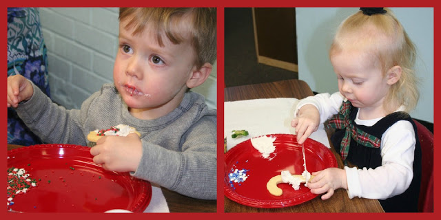
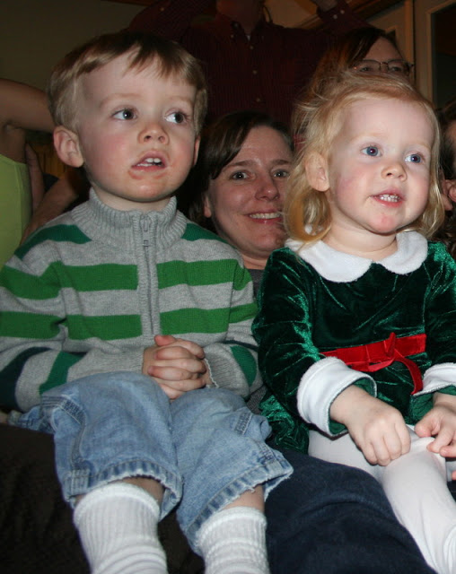
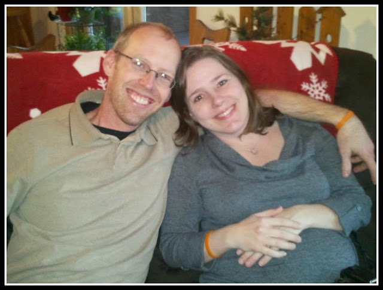
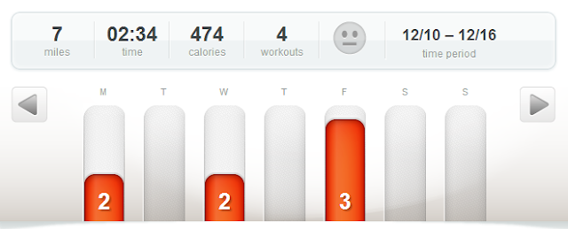

_My two little ones get a lot of snuggles from me every day but this week I have given even more. Words can't express how heartbroken I feel about the tragedy that took place at Sandy Hook Elementary on Friday. I definitely can't say anything different or more eloquent than others have already. I struggled with the decision to say something on my blog, since I am still at a loss as what to say. But it has definitely affected my week and not to mention it seemed wrong._ 

_My heart goes out to those affected by the violence._ 

  

  

  

It's official, the holiday parties have begun! The kids had a party at school.  

  

  

They decorated sugar cookies with lots of frosting and sprinkles. We also enjoyed Christmas centers and Christmas songs. Now they have 3 weeks off!  
C.J. and I had a date night for our local Team in Training holiday party. It was fun to get out and I loved my mojito, no alcohol, of course!   
  
  

  
We traveled to Nana and Papa's house for another Christmas party with friends and family. My favorite part of this particular party was sitting around after dinner singing Christmas carols. The kids really got into it this year and requested Frosty, Jingle Bells and the ABCs! I loved that they sang along with the group for their favorite songs.   
  
  

<table align="center" cellpadding="0" cellspacing="0"><tbody><tr><td><a href="http://2.bp.blogspot.com/-TdbL86hx2Aw/UNChc4qaq9I/AAAAAAAABAU/QwijpHvdQEM/s1600/IMG_7539.JPG" imageanchor="1"></a></td></tr><tr><td>Singing Carols</td></tr></tbody></table>

  
I'm still currently reading "Code Name Verity." It was a hard week to get in a lot of last minute reading. My head just wasn't into it. I had book club on Monday night and only one of us finished the book! I'm pretty sure in the 12 years we have been meeting this was a first. The book is getting a lot better but it had a very slow start.  
  
My walking exercise has continued this week. I completed a total of 6.9 miles, all on the treadmill. I just started watching Glee on Netflix (yes, I'm a little behind!) and I've also discovered that I can catch up on my Google Reader while walking. I'm happily surprised by how much I still enjoy walking on the treadmill. It's easy to find distractions and it makes the workout go by quickly.  
  
  

  
Baby Update:  
  
I had my second (long!) gestational diabetes test this week and passed it. So I'm doing well in that area. I also stayed within my 'recommended' weight gain for the past two weeks. The baby is sideways, or oblique, right now, which \*could\* be better than the breech position of my last appointment.  
  
30 weeks pregnant tomorrow!  
  
  

\------------------------------------------

  
Find A Mother's Pace on...  
  
Twitter [@amotherspace3](https://twitter.com/amotherspace3)  
  
Facebook [amotherspace3](http://facebook.com/amotherspace3)  
  
Instagram [amotherspace](http://instagram.com/amotherspace)  
  
Pinterest [amotherspace](http://pinterest.com/amotherspace/)  
  
Bloglovin' [A Mother's Pace](http://www.bloglovin.com/en/blog/6680087)  
  
RSS [amotherspace](http://feeds.feedburner.com/amotherspace)
