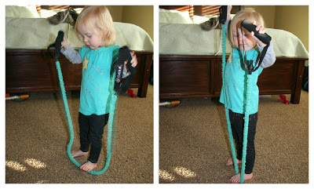
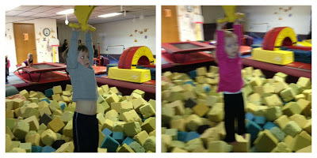
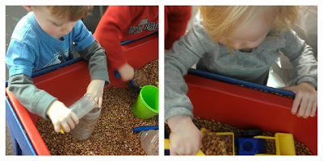

Last week was a good week for my pregnancy workouts. I walked every day, except Sunday, and I did 50 minutes of strength training!   

I even decided to fit in an unexpected walk during my son's gymnastics class. The class is below the track at the Y and so I could still watch the majority of his class and get a walk in.   
  
It helped me to feel \*good\* all week. I can tell that my leg strength is increasing because of the strength workouts. Seeing this motivates me to keep it up!  
  
Little A was motivated by my strength training too!  

Of course, by saying that I'm feeling good I'm not really including all the normal uncomfortable body aches that come with the end of a pregnancy. Everything is such an effort these days...but I'm getting closer and closer to my due date!  
  
Speaking of gymnastics, this week we had an extra visit planned at a local gymnastics club. It was bring a friend week and we were lucky enough to be invited.   

The zip line was a favorite. I'm a little surprised that they both did it.   
  
This class was a little longer than the Y's and the teacher tended to actually teach the kids just a little more. I was impressed by how much all of the kids could already accomplish in the 3-year-old class.   

The kids had a great week at school. The beans were in the sensory tub, which is always a plus. They could both play in there for hours.  
  
It's my week off from my doctor. This is the last two week doctor visit. After next week I go EVERY week! That makes it seem so close but yet so far away.   
  
Five weeks on Thursday!
