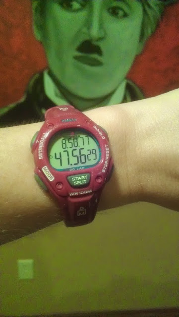
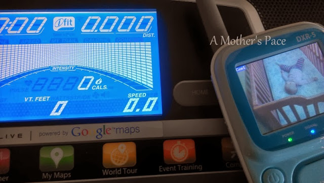
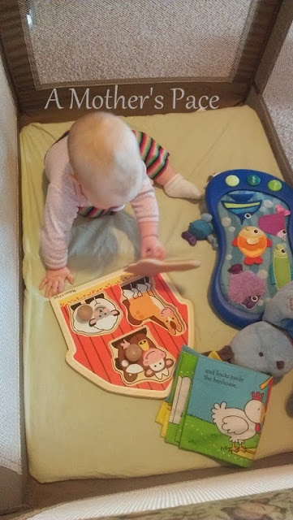
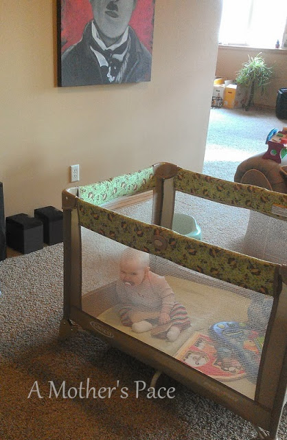
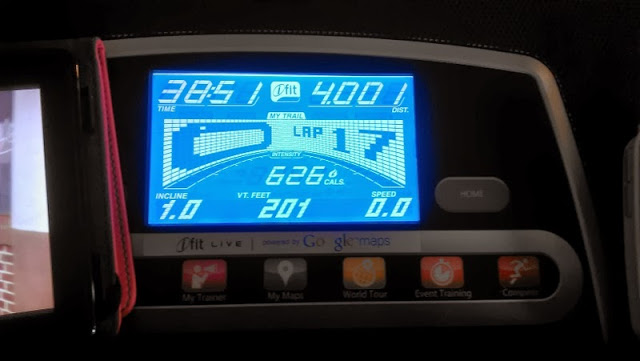
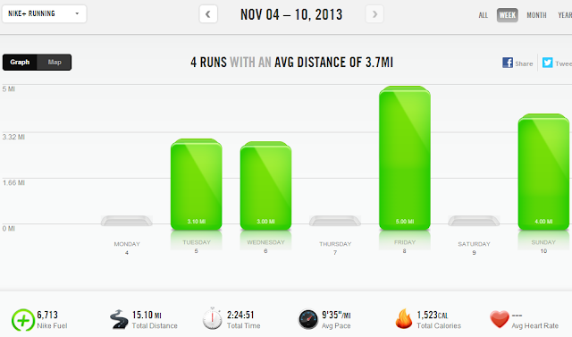

Last week was all about the treadmill for me. 3 out of 4 runs were on the treadmill and all for different reasons.  
  

  
I've started tracking the splits of my treadmill runs with a Timex watch I won on twitter. (#imarunner) I use the Nike+ app to track my inside running but the splits aren't the most reliable (really, neither is the mileage but I can adjust that to match my treadmill after I'm finished.) so the watch has come in handy this week.  
  
The first treadmill run was Wednesday and I ran inside because it was a speed work day and it's difficult for me to run that kind of a workout in the dark. I was not feeling this run at all but I did manage 5 400's and an average pace of 8:46 for 3 miles.   
  
My next run was Friday and again on the treadmill. I ran after my husband got off of work and the wind was crazy outside. I choose to get 5 miles in down in the basement instead of battling the wind.  
  

  
Then Sunday I ran inside during nap time. We just bought a video monitor so that I can watch Little E while she sleeps and I run. It's one of those purchases that I wish we made a long time ago.  
  
The run really wasn't too successful. I ran 4 miles and had to stop 4 times. Little E woke up after sleeping for 10 minutes. I unsuccessfully tried to put her down again but ended up putting her in the pack n' play while I ran.  
  

  
She played for a bit and then got sleepy again. She didn't mind being cooped up in there as much as I thought she would.   
  

  
It worked well because I could watch her from the treadmill. Gone are the days when I can just put her on the floor with some toys while I run because she is now officially a crawler!  
  
So, yes, 4 miles. My minimum was 3 and my max (in my dreams) was 7. I'm pretty happy that I accomplished 4!  
  

  
And here's the wrap up of my week in workouts.  
  

  
**Weekly Workouts**  
  
Monday: Rest Day + 70 second plank  
  
Tuesday: 3.1 miles (9:21 pace) + 80 second plank  
  
Wednesday: 3 speed work miles (8:46 pace) +70 second plank  
  
Thursday: Rest Day  
Friday: 5 miles (9:37 pace)   
  
Saturday: Rest Day + 85 second plank  
  
Sunday: 4 miles (9:42 pace) + 85 second plank  
  

  

  
Total Running Miles: 15.10  
Weekly Average Pace: 9:35  
  
November Running Miles: 29.21  
2013 Running Miles: 464.22  
  
  
  

**Do you love or hate the treadmill?** 

  

\-------------------------------

  

Find A Mother's Pace on...  
  
Twitter [@amotherspace3](https://twitter.com/amotherspace3)  
  
Facebook [amotherspace3](http://facebook.com/amotherspace3)  
  
Instagram [amotherspace](http://instagram.com/amotherspace)  
  
Pinterest [amotherspace](http://pinterest.com/amotherspace/)  
  
Bloglovin' [A Mother's Pace](http://www.bloglovin.com/en/blog/6680087)  
  
RSS [amotherspace](http://feeds.feedburner.com/amotherspace)
