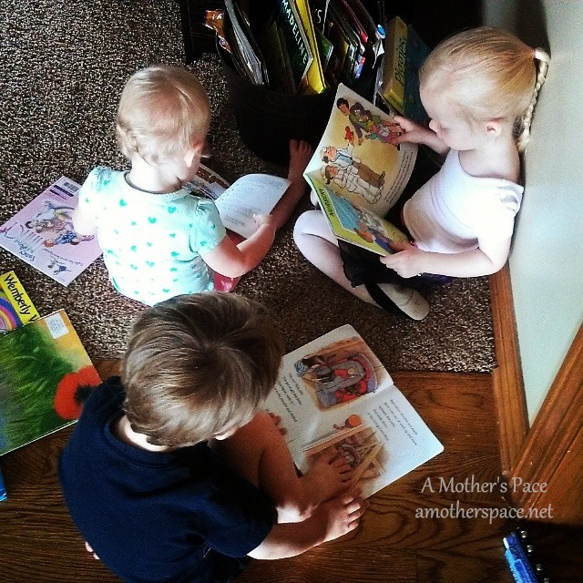

 

If you follow me on Instagram then you already know that I'm playing along with the #ActiveLivingChallenge with [Lorna Jane](lornajane.com) and FitApproach. It runs from August 4th through the 24th so there is plenty of time to follow along and join in on the excitement!

Not only is the challenge fun but it's a great way to connect with other active people on both Instagram and Twitter!

## #ActiveLivingChallenge Day 1

{Favorite Summer Workout Move} Running, of course!

 

## #ActiveLivingChallenge Day 2

{Favorite Healthy Recipe} Right now it's anything that my husband makes on his smoker. We recently had a delicious pulled pork! After posting this picture online, one friend suggested that I go out and buy some magnetic eyes immediately. I'll never look at the grill the same way again!

 

 

 

## #ActiveLivingChallenge Day 3

{What active living means to me} My reasons for being active have changed a lot over the years but right now my main reason has to do with these 3. They soak up everything around them and I want to be a positive role model for them. It's important to be healthy, active and take care of yourself. P.S. They all love books and I find them like this a lot!

 

 

## #ActiveLivingChallenge Day 4

{Favorite Place to relax/have quite time} I love to sit on the back deck, read and have a glass of wine or beer. This past week it was a beer. And on a side note, [The Mind Gym](http://amzn.to/1oDN7Ep) is an AMAZING book. I highly recommend it especially if you have issues with negative thinking while running.

 

 

## #ActiveLivingChallenge Day 5

{Snap a workout sweaty selfie!} With the humidity in the 90's all my running is very sweaty. 3 miles this morning in the rain. No music or podcasts, just me and the sprinkles.

 

 

 

## #ActiveLivingChallenge Day 6

{Moving/working out with your friends!} 99% of the time I run alone so my kids are my workout buddies when we are on the bike.

 

## #ActiveLivingChallenge Day 7

{Something I'm grateful for} Every day I'm so grateful for my husband and 3 children. They bring me such joy and I feel so blessed to be able to call these special people my family.

 

 

 

Stay tuned for next weeks post on week 2 of the challenge. Until then you can follow along with me on [Instagram](http://instagram/amotherspace) or head over to [Move Nourish Believe](http://www.movenourishbelieve.com/) to find even more inspiration on active living.

 

\_\_\_\_\_\_\_\_\_\_\_\_\_\_\_\_\_

I’m running the Chicago Marathon with Team RMHC!

To find out more read my post about [Running for Charity](http://amotherspace.net/2014/06/the-chicago-marathon-running-for-charity/) or head over to my [fundraising page](http://www.kintera.org/faf/donorReg/donorPledge.asp?ievent=1097960&supId=399266070) to make a donation.

——————————-

Find A Mother’s Pace on…

Twitter [@amotherspace3](https://twitter.com/amotherspace3)

Facebook [amotherspace3](http://facebook.com/amotherspace3)

Instagram [amotherspace](http://instagram.com/amotherspace)

Pinterest [amotherspace](http://pinterest.com/amotherspace/)

Bloglovin’ [A Mother’s Pace](http://www.bloglovin.com/en/blog/6680087)

RSS [amotherspace](http://feeds.feedburner.com/amotherspace)
