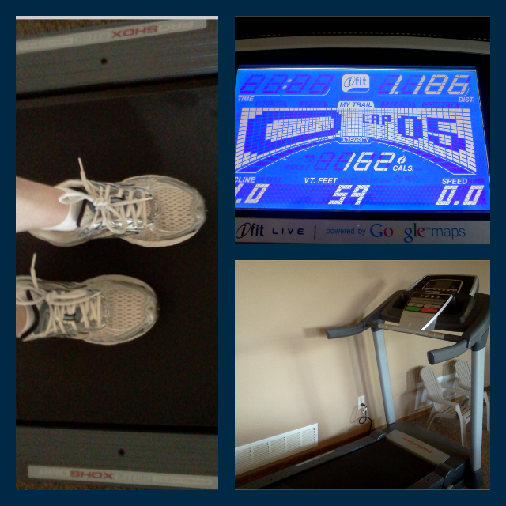

Lucky for me, there was a great deal on a treadmill just when I needed one. I've never owned a treadmill before and I've never particularly loved running on one. But if it is a choice between _not_ running and _running_ on a treadmill, I pick the treadmill.  
It's been set up for two days now and because of my new friend I ran on both of those days!   
I took a week off because I was pretty sore after my last 5K race. (My sciatic nerve has been killing me! I don't think from the run, just from pregnancy in general.) I wanted my body to get some good rest and I was beginning to wonder if my days of running while pregnant were over. Without the treadmill I doubt I would have gotten much more running in in the next 5 months or so. 5 months! I can't imagine. I'm so glad that I now have the opportunity to run when I have little bits of time throughout the day.   
  
  

  
So far both of my runs have happened while my kids are playing in the same room. We have a playroom set up in our family room downstairs. It's easy for me to keep an eye on them and run at the same time. They love it because they love playing downstairs so it works perfectly!   
  
Since I took some time off I'm starting from the beginning again. My two runs were just a mile each but today I walked another mile to round out the workout and make it just over 30 minutes. It felt wonderful. Yesterday my sciatic nerve felt great for the rest of the day after running in the morning. I'm so glad that running didn't aggravate it!  
  
I never thought I would be so excited about owning a treadmill!  
  
  

\-------------------------------

  

Find A Mother's Pace on...  
  
Twitter [@amotherspace3](https://twitter.com/amotherspace3)  
  
Facebook [amotherspace3](http://facebook.com/amotherspace3)  
  
Instagram [amotherspace](http://instagram.com/amotherspace)  
  
Pinterest [amotherspace](http://pinterest.com/amotherspace/)  
  
Bloglovin' [A Mother's Pace](http://www.bloglovin.com/en/blog/6680087)  
  
RSS [amotherspace](http://feeds.feedburner.com/amotherspace)
