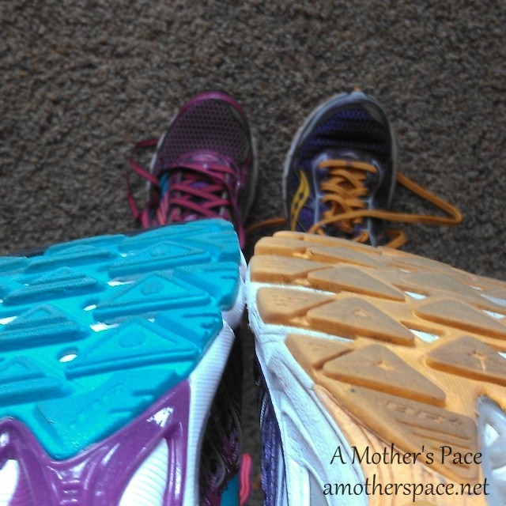

 

I can usually get about 500 miles out of a pair of running shoes before I start to notice a big difference in the quality of the shoe. Due to some poor planning on my part, my two pairs of shoes in rotation recently came close to this milestone at the same time.

Yes, that means I had the pleasure of going to one of our local running stores and buying TWO pairs of running shoes.

Now, I love my Saucony shoes. I've been in them for years. They've been good to me and we've spent many, many miles together.

But this time I wanted to branch out. I read in a recent Runner's World shoe guide that the Saucony Kinvara's or the Brooks PureFlow 3's might be a good match for me according to my weekly mileage and the fact that I'm not prone to injury.

 

 

I tried both on and I overwhelmingly liked the PureFlow's. I felt like I was cheating on Saucony, it felt wrong to want to go with Brooks, but I did and I'm very happy with my choice.

I didn't leave Saucony behind altogether though. I also bought a pair of the Ride 6's to add to my collection of Rides.

 

 

I've had both of the shoes for several weeks now so I thought it was time to let you know what I think about them.

The Saucony Ride's are a shoe I'm familiar with. This pair didn't feel as comfortable as my last pair of Ride's with 500 miles on them but I think they just needed to be broken in a bit. The photo below is 3 miles vs. 500 miles. Quite a difference!

 

 

The Rides are just a good sturdy shoe that can handle a lot of miles. It's my current shoe that I wear on most runs over 3 miles. I've mainly worn them on the treadmill but I've been out in them a few times as well. Last weekend I took them on my 13.1 long run of the week and they felt great.

 

 

The PureFlows are a lower drop shoe. Because they are different than what I am used to running in, I took a very conservative route to get used to wearing them. It's not worth it to change a shoe only to find myself injured. For 3 weeks I just ran 1 mile at a time in them and then I would switch to a different pair of shoes and continue my run.

 

 

The first time I ran in them my shins felt different and that's how I knew I needed to take the transition easy. I ran 4 1 milers in them but then this week, as I was running a scheduled 3 mile run, my legs felt great and I didn't want to stop to change them out.

I ran over 3.5 miles in the PureFlows and just felt good overall. My favorite part about these shoes is the band that goes over the top of the foot. I feel that extra support and my foot really likes it. That band is what sold me on these shoes in the running store the second I put them on.

 

**What running shoe do you wear? Are you loyal to a certain brand?**

 

 

\-------------------------------

Find A Mother's Pace on...

Twitter [@amotherspace3](https://twitter.com/amotherspace3)

Facebook [amotherspace3](http://facebook.com/amotherspace3)

Instagram [amotherspace](http://instagram.com/amotherspace)

Pinterest [amotherspace](http://pinterest.com/amotherspace/)

Bloglovin' [A Mother's Pace](http://www.bloglovin.com/en/blog/6680087)

RSS [amotherspace](http://feeds.feedburner.com/amotherspace)
