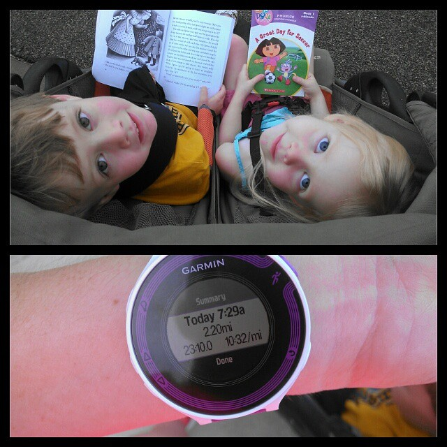
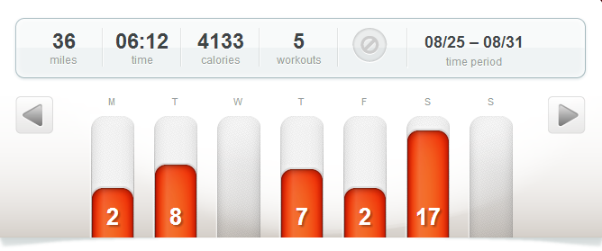

 

I'm another week closer to the Chicago Marathon! My training overall is going o.k. August was my highest month ever in mileage!! I had a grand total of 165.44 miles for the month. So I'm getting my miles in but this hot and humid weather that we are having is taking a toll because my pace has been slower than usual lately. I just keep waiting for the cooler fall weather in hopes that my speed will come back with it.

 

 

The bright side of the weather right now is that I am waking up early and catching some pretty amazing Kansas sunrises. It's still really humid but at least it's beautiful!

I'm at the point in my training where I have ran all my routes too many times. I need a new place to run but I'm pretty limited if I leave from my house. It's not impossible though so my goal this week is to figure out some new routes to mix up my running a bit.

The good thing about running a new route is that my new GPS watch, the [Garmin Forerunner 220](http://amotherspace.net/2014/08/forerunner-220-mini-review-week-11-chimarathon-training/ "Forerunner 220 Mini Review + Week 11 #ChiMarathon Training"), has a LiveTrack feature. I just turn it on before I head out for my run and it shoots my husband an email with a link so he can follow my run on a map. It shows my pace and updates every minute so it's a pretty accurate way to keep track of me. Typically I tell him my route before I go out on a run but now I can just go and he'll know where I'm running. Yes, I'm really starting to like this new watch of mine!

And now on to my workouts of the week!

 

 

## **Weekly Workouts**

Chicago Marathon Training: Week 12

**Monday:** 2.01 miles (10:31 pace)

With my long run on Sunday, this run was tough. I wanted to stick to my normal training log which called for an easy 4-5 miles but usually I take a complete rest day after my Saturday long run. My legs didn't hurt but they sure did feel tired. I just couldn't get them moving and so I decided to head back early and cut it short.

**Tuesday:** 8.01 miles (10:04 pace)

This was supposed to be a speed work session but I just couldn't put out the speed I was hoping for. My training plan called for 8 miles with a 10 minute warm up and cool down with 10 4 minute intervals with 3 minutes of recovery running between. I still ran faster on the intervals but I guess my legs were still a little tired from the weekend.

**Wednesday:** REST

**Thursday:** 7.01 miles (10:13 pace)

7 miles at an easy pace on this hot and humid morning. I crunched through leaves for the first time this season. How is it already time for the leaves to fall off the trees? Now only if the temperature would cool down a little! I also started listening to The Goldfinch audio book today.

**Friday:** 2.2 miles (10:32 pace)

This was my first stroller run in a long time. On a whim I took the 2 older kids along for my morning run. It was tough, they are a lot bigger than the last time we did this, but I enjoyed the time together. My son entertained us by reading to us during the entire run.

 

 

**Saturday:** 17 miles (10:20 pace)

Temps were supposed to be in the mid 60's when I started this one but the humidity was horrible. I dragged at the beginning and tried to pick it up to add in a few race pace miles but it was a tough one all around.

**Sunday:** REST

 

One of my main goals for 2014 is to Run This Year in kilometers. That's 2,014 kilometers or 1,251.44 miles.

Weekly Running Miles: 36.24

August Running Miles: 165.44

2014 Running Miles: 944.85

2014 Running Kilometers: 1520.59

 

**Has cool fall weather arrived for you yet?**

 

\_\_\_\_\_\_\_\_\_\_\_\_\_\_\_\_\_

I’m running the Chicago Marathon with Team RMHC!

To find out more read my post about [Running for Charity](http://amotherspace.net/2014/06/the-chicago-marathon-running-for-charity/) or head over to my [fundraising page](http://www.kintera.org/faf/donorReg/donorPledge.asp?ievent=1097960&supId=399266070) to make a donation.

——————————-

Find A Mother’s Pace on…

Twitter [@amotherspace3](https://twitter.com/amotherspace3)

Facebook [amotherspace3](http://facebook.com/amotherspace3)

Instagram [amotherspace](http://instagram.com/amotherspace)

Pinterest [amotherspace](http://pinterest.com/amotherspace/)

Bloglovin’ [A Mother’s Pace](http://www.bloglovin.com/en/blog/6680087)

RSS [amotherspace](http://feeds.feedburner.com/amotherspace)
