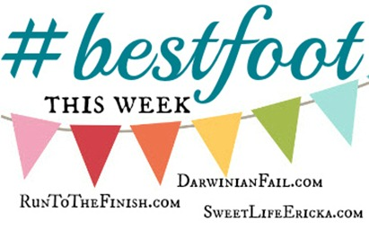

I'm sure that all of you have ran a race just for fun and not for time or a personal best.

That's what happened for me this week when I went out to run my 5 by the 5th virtual race. It's the 3rd in the series from Laura over at [Mommy Run Fast](http://www.mommyrunfast.com/) and we have one left to go in May. It was hard for me to fit a fast 5k into my training plan for the week so I just decided to run this one for fun during my 'easy' running day on Friday.

We were traveling and staying with Nana and Papa so I was able to run out in the country on the gravel roads. I set out in the morning in the chilly air. I had packed to run in 42 degree weather but it 'felt like' 18. I thought I would be freezing in my light jacket and capris but it ended up o.k.

 

 

The wind was at my back on the way out to the cows. I succeeded in scaring them all (not that I was trying at all!). They were right up at the fence when I first started approaching but quickly ran away.

I turned around and the cold air made the second half of my run a little more challenging.Overall, it ended up being a great run. I love the peacefulness of the country. The roosters were crowing and some fields had been burnt recently so the smell was strong.

 

 

It's just a completely different environment than I usually run in and the variety is very motivating.

My initial goal when starting this 5 by the 5th series was to run each race a little faster. But ultimately my goal race at the beginning of May is much more important to me so this will have to do for this month.

 

 

Evidently, Friday was also my 7 year anniversary with Nike+!

 

 

I remember when I bought my first ipod and had the shoe pod to help track my runs. It seems like much longer than 7 years ago in some ways and yet at the same time not very long ago at all.

Want more 5 by the 5th? Read my [February](http://amotherspace.net/2014/02/5-by-the-5th-february/) and [March](http://amotherspace.net/2014/03/5-by-the-5th-march/) recaps.

And now on to the rest of my training from last week. I just finished up week 9 of the Train Like a Mother Own It Plan.

 

 

**Weekly Workouts**

Monday: 3 miles (9:26 pace) + 15 minutes of Yoga

Tuesday: Rest Day

Wednesday: Rest Day

Thursday: Rest Day

Friday: 3.11 miles (9:36 pace)

Saturday: 15.02 miles (10:00 pace)

Sunday: Rest Day

 

 

Last week was a bad training week. I only ran 3 days out of the 5 typical days that I run AND I skipped both my speed work sessions. I have a ton of excuses but I'm just calling it a bad week and moving on. This week will be better!

 

One of my main goals for 2014 is to Run This Year in kilometers. That's 2,014 kilometers or 1,251.44 miles.

Weekly Running Miles: 21.13

Weekly Average Pace: 9:51

March Running Miles: 131.52

April Running Miles: 18.13

2014 Running Miles: 328.70

2014 Running Kilometers: 529.12

 

 

**Is anyone else participating in the 5 by the 5th race series? How was your April race? How do you deal with bad training weeks?** 

 

——————————-

Find A Mother’s Pace on…

Twitter [@amotherspace3](https://twitter.com/amotherspace3)

Facebook [amotherspace3](http://facebook.com/amotherspace3)

Instagram [amotherspace](http://instagram.com/amotherspace)

Pinterest [amotherspace](http://pinterest.com/amotherspace/)

Bloglovin’ [A Mother’s Pace](http://www.bloglovin.com/en/blog/6680087)

RSS [amotherspace](http://feeds.feedburner.com/amotherspace)
