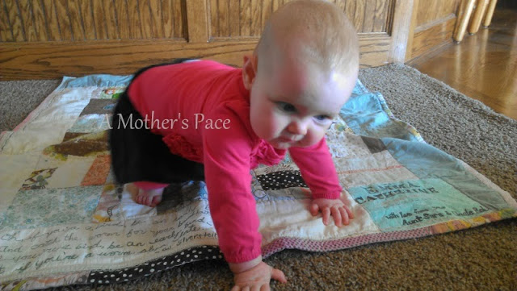

Our Little E turned 8 months last week. She is a blessing to our family and adds so much joy to our daily life.   
  
She's always laughing and going with the flow of our family. She's rarely cranky, except while teething. Little E's a great eater and loves to try new foods.   
  
Her biggest change recently is that she has become mobile.  
  
  

  
She's not officially crawling yet but she is definitely getting around. She gets up on all fours and scoots backwards. She rolls. She leans forward to grab something and moves a little at a time while reaching out.  
  
  

  

  
With two other children in the house (a 4-year-old and an almost 3-year-old) it is a huge challenge to baby proof the house. About 90% of the toys that the kids play with on a daily basis are too small for Little E. Little plastic dinosaurs, legos, and trains just to name a few.   
  
Recently, though, toys were not the problem. Little E's main playing area is the living room. I can watch her easily from the kitchen and dining room which is what I was doing when she found the aloe plant.   
  
We've had the aloe plant for awhile and I never really considered moving it up high away from the kids. (Ridiculous, I know!) Now that I've read about plants that can be poisonous I've moved a few plants to other rooms and will find places up high away from the kiddos.   
  
  

  
Back to Little E. She was playing by her basket of toys, sitting with her back to me. I thought she had her toys from where I was watching her from across the room. After a few minutes I came in to check on her and saw that she had the aloe. She had a lot of it. Evidently, it tastes pretty good.   
  
I scooped what was left of the aloe out of her mouth. Googled it and then went downstairs to discuss it with my husband. This was one of those times that I'm so happy he works from home!  
  
We decided to go ahead and call poison control, which, even though they didn't tell us anything different from Google, I'm glad we did. Peace of mind.   
  
Aloe is a laxative and so her stools might be different but so far she's not showing any symptoms. Other than that she should be fine.   
  
  

  
This was my wake up call. Now we need to get on the baby proofing and decide what we are going to do with all these toys. Any day now she's going to be crawling forward and there will be no stopping her!   
  
There are a lot of small and dangerous items in a household and many things you can do to baby-proof. Here are just a few things that we are currently working on to get our house ready for our mover.  
  

  

- **Get down on your hands and knees.** The view from down low is different and you may see things you wouldn't have noticed otherwise.
- **Use baby gates and knob covers**. We have a gate to our basement and knob locks on doors to areas that aren't baby-proofed. 
- **Move or fasten down furniture that is not stable.** Plant stands, shelving, etc...
- **Do a double take of everyday things.** When you are down on all fours look at everything. Some things blend in and you don't think about them (for us, plants!). 

  
  
  

**What did you have to baby proof that you didn't initially thing about?** 

\------------------------------------------

  
Find A Mother's Pace on...  
  
Twitter [@amotherspace3](https://twitter.com/amotherspace3)  
  
Facebook [amotherspace3](http://facebook.com/amotherspace3)  
  
Instagram [amotherspace](http://instagram.com/amotherspace)  
  
Pinterest [amotherspace](http://pinterest.com/amotherspace/)  
  
Bloglovin' [A Mother's Pace](http://www.bloglovin.com/en/blog/6680087)  
  
RSS [amotherspace](http://feeds.feedburner.com/amotherspace)
