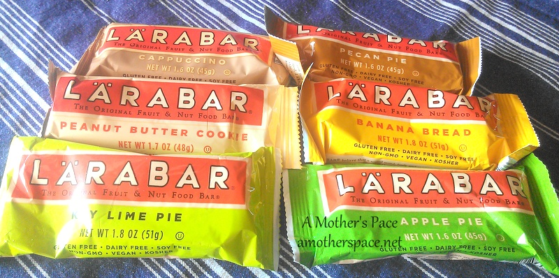
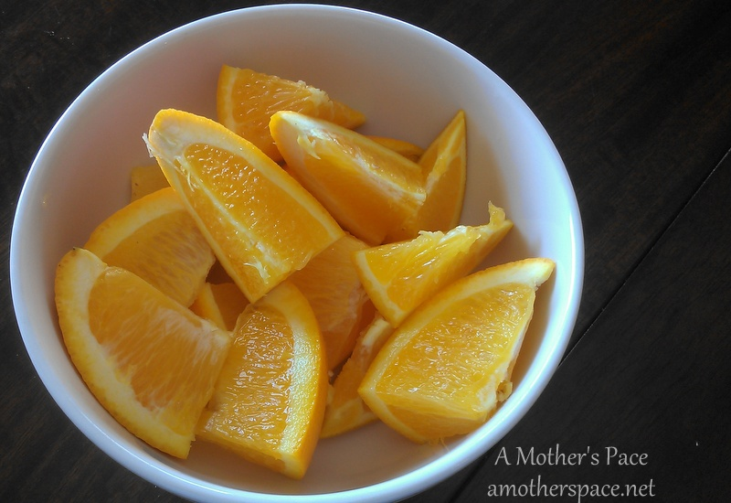
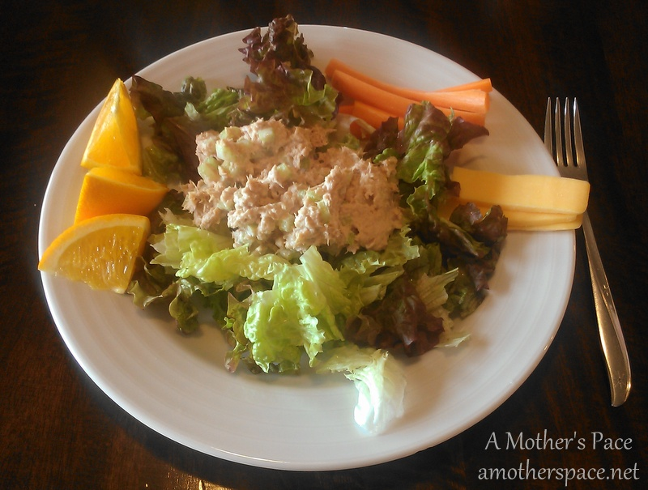
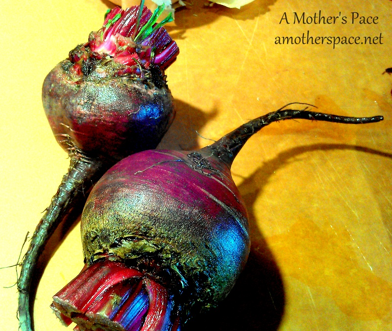
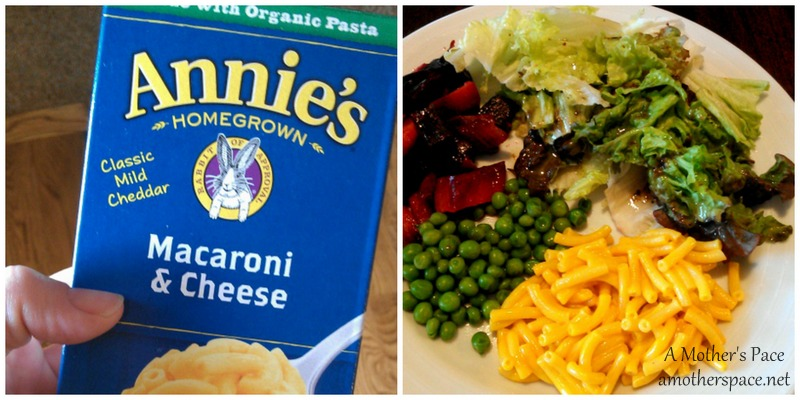

I'm back! I've missed meal planning over the past few weeks but I'm back and ready to share our plan for the week. But first a look at some of the food we've been eating lately.

I know I'm running more lately because I am hungry all the time. I'm trying to make better choices and grab something healthy in the afternoon when I'm craving chocolate. I seriously crave chocolate in the afternoon for some reason. I've avoided it since Tuesday and that's really good for me. I even chose a banana over chocolate and guess what? It was good and it satisfied my craving.

\[pre-run\]

For awhile now I have just been getting up and running without eating anything before my workout. That worked just fine when I was just running easy runs. But now that I'm training again with longer workouts mid-week including speed work; it just doesn't cut it. I've been eating half a Larabar before running and it helps me get through my run and not hit the wall half way through. Pecan Pie is my new favorite!

 

 

\[snack\]

My favorite snack of the week is a juicy cut up orange. I used to peel oranges all the time instead of cut them but I saw my mother-in-law do this recently. It's so much easier and the kids enjoy eating them like this too. We've been eating  a lot more oranges lately because of it. And they are so good right now!

 

 

\[lunch\]

Tuna salad has made a reappearance but this time I'm eating it on a bed of greens. I can't wait until the garden tomatoes are here because that would make this plate perfection.

 

 

\[dinner\]

I recently tried roasting beets for the first time and it was a complete game changer. I admit that I liked them the most but I was also very happy that my 12 month old daughter seems to love them and my 3 year old eats them as well. If you haven't tried roasting beets yet, try it! They are so good. Next up, I'm trying roasted radishes!

 

 

\[bonus:dinner\]

Confession: I admit that we occasionally eat boxed mac and cheese. But we use the Annie's brand which is a little better for you. My kids love mac and cheese and in a pinch it's a good side for the grown-ups too.

 

 

Here's our menu for next week: \[monday\]

[Sausage Bake](http://amotherspace.net/2013/10/sausage-bake/)

\[tuesday\]

Tilapia Tacos

\[wednesday\]

Leftovers

\[thursday\]

Lasagna

\[friday\]

Pizza

\[saturday\]

No Peak Chicken

\[sunday\]

Leftovers

\-------------------------------

Find A Mother's Pace on...

Twitter [@amotherspace3](https://twitter.com/amotherspace3)

Facebook [amotherspace3](http://facebook.com/amotherspace3)

Instagram [amotherspace](http://instagram.com/amotherspace)

Pinterest [amotherspace](http://pinterest.com/amotherspace/)

Bloglovin' [A Mother's Pace](http://www.bloglovin.com/en/blog/6680087)

RSS [amotherspace](http://feeds.feedburner.com/amotherspace)
