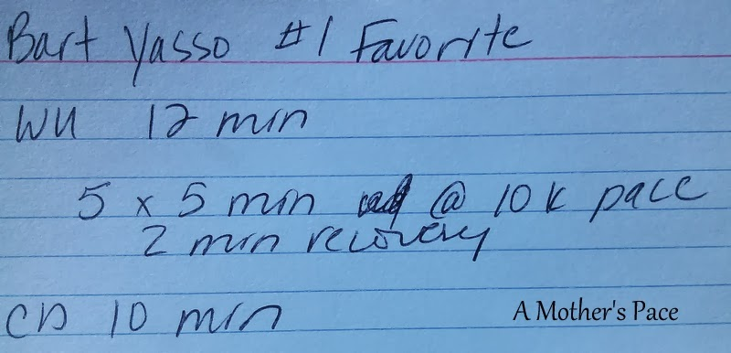
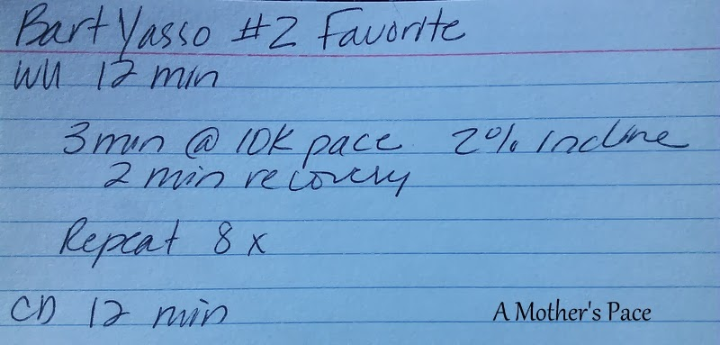
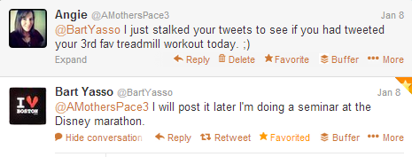
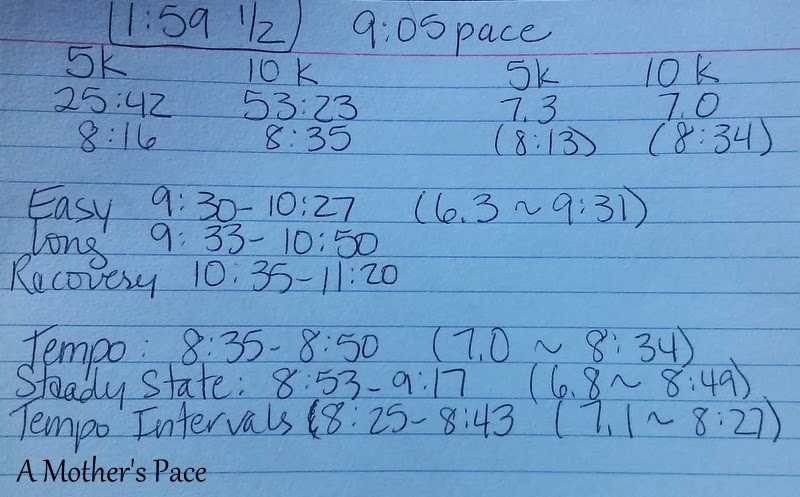

A few weeks ago, Bart Yasso, CRO of Runner's World Magazine, posted his favorite treadmill workout on Twitter. I love finding new treadmill workouts so I guess you could say I was excited to see _Bart's_ favorite.  
  
I tweeted him a quick thank you.  
  
  

  
And proceeded to write it down on one of my very professional looking cards to try at a later date.  
  
  

  
The next day I was happily surprised to see that Bart was sharing his second favorite treadmill workout.  
  
  

  
You guessed it, I tweeted him another quick thank you and then wrote down that workout as well.  
  
  

  
The next day I stalked his Twitter account to see if I had missed his 3rd favorite. Surely his unofficial series can't just stop with two!  
  
  

  
Well, the man is busy, that's an understatement! I'm just impressed that he replied to me. :)  
  
I didn't end up seeing his 3rd favorite when he put it out in the twitterverse but I have tried both of his other favs down on my treadmill.  
  
I ran his top treadmill workout first but only ended up running 4 repeats instead of 5. With the warm up and cool down it still ended up as a 5 mile run and that was plenty for the workout I had wanted.   
  
I've found that pressing buttons and changing incline on the treadmill greatly helps distract me from running in one place. This workout was challenging enough for a speed work session but fun at the same time.  
  
I love that his second favorite plays around with the incline. I haven't done that much on my treadmill yet but I'm loving adding incline lately so this one was perfect yesterday morning.   
  
The workout called for 8 (!!) repeats with 3 minutes at a 2% incline and a 10k pace. I'll work up to 8 but for my workout yesterday, I ended up accomplishing half of that to make a nice 4 mile run.   
  
How did I figure out all of my paces for these workouts? I used Greg McMillan's [running calculator](http://www.mcmillanrunning.com/index.php/site/calculator) and plugged in my latest race time to find my goal paces.  
  
  

  
If you're not following [Bart Yasso](https://twitter.com/BartYasso) on Twitter yet, do it! And if you'd like a more 'professional' write up of Bart's favorites, check out this [article](http://www.runnersworld.com/workouts/bart-yassos-top-three-treadmill-workouts?cm_mmc=Twitter-_-RunnersWorld-_-Content-Training-_-BartYassoTreadmillWorkouts) from Runner's World. I was delighted (yes, I did just say delighted!) to see that they published it because I had missed his 3rd favorite treadmill workout when he tweeted it. It's a half marathon pace workout and, yes, I'm going to try it soon.  
  
  

**Do you follow Bart Yasso on Twitter? What are some of your other favorite running people on Twitter? And, finally, what is YOUR favorite treadmill workout?**

  
  
  

\-------------------------------

  

Find A Mother's Pace on...  
  
Twitter [@amotherspace3](https://twitter.com/amotherspace3)  
  
Facebook [amotherspace3](http://facebook.com/amotherspace3)  
  
Instagram [amotherspace](http://instagram.com/amotherspace)  
  
Pinterest [amotherspace](http://pinterest.com/amotherspace/)  
  
Bloglovin' [A Mother's Pace](http://www.bloglovin.com/en/blog/6680087)  
  
RSS [amotherspace](http://feeds.feedburner.com/amotherspace)
