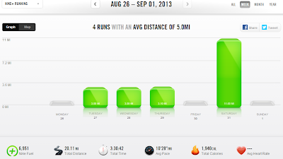

Last week was all about being flexible. Trying to fit running in before everyone has to be ready for school is definitely a challenge. There used to be a day when I woke up easily at 5:30 or earlier to head out on early morning runs. I looked forward to this early morning alone time. Not anymore though. It's really tough lately but I've been making due and usually getting it in later on the treadmill if the morning doesn't work out.   
  
Friday I missed my early morning 5 miles of speed work. But it really worked out for the best. My husband and I decided to run our long run of the weekend together on Saturday. I usually run long on Sunday and if I had done my speed work on Friday my legs wouldn't have been ready for a long run the next day.  
  
I'm planning on adding the 5 mile speed session in on Monday as part of my [Fall 5 or 10 Mile Virtual Race](http://bit.ly/16Zv3iz) I'm participating in over the next few months.  
  
Saturday morning I set out for 11 miles by myself. My mom stayed with the kids (Thanks, Mom!!) while my husband drove to the park and started to run towards me. He ran about a mile before meeting up with me. I was at about 3.5 miles at that point. We ran together until he reached his 6 miles and then I kept going until my 11 were finished.  
  
  

  
I'm not used to running with other people but I really enjoyed running with my husband. (Good thing, right??)  
  

  
**Weekly Workouts**  
  
Monday:  Rest Day  
  
Tuesday: 3 miles  
  
Wednesday: 3 miles  
  
Thursday: 3.1 miles  
  
Friday: Unexpected Rest Day  
  
Saturday: 11 miles (long run)  
  
Sunday: Rest Day  
  
  

  
Total Running Miles: 20.1  
Weekly Average Pace: 10:28  
  
August Running Miles: 109.58  
2013 Running Miles: 299.16  
  
  
  

**How were your workouts last week? Are you flexible with your training plan? Do you run with your significant other?**

  
I've linked up with Jen over at [Marathon Mom](http://bit.ly/1cyn4eH) today.  
  
  

\------------------------------------------

  

Staying at home with kids sounds easy, right? Life with 3 little ones is busier than I imagined. I don't write every day on the blog but I do update Facebook, Twitter and Instagram more often.   
  
Find A Mother's Pace on...  
  
Twitter [@amotherspace3](https://twitter.com/amotherspace3)  
  
Facebook [amotherspace3](http://facebook.com/amotherspace3)  
  
Instagram [amotherspace](http://instagram.com/amotherspace)  
  
Pinterest [amotherspace](http://pinterest.com/amotherspace/)  
  
Bloglovin' [A Mother's Pace](http://www.bloglovin.com/en/blog/6680087)  
  
RSS [amotherspace](http://feeds.feedburner.com/amotherspace)
