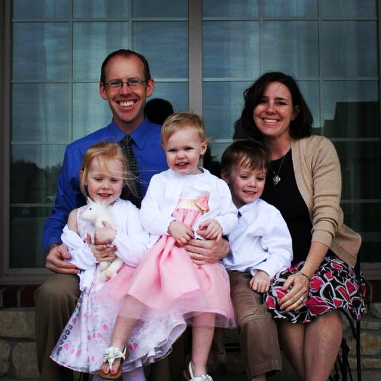

 

Oh, boy. I look back on my last post and I can't believe that it's been so long since I have disappeared. But there is a reason and I figured it was time to finally share it with you.

 

 

Our big news is that Little E is going to be a Big Sis. Baby #4 will be arriving in late October!

I'm currently in the middle of week 13, right at the end of the first trimester and has it ever been a rough one. Nausea and exhaustion basically have taken over my life and I'm not even accomplishing the regular day to day activities that I need to do so this blog took the back seat.

Not only did my blog stop but my running came to a screeching halt as well. The last time I ran was several weeks ago and it was tough to get through because of the nausea. I'm hoping that with the end of the first trimester arriving soon that I will be back out there running again. I miss it terribly and I feel more like 'me' when I'm running.

I can't say that I'm going to write much over the next few months as I make my way through this pregnancy but I may find I want to write more once I start running again. I am still posting pictures over on [Instagram](http://instagram.com/amotherspace) so be sure to keep in touch with me over there.

Pretty soon we will be a family of 6!

 

 

——————————-

Find A Mother’s Pace on…

Twitter [@amotherspace3](https://twitter.com/amotherspace3)

Facebook [amotherspace3](http://facebook.com/amotherspace3)

Instagram [amotherspace](http://instagram.com/amotherspace)

Pinterest [amotherspace](http://pinterest.com/amotherspace/)

Bloglovin’ [A Mother’s Pace](http://www.bloglovin.com/en/blog/6680087)

RSS [amotherspace](http://feeds.feedburner.com/amotherspace)
