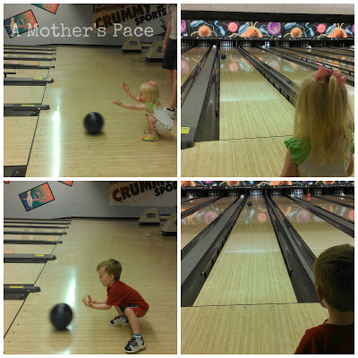
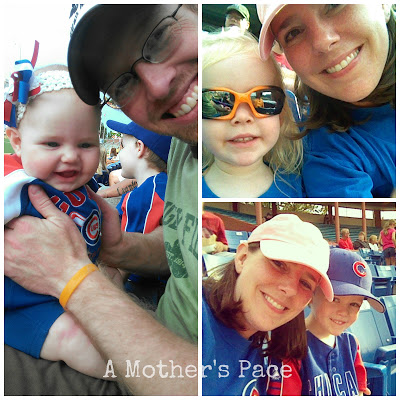
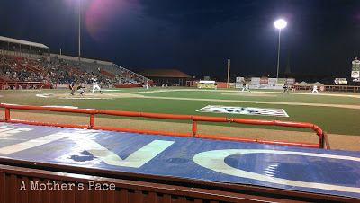

Friday and Saturday were my first two non-running days in a long time. Friday was on purpose but my day got away from me on Saturday. I ended up doing a little retail therapy (spent gift cards and a whopping $14, made my husband happy!) and watched a baseball game instead of running.  
  
Bowling first.  

  

Both Little O and Little A bowled their first game on Friday. They had bumpers up but I'm pretty sure even if they didn't have the bumpers they would have had a higher score than I did.   
  
My score may or may not have been 6 in the 8th frame. How can someone be that horrible at bowling??  
  
Well, that goes down as my worst bowling experience ever. Except the fact that I was bowling with my family and my godson. That part was fantastic.  
  

  
I've never seen a ball go down the lane so slowly before. A few times we even had to have the man come and rescue the ball.  
  
It was a fun experience but it might be awhile before we head back because I stink at bowling. I'd like the kids to get a little stronger before we try it again.  
  
Now baseball.  
  
I'm a pretty huge Cubs fan. Or I used to be before I had kids. I'm still a fan but don't have as much time to follow them. I always had the t.v. on to WGN during the game and every time I went to Chicago I tried to fit in a game.   
  
Saturday we had the opportunity to see the Wingnuts play here in Wichita. It wasn't the Cubs but we sure dressed like it was!   
  

  
It was a beautiful evening in the 80's (in July, crazy!). We had great seats behind the visitor's dugout. The kids lasted throughout the entire 9 innings. I didn't think we would stay the whole evening but I'm glad we did. Our team won too, 7-0!  
  

  
  

**What is your PR for a low bowling score? High score? Any MLB fans out there? What team?**

\------------------------------------------

  

  
Find A Mother's Pace on...  
  
Twitter [@amotherpace3](https://twitter.com/amotherspace3)  
  
Facebook [http://facebook.com/amotherspace3](http://facebook.com/amotherspace3)   
  
Instagram [amotherspace](http://instagram.com/amotherspace)  
  
RSS [amotherspace](http://feeds.feedburner.com/amotherspace)
