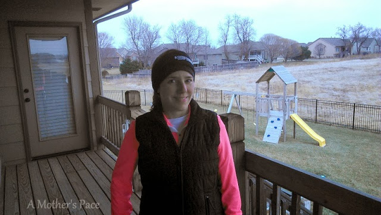
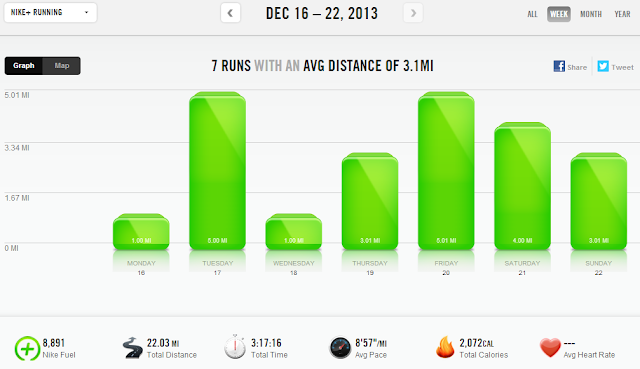

When 2013 started I was very pregnant. I had no mileage goals, I just wanted to get back into running after my pregnancy.   
  
Recently I noticed how close I was to 600 miles so it became my goal to try and get past 600. That meant I had to run over 22 miles each week and so far I'm accomplishing it.   
  
22 miles isn't _that_ much for a week but I'm not training for anything and it's definitely more than I would have ran if I didn't want to hit a certain mileage number.   
  
I've already surpassed my highest mileage year (at least as long as I've been tracking the miles) and I have even bigger goals for next year.   
  

  
It was another week of the treadmill. I did get out twice and enjoyed the cold but beautiful weather. Every other run was on the treadmill. I'm still streaking and only have 8 more runs to complete the holiday streak.  
  
  

  
**Weekly Workouts**  
  
Monday: 1 mile (9:07 pace)   
  
Tuesday: 5 miles (8:41 pace) + Core Work  
  
Wednesday: 1 mile (7:33 pace) + Full Body Strength Workout  
  
Thursday: 3.01 miles (9:09 pace)  
  
Friday: 5.01 miles (9:10 pace)  
  
Saturday: 4.01 miles (9:08 pace)  
  
Sunday: 3.01 miles (9:13 pace)  
  
  
  

  
Total Running Miles: 22.04  
Weekly Average Pace: 8:57  
  
December Running Miles: 69.19  
2013 Running Miles: 576.25  
  
  
  

**Do you have a mileage goal for 2013?**

  
  

\-------------------------------

  

Find A Mother's Pace on...  
  
Twitter [@amotherspace3](https://twitter.com/amotherspace3)  
  
Facebook [amotherspace3](http://facebook.com/amotherspace3)  
  
Instagram [amotherspace](http://instagram.com/amotherspace)  
  
Pinterest [amotherspace](http://pinterest.com/amotherspace/)  
  
Bloglovin' [A Mother's Pace](http://www.bloglovin.com/en/blog/6680087)  
  
RSS [amotherspace](http://feeds.feedburner.com/amotherspace)
