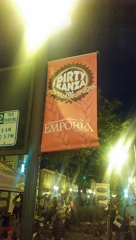
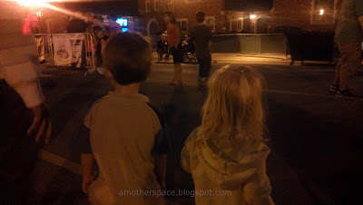
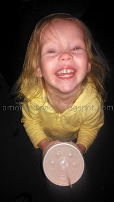
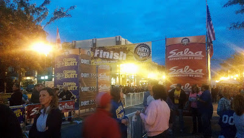
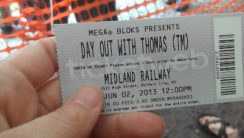
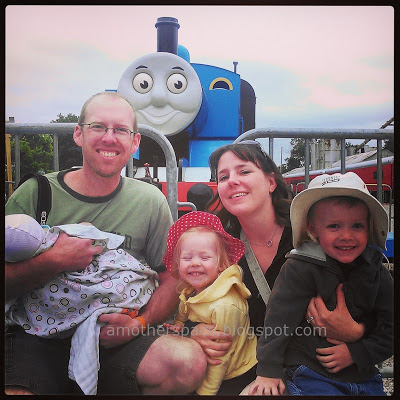
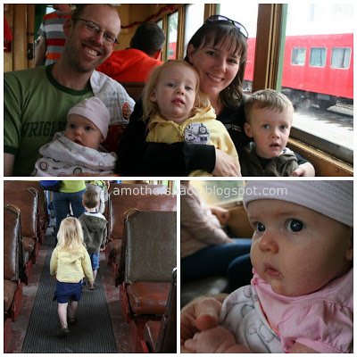
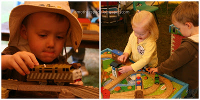
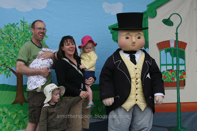
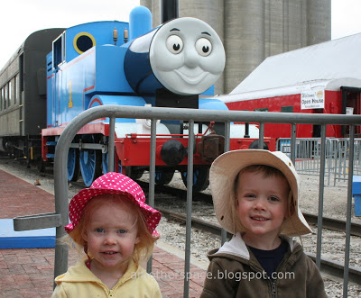

Happy National Running Day! I celebrated by waking up early and running 4 miles. Are you running today?  

  

Do you want a National Running Day Badge? Make one [here](http://bit.ly/10P9CPQ).  
  
  
\-------------------------------------------------

  
I've been to so many running races as a participant and a spectator that I've lost count. Last weekend I had the opportunity to cheer at the finish line of the [Dirty Kanza 200](http://bit.ly/1b1sbBr) (DK 200). Cycling!   
  
  

  
It's a tough race with 200 miles and many of those on dirt and gravel roads throughout the Flint Hills. The participants were on their bicycles for hours and hours. I can't even imagine. Of course, many of them probably can't imagine running for hours either. :)   
  
Emporia is my husbands hometown and I have to say I was extremely impressed with those who came out to cheer. Well done, Emporia!  
  

  
It was a party. Plenty of good food, beer, cowbells, games for the kids and so many people came out to watch the finishers come in.   
  
  

  
  
I will never sign up to ride the DK 200 but I will go and cheer on the finishers again!  
  
  

  
  
That was Saturday. On Sunday we drove over to Baldwin City, Kansas to spend a Day Out With Thomas.  
  
  

  
My 3-year-old is obsessed with Thomas and his friends, to put it mildly. He was over the top excited to see Thomas and the day did not disappoint.  
  
  

  
  

  
Not only did we get to ride on one of Thomas' passenger cars but all the other activities were pretty amazing too.   
  
  

  
They had a tent set up with train and Mega Block stations.   
  
  

  
  
They had a temporary tattoo tent. They had a video and storytelling tent (which was perfect for lunch time). We met Sir Topham Hatt, which was kinda scary, even for me. :)  
  
  

  
And much more. We could have easily spent twice the time that we were able there and enjoyed every second of it. If you have a little one who loves Thomas I would highly recommend spending the day with Thomas.   
  
  

  
  
  
  

\------------------------------------------

  

  
Find A Mother's Pace on...  
  
Twitter [@amotherpace3](https://twitter.com/amotherspace3)  
  
Facebook [http://facebook.com/amotherspace3](http://facebook.com/amotherspace3)   
  
Instagram [amotherspace](http://instagram.com/amotherspace)  
  
RSS [amotherspace](http://feeds.feedburner.com/amotherspace)
