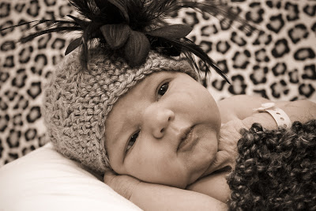
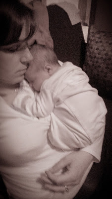
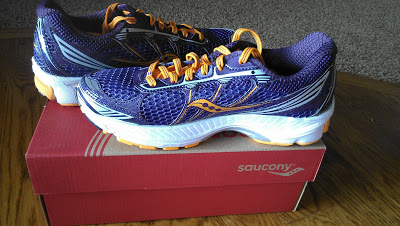
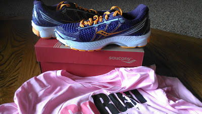
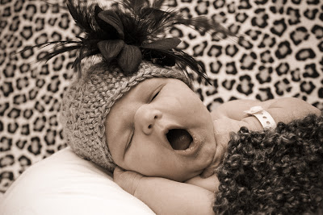

Two weeks ago today, this little angel was born.  
  
  

She's not even 16 hours old in the photograph above. It's hard to believe that two weeks have passed already. I've been trying to soak it all in and enjoy the little things in life right now.   
Newborn skin is so soft. Snuggling is really my highest priority.   
  
  

I know from my experiences with my other two children just how quickly this precious stage passes by so I am really trying to enjoy every moment with my little girl.   
  
Even the middle of the night moments.  
I can't really complain about sleepless nights because on average she's only waking up once a night. I'm probably getting more continuous sleep now then I was when I was pregnant.   
When I was dismissed from the hospital I asked my doctor about when I could resume exercise. He surprised me by saying in about two weeks. I thought he would want me to wait the full six weeks and it was exciting to think that I could start running again so soon.   
Fast forward two weeks and I'm really no where near ready to run. My body is taking it's sweet time trying to heal after delivery and I can't even begin to think about hopping on the treadmill or hitting the pavement outside. Even walking at a good clip or for an extended distance seems impossible.   
So, I'm listening to my body and hopefully will start walking (slowly) this week. I'm feeling a lot better but I don't want to push it. I'll walk first and see how that feels and then add in a little running.   
My first 5K that I would like to run (I'm not saying 'race' here on purpose!) is in May. I'm hopeful that I will have plenty of time to build up the miles to be able to participate in the Mother's Day Girls on the Run 5K.   
  
I'm ready to go whenever my body is. I even have the shoes!  
  
  

  
Last weekend my local running store gave away one of their dry fit shirts with a shoe purchase. I knew exactly what [pair of shoes I wanted](http://amotherspace.blogspot.com/2013_02_01_archive.html#493043346396069152) and I already have one of their dry fit shirts, which I love. It seemed like the perfect opportunity to pick up the shoes that I have been eyeing.   
  
  

  
And just because I can't resist, I'll leave you with another adorable photograph from the hospital.  
  
  

  
  
  

\-------------------------------

  

Find A Mother's Pace on...  
  
Twitter [@amotherspace3](https://twitter.com/amotherspace3)  
  
Facebook [amotherspace3](http://facebook.com/amotherspace3)  
  
Instagram [amotherspace](http://instagram.com/amotherspace)  
  
Pinterest [amotherspace](http://pinterest.com/amotherspace/)  
  
Bloglovin' [A Mother's Pace](http://www.bloglovin.com/en/blog/6680087)  
  
RSS [amotherspace](http://feeds.feedburner.com/amotherspace)
