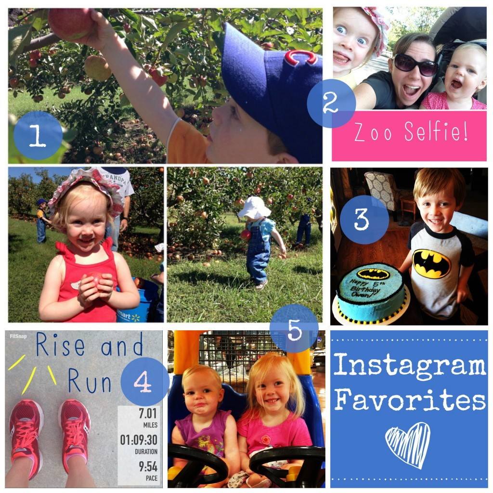

It's finally here! RACE WEEKEND!

We're heading to the Expo today. I've never been to a big city expo and I'm sure it will not disappoint. Tomorrow I'm planning on staying off of my feet as much as possible, checking in to the hotel and then heading out to the Ronald McDonald House pasta party.

We're staying less than a mile away from the start line and I'm so thankful. We could have stayed at my sister's place but it would have meant an hour (at least) on the el. It just means that I have one less thing to organize and worry about the morning of the marathon.

The past couple of weeks have been crazy. We've traveled a few times, had a birthday celebration, spent hours watching the Royals in the playoffs, and on top of all that I've had all of marathon preparation. Here's a look back at some of the fun things that we've been doing throughout it all as shown on my Instagram account.

## Instagram

\[one\] We recently had our second annual trip to the apple orchard. The kids talked about it all year long and were so excited when the day to go again arrived. We picked many, many apples and then made applesauce to last until next year.

\[two\] The nice fall weather that we are having right now means that it's been perfect for zoo trips. We have a membership to our local zoo and take advantage of it a lot. It's nice just to run in and see a few animals when we have a little time.

\[three\] Someone at our house turned 5 recently! Little O is such a special boy and watching him grow and develop his personality over the past 5 years has been a such a blessing. I'm so proud of my little man!

\[four\] Taper week means not running quite as long but I'm still running every morning and waking up early. Well, not this morning. This morning I'm resting for the MARATHON!

\[five\] Grocery shopping with my two girls! These car carts are a life saver and make shopping much more fun for the littles.

 

Follow me on Instagram ----> [here](http://instagram.com/amotherspace).

**Have a great weekend! Tell me something fun that you are planning for the weekend.**

 

I'm running the Chicago Marathon with Team RMHC!

To find out more read my post about [Running for Charity](http://amotherspace.net/2014/06/the-chicago-marathon-running-for-charity/) or head over to my [fundraising page](http://www.kintera.org/faf/donorReg/donorPledge.asp?ievent=1097960&supId=399266070) to make a donation.

——————————-

Find A Mother’s Pace on…

Twitter [@amotherspace3](https://twitter.com/amotherspace3)

Facebook [amotherspace3](http://facebook.com/amotherspace3)

Instagram [amotherspace](http://instagram.com/amotherspace)

Pinterest [amotherspace](http://pinterest.com/amotherspace/)

Bloglovin’ [A Mother’s Pace](http://www.bloglovin.com/en/blog/6680087)

RSS [amotherspace](http://feeds.feedburner.com/amotherspace)
