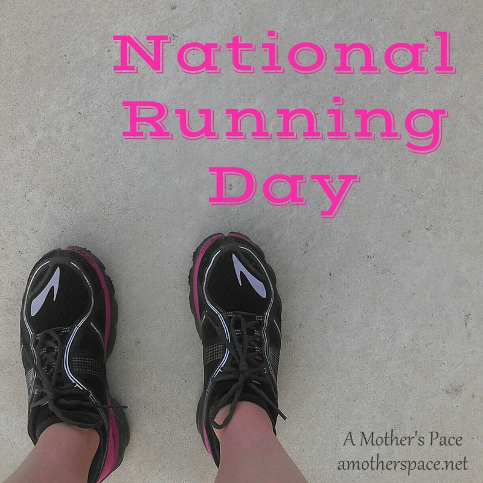
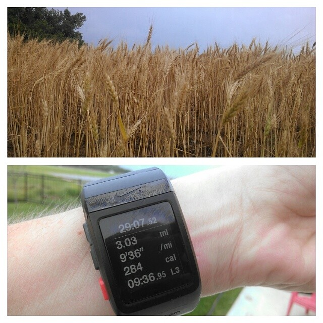
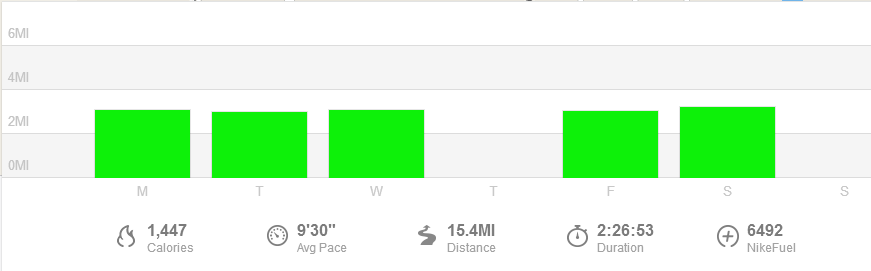
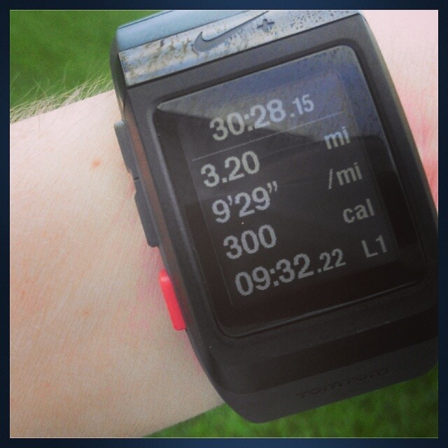

 

Today my Chicago Marathon training officially begins! October seems so far away right now but I have a lot of miles to run between now and then.

After training for my last half with the Own It plan from [Train Like a Mother](http://amzn.to/1un3PgW) (affiliate link) I decided to use the marathon version for this race. I know that it is a difficult plan and it will really challenge me to do my best.

My first day of training calls for an easy 4-5 miles. I'll have 2 easy runs each week, 2 types of speed workout, some cross training and a long run. Not to mention keeping up with strength training and perhaps a little yoga to top it off. Thank goodness I'll have a rest day every Sunday!

And here is a look back at my last week of maintenance running. It was my last week to run just for the run. Run easy, and run however short or long I wanted.

 

 

## Weekly Training Log

  
 **Monday:** 3.1 miles (9:30 pace)

I tried the app Rock My Run today for the first time. Basically, the app gives you playlists with a certain BPM which helps to keep a designated pace during a run. It worked for me. Lately my 'easy' runs have been around a 9:40-9:50. Today it was easy to keep at the 9:30 pace and I wasn't continuously looking at my watch either.  I haven't been running with music at all lately so it was quite a change for me but I liked it enough to keep trying it.

**Tuesday:** 3 miles (9:35 pace) + 20 minutes strength

A super humid run in the morning with an out and back route. I realized after I was about a mile out that I forgot to eat my usual handful of granola before walking out the door. I used to run without eating all the time but for the past several months I have eaten a little bit before running and it seems to give me a lot more energy. I didn't have time for strength when I got back home but I did squeeze it in during nap time in the afternoon.

**Wednesday:** 3.1 miles (9:20 pace) + 15 minutes NTC Ab Burner Core Work

Wednesday is usually my rest day but I can't NOT run on National Running Day. To celebrate I ran my normal route backwards for the first time. It really was like running a new route. Why have I never done this before?

 

 

**Thursday:** 35 minutes Spin Bike +  25 minutes Jillian Michaels Circuit Strength

I woke up to heavy rain, hail and lightning. I was instantly up and ready to go. I wish I could have that kind of an alarm every morning. Because of the weather I was glad that I had planned an indoor workout for the day anyway. I pulled out my Jillian Michaels circuit for a 25 minute strength workout and then jumped on the spin bike for 35 minutes. I love this circuit workout and I need to do it every week. It makes me feel strong.

**Friday:** 3 miles (9:35 pace)

Lack of sleep the night before made getting out the door for this run difficult. But I finally made it and I'm so glad I did. Instead of my feet dragging, like I thought they would, my legs felt light and it ended up being a great run. You just never know how a run is going to go until you are out there on the pavement!

 

 

**Saturday:** 3.2 miles (9:30 pace)

We had 3 inches (!!!) of rain the night before so I thoroughly enjoyed this nice and cool 3 miles.  I decided to keep this a short run so that I am ready to go when training rolls around. My Saturdays will be full of long runs for the next several months.

**Sunday:** Rest Day

 

 

My week of easy running was very even as well! My runs were all about 3 miles and only ranged in pace between 9:20 and 9:35. I'm happy that my 'easy' pace this week was close to a 9:30, that's right where I want it to be at this point.

 

 

One of my main goals for 2014 is to Run This Year in kilometers. That's 2,014 kilometers or 1,251.44 miles.

Weekly Running Miles: 15.4

Weekly Average Pace: 9:30

June Running Miles: 15.4

2014 Running Miles: 521.26

2014 Running Kilometers: 838.89

 

**Is anyone else running Chicago in October? How was your week in workouts?**

——————————-

Find A Mother’s Pace on…

Twitter [@amotherspace3](https://twitter.com/amotherspace3)

Facebook [amotherspace3](http://facebook.com/amotherspace3)

Instagram [amotherspace](http://instagram.com/amotherspace)

Pinterest [amotherspace](http://pinterest.com/amotherspace/)

Bloglovin’ [A Mother’s Pace](http://www.bloglovin.com/en/blog/6680087)

RSS [amotherspace](http://feeds.feedburner.com/amotherspace)
