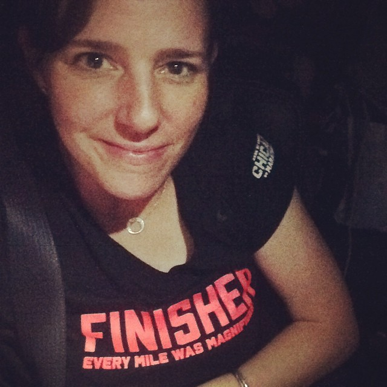
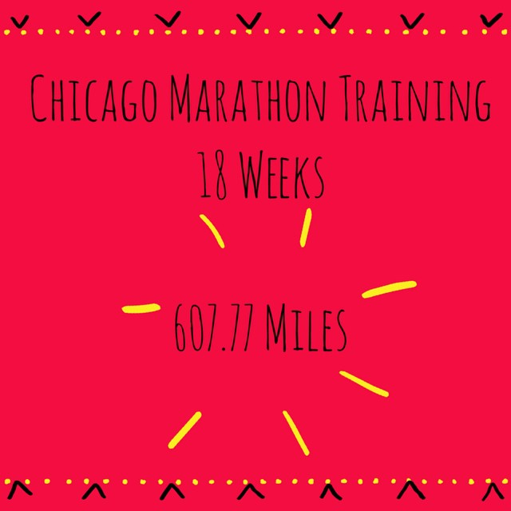
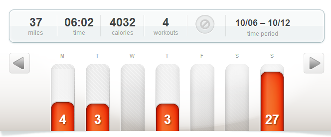
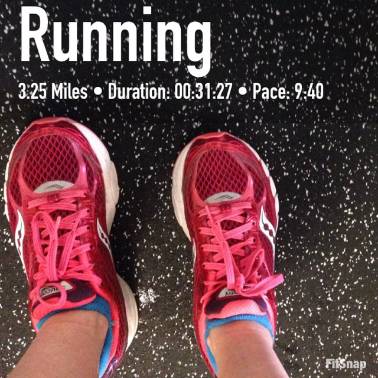

On Sunday I finished my second marathon!

The Chicago Marathon was an incredible experience that I will never forget. Every mile WAS magnificent!I have so much to write about, including the marathon itself, the Expo and running for the Ronald McDonald House so I will have several posts coming up. Today I'm just checking in with my race week training log and I'll continue with more marathon news later this week.

18 weeks and 607+ miles, that's quite a journey. I couldn't have done it without the help and support of my friends and family. My husband deserves a medal of his own for taking over on all the Saturday mornings while I was out running for 2-3.5 hours each week.

I had so many people cheering for me from near and far during the race and that support helped me to cross the finish line. I want to send out a huge thank you to everyone for all of the love on this blog, through Instagram, Twitter, Facebook and in real life.

## **Weekly Workouts**

Chicago Marathon Training: Week 18 

**Monday:** 4.01 miles (9:44 pace) 4 miles in the dark to kick off race week. I'm feeling strong and ready for the race in less than a week.

**Tuesday:**  3.02 miles (9:25 pace)

**Wednesday:** Rest

**Thursday:** 3.25 miles (9:40 pace) 3 hotel treadmill miles on our overnight stop in St. Louis on the way to CHICAGO! The hotel had an extremely tiny fitness room so I'm glad I happened to be the only one using it. I ran 3 miles plus some strides at the end.

 

**Friday:** Rest

**Saturday:**  Rest

**Sunday:** The Chicago Marathon! 26.54 miles (9:54 pace) \[from my Garmin\]

I'll share my official time soon. My tangents were horrible so I ran long and my official pace wasn't under 10 minutes but technically I ran 26.54 miles UNDER a 10 minute pace. That's something that I never dreamed was possible a few years ago!

 

**Who else raced this weekend? How did it go?**

  One of my main goals for 2014 is to Run This Year in kilometers. That's 2,014 kilometers or 1,251.44 miles.

Weekly Running Miles: 36.82

October Running Miles: 59.23

2014 Running Miles: 1,156.57 2014

Running Kilometers: 1,861.32

 

 

 

\_\_\_\_\_\_\_\_\_\_\_\_\_\_\_\_\_

I’m running the Chicago Marathon with Team RMHC!

To find out more read my post about [Running for Charity](http://amotherspace.net/2014/06/the-chicago-marathon-running-for-charity/) or head over to my [fundraising page](http://www.kintera.org/faf/donorReg/donorPledge.asp?ievent=1097960&supId=399266070) to make a donation.

——————————-

Find A Mother’s Pace on…

Twitter [@amotherspace3](https://twitter.com/amotherspace3)

Facebook [amotherspace3](http://facebook.com/amotherspace3)

Instagram [amotherspace](http://instagram.com/amotherspace)

Pinterest [amotherspace](http://pinterest.com/amotherspace/)

Bloglovin’ [A Mother’s Pace](http://www.bloglovin.com/en/blog/6680087)

RSS [amotherspace](http://feeds.feedburner.com/amotherspace)
