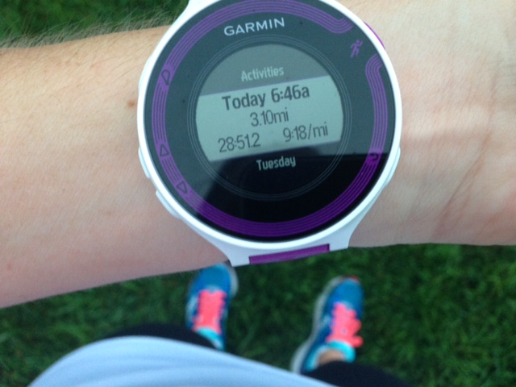
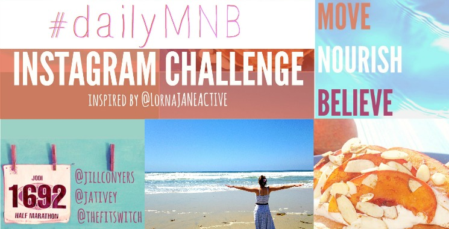
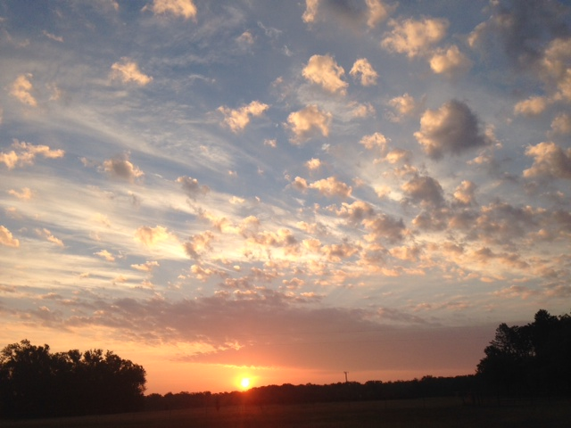
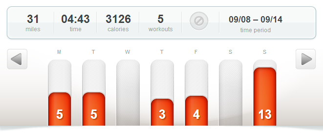

It is now less than a month away from Chicago's start line!

This past week there was a big shift in the weather and in my training. The cooler fall weather is here and I'm loving it, of course. Not only does it feel better to be outside but my paces have dropped dramatically and the effort still feels easy.

 

 

Looking back through my training log, over the summer I would see 1 or 2 runs under a 10 minute mile average pace per week. Last week though every run was between 9:18 and 9:33 for my easy, every day type of run.

How early is too early to start stalking the weather for race day? Now that we are getting closer I know that I will run in any weather condition but my recent paces in cooler weather have me hoping for the perfect race day conditions.

And speaking of perfect race day conditions, yesterday I ran my 8th half marathon. I'll have a recap of the race coming up this week but if you've been following me on Instagram you already know that I ran a perfect race and scored a HUGE PR.

 

Today marks the second day of the #dailyMNB challenge hosted by [Jill Conyers](http://jillconyers.com), Jodi at [Touching Your Heart](http://touchingyourheart.net/blog/ "Touching Your Heart") and Jessica at [The Fit Switch](http://www.thefitswitch.org/ "The Fit Switch") and inspired by Lorna Jane Active. It's a 7 day challenge to share how you move, nourish and believe every day. There's still time to join in on the fun, just hop over to one of the links above to find out more information.

 

 

## **Weekly Workouts**

Chicago Marathon Training: Week 14

**Monday:**  5.10 miles (9:33 pace)

This was my first run with my reflective vest this season. Last year I hardly ran in the dark because it bothered me to be out there alone. For some reason it's not bothering me this year so I'm out in my vest before dawn. Running under the stars is beautiful and as an added bonus you get to see the sunrise every morning.

**Tuesday:**  5.1 miles (9:30 pace)

This was supposed to be a 6 mile tempo run with a 1 mile warm up and cool down. Just as I was heading out the door my son woke up and needed help. By the time I was finished helping him I only had time for 5 miles. I really thought about postponing the run completely until Wednesday but I'm so glad I ran what I could fit in my day. This sunrise alone was worth it!

 

 

**Wednesday:** Rest

**Thursday:**  3.1 miles (9:18 pace)

Today my training plan said "Fun" for my workout. Well, as amazing as it seems to me, at this point in my marathon training running is still my FUN workout. I chose to do a quick 5K loop before starting my busy day with the kids.

**Friday:**  4.2 miles (9:24 pace)

Easy paced run in the neighborhood.

**Saturday:** REST

**Sunday:** Johnston's Half Marathon 13.18 miles (8:56 pace)

 

 

One of my main goals for 2014 is to Run This Year in kilometers. That's 2,014 kilometers or 1,251.44 miles.

Weekly Running Miles: 30.68

September Running Miles: 70.36

2014 Running Miles: 1015.21

2014 Running Kilometers: 1,633.82

 

 

 

**Do you check the weather obsessively before a race or just wake up and run?**

 

\_\_\_\_\_\_\_\_\_\_\_\_\_\_\_\_\_

I’m running the Chicago Marathon with Team RMHC!

To find out more read my post about [Running for Charity](http://amotherspace.net/2014/06/the-chicago-marathon-running-for-charity/) or head over to my [fundraising page](http://www.kintera.org/faf/donorReg/donorPledge.asp?ievent=1097960&supId=399266070) to make a donation.

——————————-

Find A Mother’s Pace on…

Twitter [@amotherspace3](https://twitter.com/amotherspace3)

Facebook [amotherspace3](http://facebook.com/amotherspace3)

Instagram [amotherspace](http://instagram.com/amotherspace)

Pinterest [amotherspace](http://pinterest.com/amotherspace/)

Bloglovin’ [A Mother’s Pace](http://www.bloglovin.com/en/blog/6680087)

RSS [amotherspace](http://feeds.feedburner.com/amotherspace)
