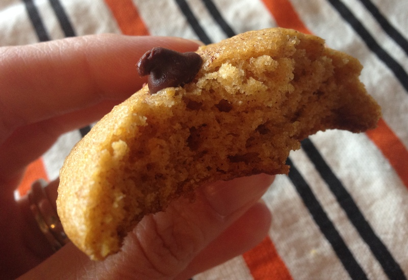

 

Every now and again I like to share one of my favorite recipes here on the blog. And this recipe for Chocolate Chip Pumpkin Cookies is too good not to share. It's one of our favorite cookies to bake and yet for some reason we still only make them in the fall.

 

 

I baked a double batch last week for Halloween and put a few in the freezer to save for later. They are easy to throw together quickly, make your house smell amazing and are just plain yummy.

In fact they are dangerous and I've been known to eat too many after I bake them. Maybe that is why I only make them once or twice a year...

I'm grateful that my sister-in-law shared her mother-in-law's recipe with us and now I'm passing it along to you!

Enjoy!

 

 

## Chocolate Chip Pumpkin Cookies

Ingredients:

1 C. Cooked Pumpkin

1 C. Sugar

1/2 C. Oil

1 Egg

2 C. Flour

2 tsp. Baking Powder

1 tsp. Cinnamon

1/2 tsp. Salt

1 tsp. Baking Soda dissolved in 1 tsp. milk

1/2 tsp. Vanilla

1 C. Chocolate Chips

1/2 C. Nuts, optional

Combine pumpkin, sugar, oil and egg. Stir together flour, baking powder, cinnamon and salt in a different bowl. Add to pumpkin mixture. Dissolve soda in milk; stir into above mixture. Stir in chocolate chips, nuts and vanilla. Scoop spoonfuls onto a greased cookie sheet. Bake at 375 degrees for 10-12 minutes.

 

 

\_\_\_\_\_\_\_\_\_\_\_\_\_\_\_\_\_

I’m running I ran the Chicago Marathon with Team RMHC!

To find out more read my post about [Running for Charity](http://amotherspace.net/2014/06/the-chicago-marathon-running-for-charity/) or head over to my [fundraising page](http://www.kintera.org/faf/donorReg/donorPledge.asp?ievent=1097960&supId=399266070) to make a donation.

——————————-

Find A Mother’s Pace on…

Twitter [@amotherspace3](https://twitter.com/amotherspace3)

Facebook [amotherspace3](http://facebook.com/amotherspace3)

Instagram [amotherspace](http://instagram.com/amotherspace)

Pinterest [amotherspace](http://pinterest.com/amotherspace/)

Bloglovin’ [A Mother’s Pace](http://www.bloglovin.com/en/blog/6680087)

RSS [amotherspace](http://feeds.feedburner.com/amotherspace)
