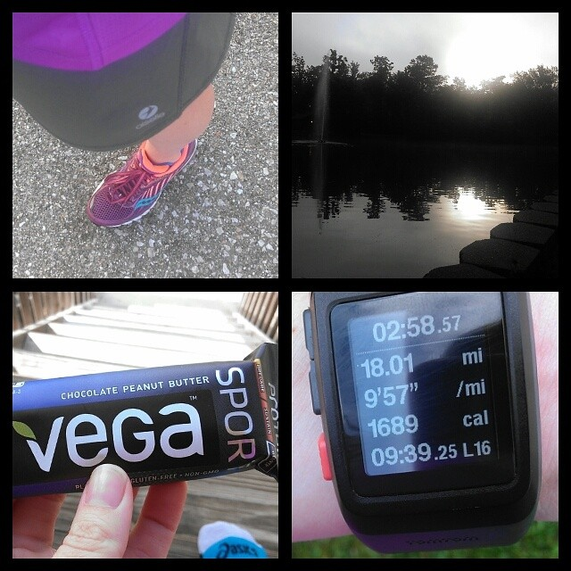
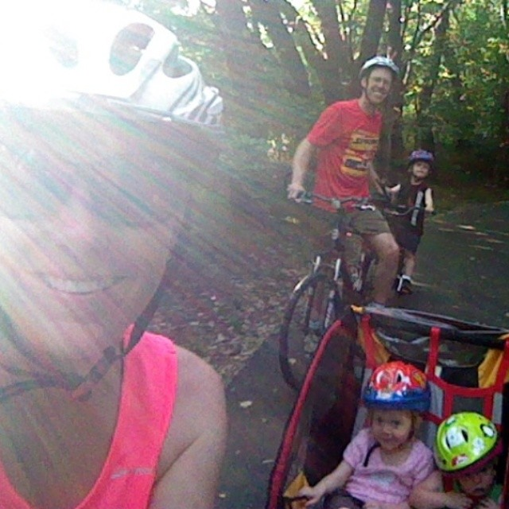
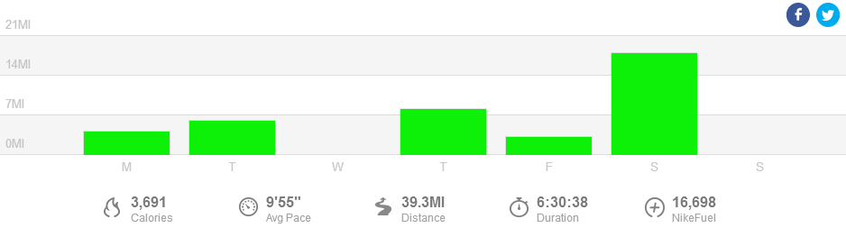

 

A week of cooler weather brought my pace down too. We had an unseasonably cool week last week and I could tell by how easy my pace felt at a faster clip. Most of my runs were in high humidity but with temps starting in the high 50's even the humidity was bearable.

 

\[caption id="attachment\_2577" align="aligncenter" width="640"\] My I[nstagram](http://instagram.com/amotherspace) post from my 18 miler this week.\[/caption\]

 

The highlight of my week was definitely my long run. I had 18 miles on the plan for Saturday. I woke up ready to go. I set out from my house and basically did a huge 18 mile loop. My mind was in the right place for this run.

At mile 16 when I was headed into the wind thoughts of tired legs kept creeping into my head but instead I concentrated on my breathing which was still nice and easy. My average pace for the run was 9:56 and the great thing is that I know I could have gone faster but I wanted to keep my breathing easy throughout to make this an 'easy' effort long run.

This long run gives me so much hope for the marathon. My long runs have been a struggle fest lately and to find out that I can crank out 18 miles and feel like I can keep going is just what I needed to put a spark back in my training!

 

 

## **Weekly Workouts**

 

**Monday:** 4.10 miles (10:16 pace) + 20 minutes Kettlebells and Core Work + 30 minute family bike ride

Hot and humid are good words to describe this run. 70 degrees with 93% humidity is no joke. I was a sweaty mess by the end of this one.

An evening family bike ride is the perfect way to end a day, in my opinion!

 

 

**Tuesday:** 6.01 miles (9:30 pace)

What a difference 10 degrees and a much lower humidity level can make. I went out for this tempo run feeling great the whole time. 4 tempo miles with 1 warm up and 1 cool down mile.

**Wednesday:** 20 minutes Spin Bike + 25 minutes Strength

Cross Day! This week along with the bike I did Jillian Michaels ['Hot Bod in a Box'](http://amzn.to/WyYN5z) Circuit. I hate the name of this workout but I love the workout.

**Thursday:** 8.10 miles (10:10 pace)

My last mile was my fastest of this run. I'm working on finishing strong and running smart. 8 miles in the chilly rain in July? I'll take it!

**Friday:** 3.15 miles (9:34 pace)

Just a nice easy loop through the neighborhood.

**Saturday:** 18.01 miles (9:56 pace)

This was one of THOSE runs. The kind where you feel like you can keep on going even after it's time to stop.

**Sunday:** REST

 

 

 

One of my main goals for 2014 is to Run This Year in kilometers. That's 2,014 kilometers or 1,251.44 miles.

Weekly Running Miles: 39,37

Weekly Average Pace: 9:55

July Running Miles: 103.55

2014 Running Miles: 718.67

2014 Running Kilometers: 1156.59

 

**Do you notice a big change in pace when the weather dips to cooler temps? How do you keep negative talk from sneaking in during a run?**

 

\_\_\_\_\_\_\_\_\_\_\_\_\_\_\_\_\_

I’m running the Chicago Marathon with Team RMHC!

To find out more read my post about [Running for Charity](http://amotherspace.net/2014/06/the-chicago-marathon-running-for-charity/) or head over to my [fundraising page](http://www.kintera.org/faf/donorReg/donorPledge.asp?ievent=1097960&supId=399266070) to make a donation.

——————————-

Find A Mother’s Pace on…

Twitter [@amotherspace3](https://twitter.com/amotherspace3)

Facebook [amotherspace3](http://facebook.com/amotherspace3)

Instagram [amotherspace](http://instagram.com/amotherspace)

Pinterest [amotherspace](http://pinterest.com/amotherspace/)

Bloglovin’ [A Mother’s Pace](http://www.bloglovin.com/en/blog/6680087)

RSS [amotherspace](http://feeds.feedburner.com/amotherspace)
