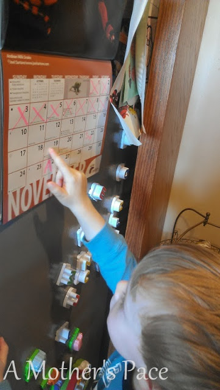
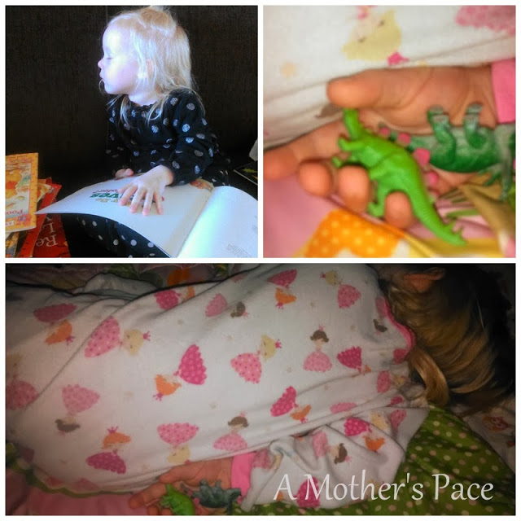
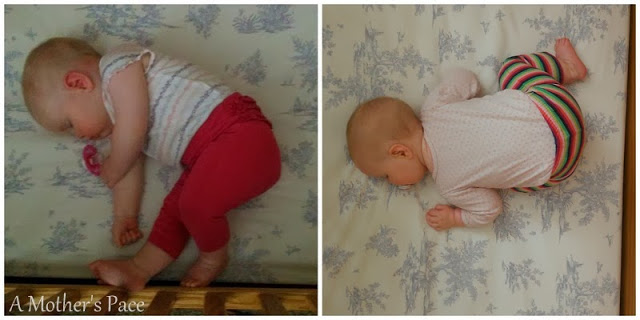
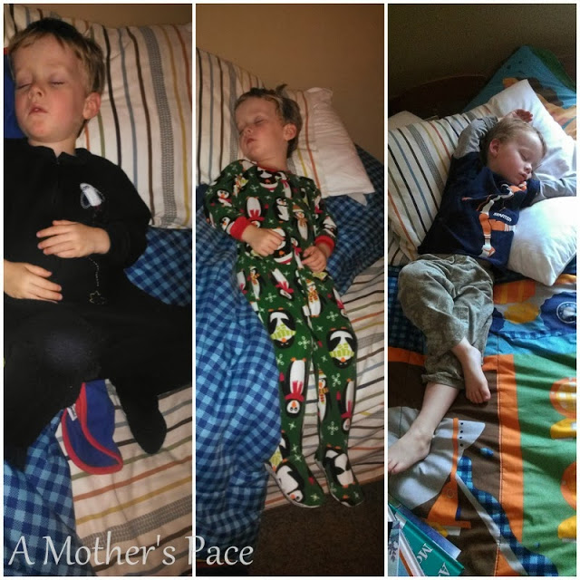
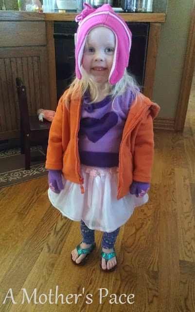
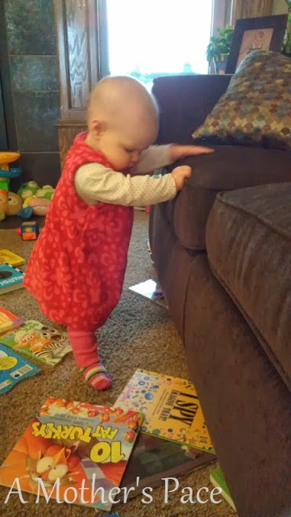

Friday is finally here! We've been counting down the days for a couple of weeks now.  
  

  
Little A's birthday party is this weekend and we have family coming in town to help us celebrate. It will be a busy but fun-filled weekend. We are ready to party!  
  
Friday brings my Friday Five. Five random thoughts of the week!  
  
\[1\]  
I love the peacefulness of running alone in the early morning darkness. There are hardly any distractions. No other people, cars or music just nature and my thoughts.   
  

  
  
\[2\]  
I take way too many sleeping pictures of my children. I can't help it and I also share them with people. Here are a couple a lot from this week.  
  

  

  

  
\[3\]  
Both of my older children love to dress themselves. Most of the time I let them stay in the clothes that they choose. Outfits usually consist of mismatched socks and comfy pants...I mean, who can blame them? This is one of my recent favorites:  
  

  
  
\[4\]  
5K's are hard. It's probably my least favorite racing distance so far. BUT I really want to run one under 25 minutes so I'm going to keep signing up for them and racing them until that happens.   
  
\[5\]  
When did she get so big! Just started crawling and now she's already pulling up on furniture. I'm sure she just wants to keep up with the other two. Nine months old next week!  
  

  
  

**Tell me something random about your Friday.**

  
  

  
\-------------------------------

  

Find A Mother's Pace on...  
  
Twitter [@amotherspace3](https://twitter.com/amotherspace3)  
  
Facebook [amotherspace3](http://facebook.com/amotherspace3)  
  
Instagram [amotherspace](http://instagram.com/amotherspace)  
  
Pinterest [amotherspace](http://pinterest.com/amotherspace/)  
  
Bloglovin' [A Mother's Pace](http://www.bloglovin.com/en/blog/6680087)  
  
RSS [amotherspace](http://feeds.feedburner.com/amotherspace)
