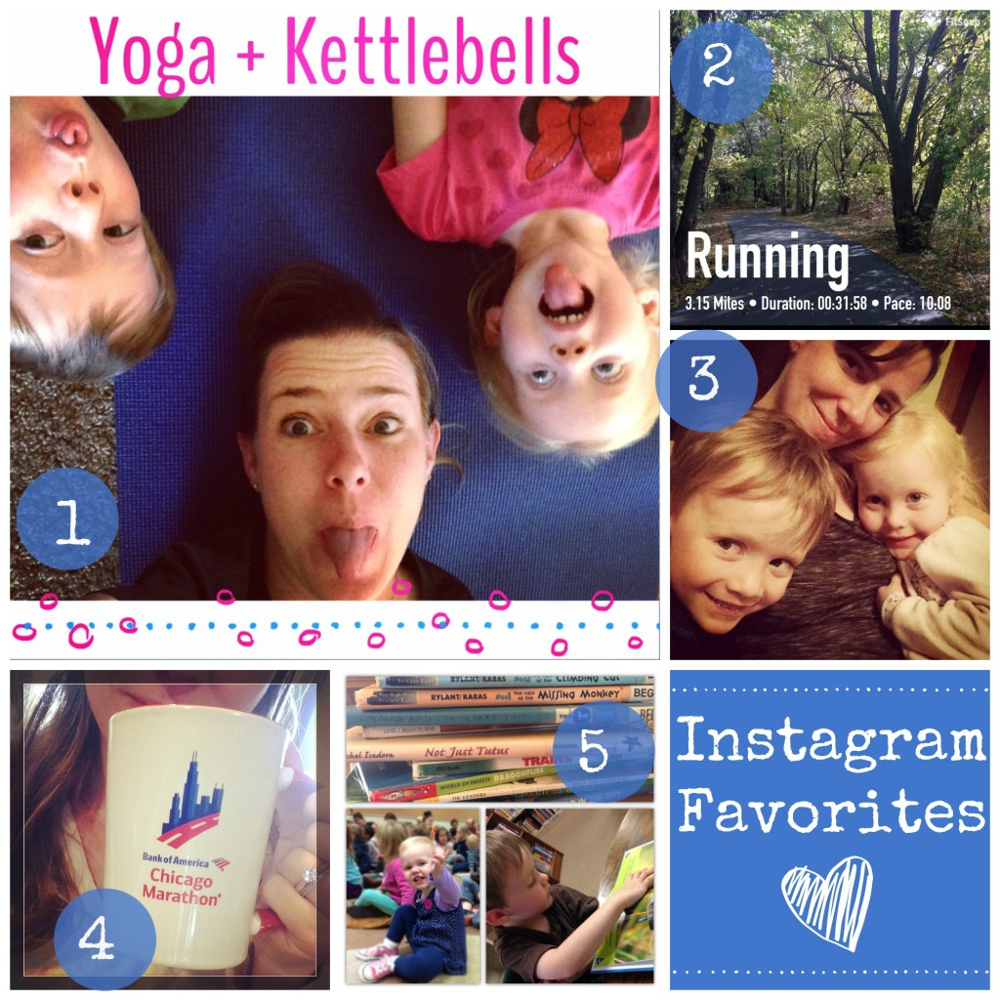
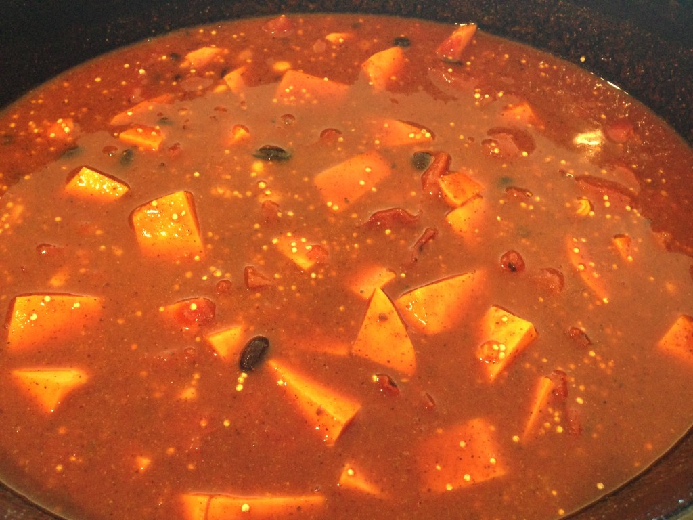

Can we just talk about how cold it got all of a sudden?

 

I took my kids to the dentist on Monday afternoon. While we were waiting for the dentist we talked about playing outside when we got home to enjoy the last little bit of warm weather for awhile. When we left not even an hour later I was shocked to see that the temps had dropped 20 degrees. It was only in the 50's at that point but the wind was horrible. I felt awful that I hadn't put jackets on the kids. Needless to say we played inside before dinner instead of outside.

The other crazy environmental thing that happened here in Kansas this week was that we had an earthquake. Yes, you read that right, an earthquake. In Kansas.

You may be surprised to hear that we have them pretty often in the Midwest but this one was different. I've only felt one other earthquake before and that was a couple of months ago. The earthquake on Wednesday was strong (4.8 magnitude!) and lasted quite awhile. I braced myself while I was standing and watched things shake in my house. I even looked out the window to see if something had happened outside (tornado or plane crash???) before I realized that it was an earthquake. Craziness!

And now on to some of my favorites from the week.

## Instagram

**\[one\]** Yoga + Kettlebells with my little monkeys. They always want to participate when they see me exercising! **\[two\]** My happy place, especially when I've been missing my regular routine of running a lot of miles lately. **\[three\]** Bedtime snuggles are the best. **\[four\]** Brrr...it's cold. Coffee tastes even better in the winter. **\[five\]** Library Story Time is one of our favorite activities of the week. I love to watch Little E participate. She dances and sings to all the songs. And Little O is such a good reader and has been picking up some nonfiction lately. He's teaching me all sorts of facts!

Follow me on Instagram ----> [here](http://instagram.com/amotherspace).

## Interesting Reads

[5 Reasons My Next Race Won't be a Marathon](http://racepacejess.com/5-reasons-next-goal-race-wont-marathon/?utm_content=buffer3266b&utm_medium=social&utm_source=twitter.com&utm_campaign=buffer) by Jess at Race Pace Jess

I like #3 and I'm thinking of trying that out. I'd also add that I promised my husband that I would take a break from marathon running until the kiddos were a little older.

[Tips for Surviving an Ice Bath](http://therunnerdad.com/tips-for-surviving-an-ice-bath/?utm_content=buffera0896&utm_medium=social&utm_source=twitter.com&utm_campaign=buffer) by Matt at The Runner Dad.

I can't say I've braved an ice bath myself but with these tips I just might try it after my next double digit run.

[5 Benefits of Self-Myofascial Release (and why you need to do it daily)](http://www.lovelifesurf.com/benefits-of-self-myofascial-release/?utm_content=bufferf0a29&utm_medium=social&utm_source=twitter.com&utm_campaign=buffer#more-5289) by Christine at Love, Life, Surf.

The foam roller and I have become good friends during this running injury. This article explains the reasons why I should keep it up after I'm feeling 100% again.

[50 Best Running Books of All Time](http://www.runtothefinish.com/2014/11/50-best-running-books-of-all-time.html?utm_content=buffera0fce&utm_medium=social&utm_source=twitter.com&utm_campaign=buffer) by Amanda at Run to the Finish.

Oh boy. I added quite a few books to my to-read list after reading this article!

[A Bitter Sweet Return](http://www.karagoucher.com/a-bitter-sweet-return/?utm_content=bufferfd570&utm_medium=social&utm_source=twitter.com&utm_campaign=buffer) by Kara Goucher.

Kara shares her thoughts on her 2014 NYC Marathon race. It is very insightful and an inspiration read!

## Currently Eating

This week I was searching for a vegetarian slow cooker recipe.We're trying to eat at home more and also cut food costs a little while still buying quality food. All the recipes that looked good in my go-to slow cooker cookbooks have meat in them which brings the $$ up a lot. So I headed over to Pinterest and searched for the perfect recipe. And did I ever find it!

[{Slow Cooker} Mexican Quinoa](http://www.chelseasmessyapron.com/slow-cooker-mexican-quinoa/?utm_content=bufferd6144&utm_medium=social&utm_source=twitter.com&utm_campaign=buffer) from Chelsea's Messy Apron was the perfect find. It was filling and has a lot of our favorite ingredients. Black beans, sweet potatoes, and quinoa plus all the spices of a yummy Mexican dish. The only problem was that the kids didn't really like it because it was a little on the spicy side. We served it with quesadillas, a salad and fresh cut veggies so even though they didn't eat the main dish they still had a healthy meal.

\[caption id="attachment\_2938" align="aligncenter" width="530"\] This was taken before turning on the slow cooker. It thicken up and was delicious over tortilla chips or a bed of lettuce.\[/caption\]

 

That's all for this Friday! Enjoy your weekend, friends!

 

I'm running I ran the Chicago Marathon with Team RMHC!

To find out more read my post about [Running for Charity](http://amotherspace.net/2014/06/the-chicago-marathon-running-for-charity/) or head over to my [fundraising page](http://www.kintera.org/faf/donorReg/donorPledge.asp?ievent=1097960&supId=399266070) to make a donation.

——————————-

Find A Mother’s Pace on…

Twitter [@amotherspace3](https://twitter.com/amotherspace3)

Facebook [amotherspace3](http://facebook.com/amotherspace3)

Instagram [amotherspace](http://instagram.com/amotherspace)

Pinterest [amotherspace](http://pinterest.com/amotherspace/)

Bloglovin’ [A Mother’s Pace](http://www.bloglovin.com/en/blog/6680087)

RSS [amotherspace](http://feeds.feedburner.com/amotherspace)
