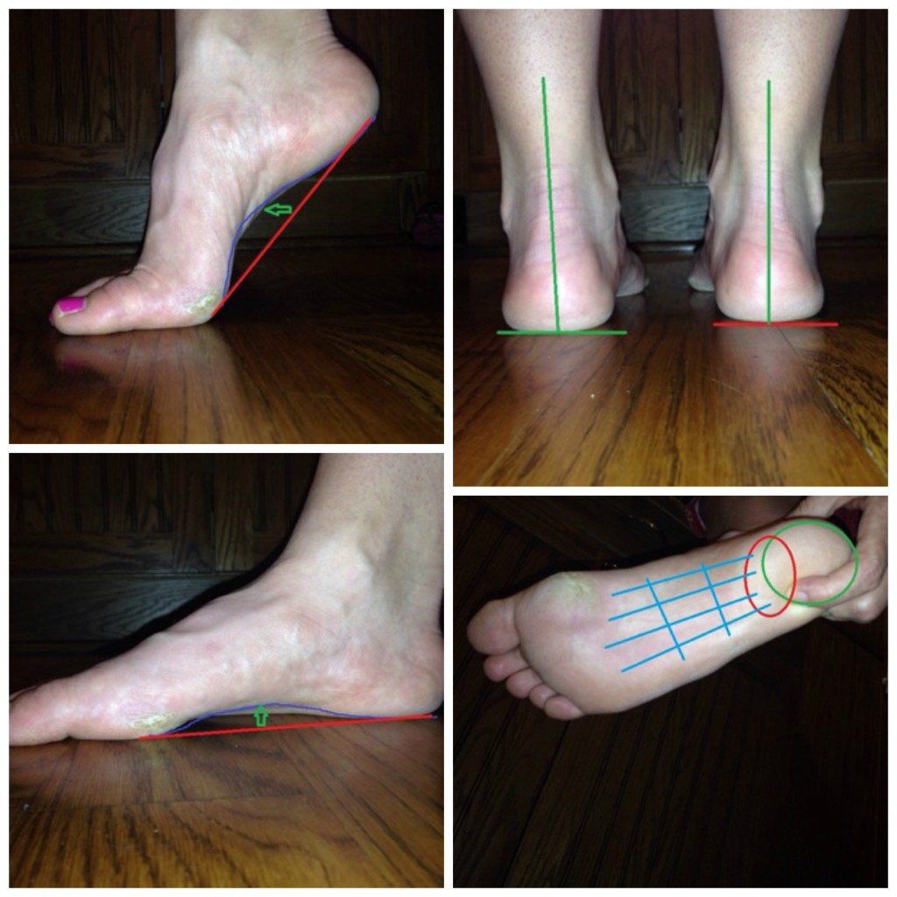
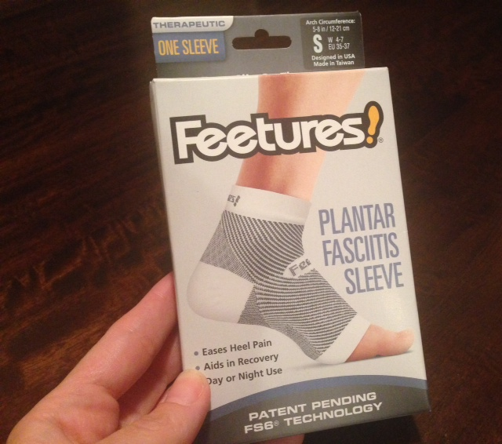

Just writing this post make it real for me but here I am writing about something I've never had to worry about before.

I'm officially injured with plantar fasciitis. (PF)

PF is something that I've always heard about from other runners and to be honest it always sounded awful. I've breezed through life with only minor injuries (chafing, back pain in high school cross country, and my knees hurt a few years ago when I tried a walk/run method with friends) but nothing significant.

During the [marathon](http://amotherspace.net/2014/10/2014-chicago-marathon-race-recap/ "2014 Chicago Marathon Race Recap") two weeks ago I had a callous on the inside of my right foot below my big toe, you can see the remains of it in the lovely runners feet photos below. It ended up bothering me while I was racing. I deliberately didn't do anything about it ahead of time because I didn't want it to become infected before the marathon. And it didn't bother me anyway, at least before the marathon it didn't bother me.

I could tell while I was running that I was adjusting my stride and foot strike so that the callous would hurt less. After 26.2+ miles of doing this it just became too much for my poor little foot. My heel and the outside of my foot stretching to my toes throbbed after the run and really my whole right side felt off. I was limping but it slowly started to feel better after several days.

I tried my first run after the marathon with 4 days of rest. I only got about 3/4 of a mile before my heel started hurting. At this point I didn't even consider PF but just decided I must have bruised my heel and that I would try running every other day. This seemed to work because my next run was pain free (yay!) but then my next one after that was painful again. After that run I knew that something was seriously wrong and started to suspect PF.

I posted about being injured on Instagram, which automatically forwards to Twitter, which is where a physical therapist found me. [Lissa](https://twitter.com/LissaB24) is from South Africa and took a lot of time with me to answer my questions, look at pictures of my feet and give me treatment options. All for free. I'm still amazed by how much she helped me.

 

 

She recommended rest, daily stretches, rolling my foot on a frozen water bottle and then rolling it on a tennis ball several times a day. The ice bottle feels amazing. She also recommended wrapping my foot and possibly buying an insert for my shoe and a splint to wear at night. It's all very time consuming but I want this to heal quickly so I can get back out there to run like I want.

I also stopped by a local running store to look for inserts for my shoe and ended up talking with an employee that is also a runner, of course. She had some great advice and actually recommended that I stay a little active. Go on a 10 minute walk or run a little bit at a time. She also recommended that I start with the Feetures Plantar Fasciitus Sleeve. She has had PF before and it was good to hear advice from someone that has dealt with it.

 

 

I bought the sleeve and it has already helped so much. My foot feels stronger with the sleeve on and, fingers crossed, I'm hoping that the sleeve, along with rest and stretching, will help me get back to running soon.

So that's where I'm at right now. I'm still deciding if I need to see a doctor about my foot or if doing the stretches and therapy that Lissa recommended will be enough for me.

 

## **Weekly Workouts**

**Monday:** Rest

**Tuesday:**  3.01 miles (9:49 pace)

Pain free until about mile 2 today. I really thought I was all better but then knew something was really wrong when the pain started up again.

**Wednesday:**  Cycling: 6 miles with Little A & Little E in the trailer (~ 60 lbs)

**Thursday:**   20 minutes Spin Bike + 10 Minutes Core Work

**Friday:**   20 minutes Spin Bike + 20 minutes Strength

**Saturday:** Rest

**Sunday:** Rest

 

One of my main goals for 2014 is to Run This Year in kilometers. That's 2,014 kilometers or 1,251.44 miles.

Weekly Running Miles: 3.01 (9:49 pace)

October Running Miles: 67.26

2014 Running Miles: 1,164.04

2014 Running Kilometers: 1,873

 

 

**Have you struggled with PF? How did you heal it?**

\_\_\_\_\_\_\_\_\_\_\_\_\_\_\_\_\_

I’m running I ran the Chicago Marathon with Team RMHC!

To find out more read my post about [Running for Charity](http://amotherspace.net/2014/06/the-chicago-marathon-running-for-charity/) or head over to my [fundraising page](http://www.kintera.org/faf/donorReg/donorPledge.asp?ievent=1097960&supId=399266070) to make a donation.

——————————-

Find A Mother’s Pace on…

Twitter [@amotherspace3](https://twitter.com/amotherspace3)

Facebook [amotherspace3](http://facebook.com/amotherspace3)

Instagram [amotherspace](http://instagram.com/amotherspace)

Pinterest [amotherspace](http://pinterest.com/amotherspace/)

Bloglovin’ [A Mother’s Pace](http://www.bloglovin.com/en/blog/6680087)

RSS [amotherspace](http://feeds.feedburner.com/amotherspace)
