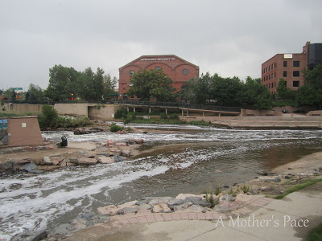
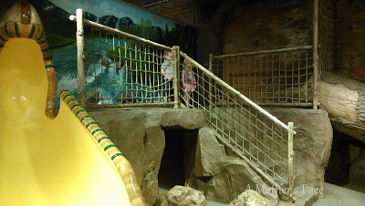
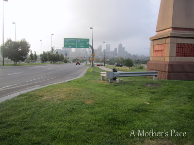
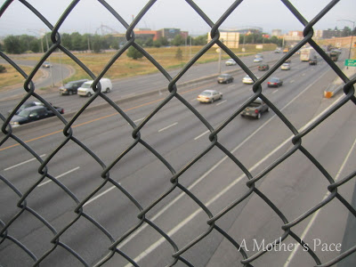
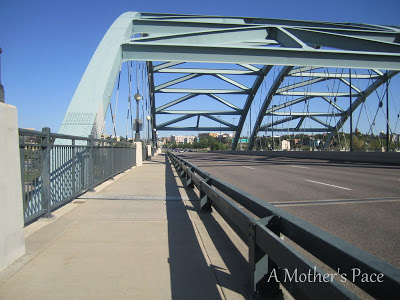
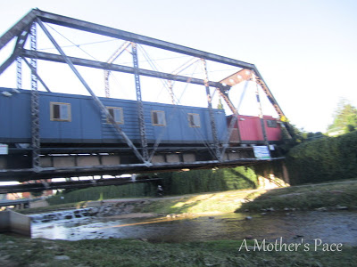
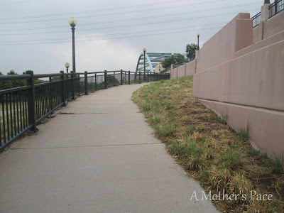

Even though I missed two regular runs and a short 1 miler on [vacation last week](http://bit.ly/166Dwyz) I only missed my mileage goal by 5 miles. Because I had missed a couple of planned runs and I don't like doing speed work in unfamiliar places, I just decided to run easy for the time allotted. I ended up running longer and adding a little mileage that way.  
  
Several years ago when I was in Denver at the REI I noticed a lot of people going behind the store to cycle on a path. I didn't really check into it at the time but I remembered it during this trip.   
  

  
Our hotel was very close to the REI so I googled the area to see if any running paths came up. Sure enough, I discovered the Cherry Creek Path.   
  
On a side note, I love REI and so do the kids. We had a leisurely stroll through the store one morning. The kids got to play on this:  
  

  
and I was able to buy watermelon and grape NUUN (which I've been dying to try) and a new baby carrier for Little E.   
  
Back to running.  
  

  
The path was about a half mile from my hotel.  
  
I had to run over Highway 25 and I'm surprised by how much I didn't like running on the bridge. It really freaked me out when a semi was barreling down the road at me even if it was below me.  
  

  
This bridge I enjoyed. Denver definitely has unique bridges.  
  

  
The first morning that I ran I was out the door by 6 and finished by 7. There were a ton of runners on the path and just a few cyclists.   
  
The second morning I ran a little later. I was at the path around 7 and that time there were a ton of cyclists and only a handful of runners. I loved seeing all the people biking to work. They were really easy to spot in dressy clothes and usually no helmet (at least the women) while the serious cyclists had on all the cycling gear.  
  
There had been flooding recently in Denver so the path was a little rustic and I even encountered a little street sweeper. (Is that what you call it when it cleans a sidewalk??)   
  
The path is lower than the streets so that you are running under a lot of bridges. There were a few train bridges that my 3 year old loved hearing about after I got back to the hotel.  
  

  
And because the path was lower I had to run up this beauty towards the end of my run.  
  

  
I was a little short on the amount of running in Colorado and I really wanted to run on some trails. I am glad that I was able to get out a little and find an area with a lot of other runners.  
  
  

**How do you decide where to run when traveling? Have you ever ran or biked on the Cherry Creek path?**

  
  
  

\------------------------------------------

  

  
Find A Mother's Pace on...  
  
Twitter [@amotherpace3](https://twitter.com/amotherspace3)  
  
Facebook [http://facebook.com/amotherspace3](http://facebook.com/amotherspace3)   
  
Instagram [amotherspace](http://instagram.com/amotherspace)  
  
RSS [amotherspace](http://feeds.feedburner.com/amotherspace)
