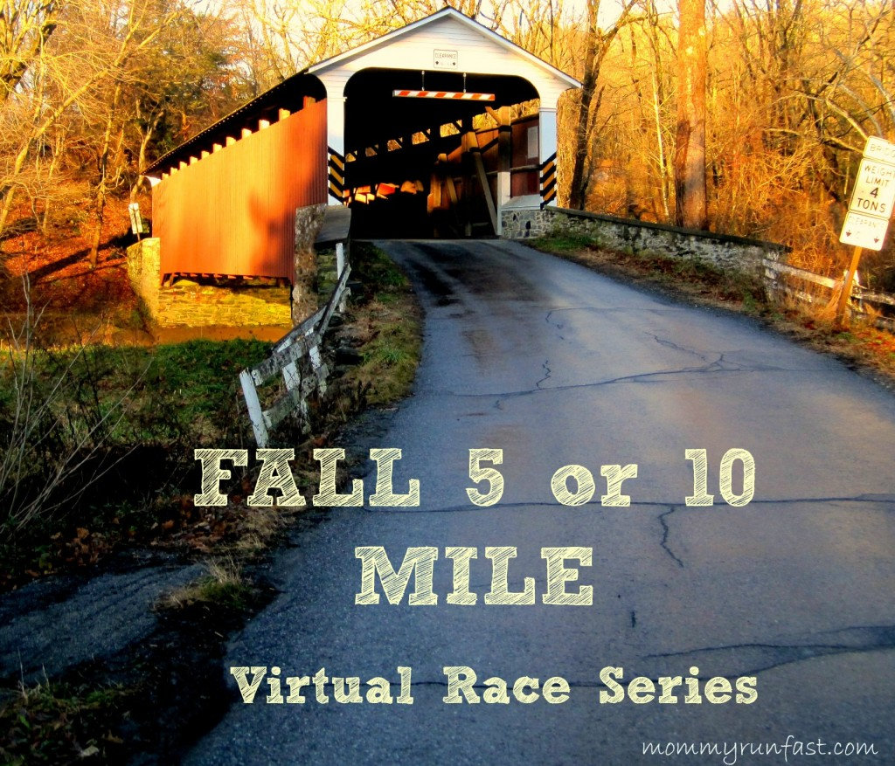

  

  
I've been participating in [Laura](http://www.mommyrunfast.com/)'s Fall 5 and 10 Virtual Race Series for the past couple of months. Each month by the 5th we are supposed to run either 5 miles or 10 miles for the race. Initially I thought I would run a mixture of 5 and 10 milers for the series but I've decided that I want to just stick with tracking the 5 milers. My goal is to keep decreasing my time and so far I've done just that!  
  
My training called for 5 'fast' miles on November 1st so it worked out well to fit this in. I ran after my husband got off work and left the house about 5:30. To run anywhere outside my neighborhood I have to take a narrow road that doesn't really have much of a shoulder to run on. I won't run on it during rush hour and staying in my neighborhood for 5 miles isn't a good option either. I ended up driving over to a friend's house to park my car and headed out from there.   
  
It took forever for my satellite to load so I ended up walk/jogging for about a half mile to warm up. Then I took off. The first month my pace was 9:31 and my second month was 9:21. I've been running a little faster lately so I was pushing for a 9 minute mile this time around.   
  

  
I felt great and when the first mile beeped at me I decided to slow it down just a little. Overall my pace was very steady and I was able to feel what the 9 minute pace 'feels' like. I'm happy that lately I'm able to just dial into a pace and hold onto it for a run.  
  
I ran an out and back as the sun was going down. When I turned around and saw the sun shining through the fall leaves I knew I had to take a quick picture.   
  

  
These early evening fall runs I've had lately are easily becoming some of my favorites. The light is so pretty at that time of day and crunching on the leaves isn't bad either.  
  

  
Distance: 5 miles  
Time: 44:48  
Average Pace: 8:57  
  
Read more about my first two runs from the 5 and 10 Virtual Race Series. [**September's Race**](http://amotherspace.blogspot.com/2013/09/a-labor-day-bestrun-5-and-10-virtual.html#.UnfpWPlQEYk). [**October's Race**](http://amotherspace.blogspot.com/2013/10/octobers-fall-5-and-10-virtual-race.html#.UnfpTflQEYk).  
  

**Have you participated in a virtual race before?** 

\------------------------------------------

  
Find A Mother's Pace on...  
  
Twitter [@amotherspace3](https://twitter.com/amotherspace3)  
  
Facebook [amotherspace3](http://facebook.com/amotherspace3)  
  
Instagram [amotherspace](http://instagram.com/amotherspace)  
  
Pinterest [amotherspace](http://pinterest.com/amotherspace/)  
  
Bloglovin' [A Mother's Pace](http://www.bloglovin.com/en/blog/6680087)  
  
RSS [amotherspace](http://feeds.feedburner.com/amotherspace)
