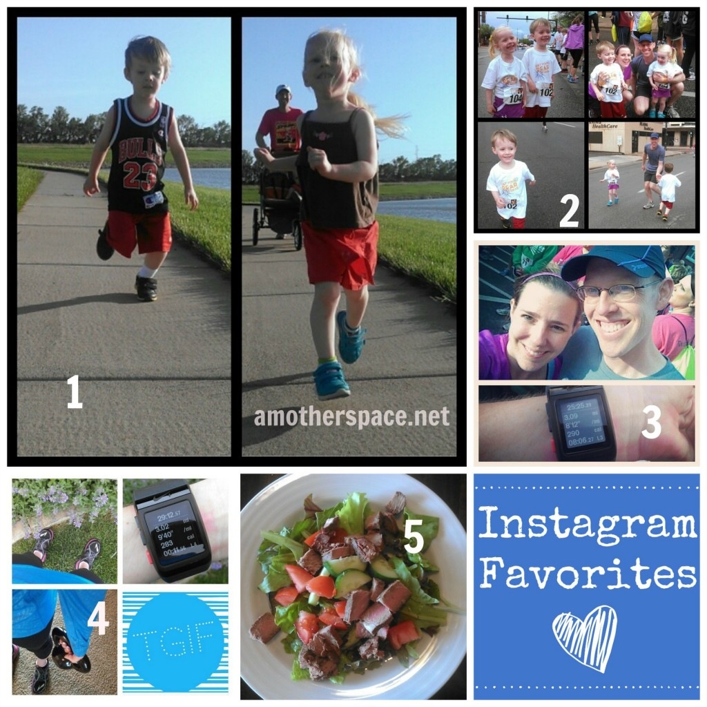
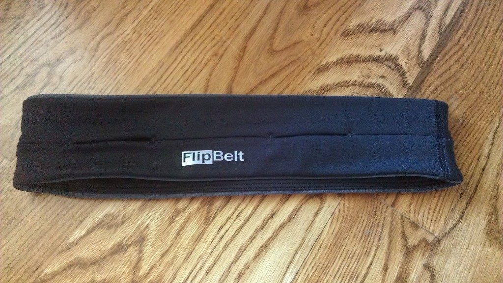

TGIF! It's Friday and this was our first full week of summer. Why does it always seem like a shorter week is actually longer? We didn't have a lot of plans and enjoyed spending time at home. I've been chipping away at cleaning projects this week and just enjoying my family.

Today I'm popping in to share some of my favorites from Instagram, a few other bloggers and one of my new favorite running items.

## Instagram

My top 5 favorite Instagram photos lately. \[1\] My son and daughter during one of their 'training' sessions before a 1-mile race last weekend. \[2\] A collage from the 1-mile race. The kids had a blast and did a fantastic job! \[3\] My husband and I before the 5k. I now have a new 5k PR! \[4\] Kettlebells are my new favorite cross training workout. They are fun and a lot tougher than I imagined. \[5\] Lunch. My favorite combo lately is lettuce, tomato, cucumbers and whatever other farmer's market finds we have for the week plus some locally raised steak.

Are you on Instagram? Find my account ----> [here](http://instagram.com/amotherspace).

 

## Running Training Tips

 

Sarah from [Run Far Girl](http://runfargirl.com/2014/05/23/training-you-can-trust-how-i-ran-a-23-minute-pr-in-the-marathon/) shares tips on how she ran a 23 minute (!!!) marathon PR recently.

[Pilates for Runners: 6 Exercises to do at Home](http://www.mommyrunfast.com/pilates-for-runners-6-exercises-to-do-at-home/?utm_content=buffer86555&utm_medium=social&utm_source=twitter.com&utm_campaign=buffer) by Laura at Mommy Run Fast. I love breaking it down into 6 moves that I can remember easily.

[2 Awesome Strength Workouts for Runners](http://www.accordingtoelle.com/2014/05/2-awesome-strength-workouts-for-runners/?utm_content=buffer29e03&utm_medium=social&utm_source=twitter.com&utm_campaign=buffer) by Elle at According to Elle. Need I say more? I'm always looking for new strength workouts.

[Push-Pull Kettlebell Workout](http://blondeponytail.com/2014/05/push-pull-kettlebell-workout/?utm_content=buffer065a0&utm_medium=social&utm_source=twitter.com&utm_campaign=buffer) by Jess at Blonde Ponytail. This one is perfect for me right now. I'm loving those kettlebells!

 

## Running Gear

 

Before my last half marathon I was unable to wear my hydration pack (which is what I usually carry gels in while running) and when I saw a [FlipBelt](http://amzn.to/1tUswBf) at the race expo I knew I had to try it out. I usually don't recommend trying something new like this on race day but I was desperate. And it ended up working out perfectly. I stored my gels in the belt and was able to fish them out successfully during the race.

 

 

Now I run with the FlipBelt every time I go out. I have since started putting my phone in the belt which is much better than strapping it onto my arm. There is no jiggling and everything stays in place. Does this sound too much like an advertisement? I purchased my own product and just wanted to share something that I'm loving with you. Click the affiliate link above to find out more.

And there you have it, some of my favorites from the week. I hope your Friday is going well and you have a fantastic weekend!

 

**What is your favorite running gear right now? Have you tried the FlipBelt?**

 

——————————-

Find A Mother’s Pace on…

Twitter [@amotherspace3](https://twitter.com/amotherspace3)

Facebook [amotherspace3](http://facebook.com/amotherspace3)

Instagram [amotherspace](http://instagram.com/amotherspace)

Pinterest [amotherspace](http://pinterest.com/amotherspace/)

Bloglovin’ [A Mother’s Pace](http://www.bloglovin.com/en/blog/6680087)

RSS [amotherspace](http://feeds.feedburner.com/amotherspace)
