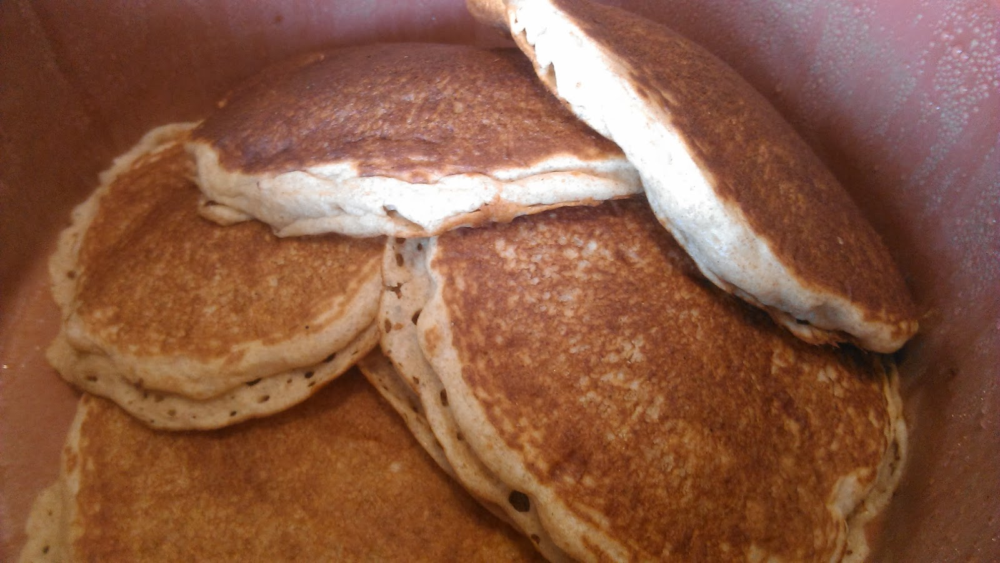
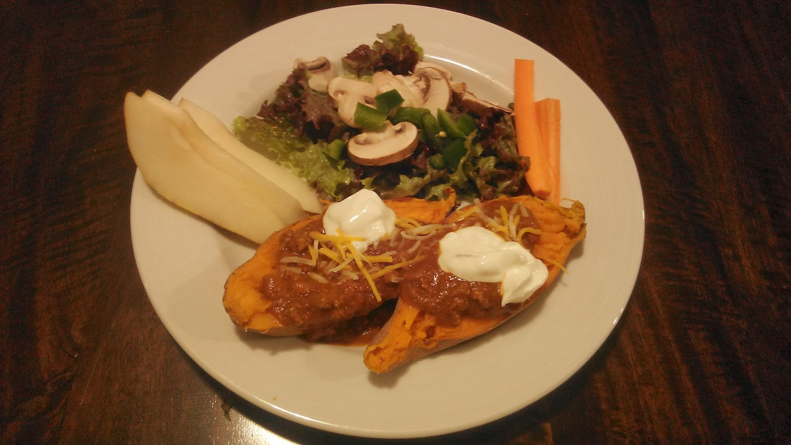
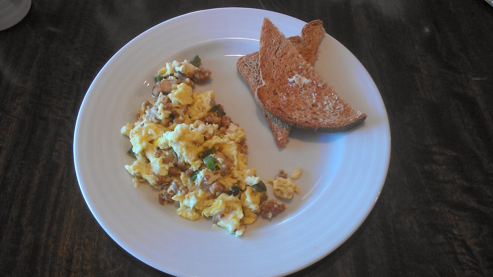
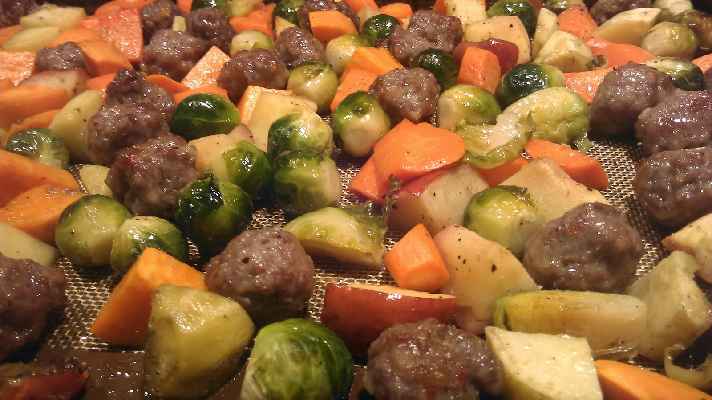
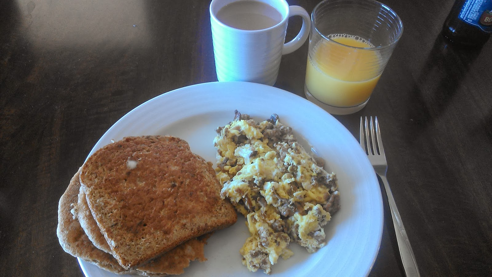

It's been a crazy, busy, exciting week. For those of you who read [Friday's post](http://amotherspace.blogspot.com/2014/01/she-is-fierce.html#.UtGLXPRDtSf) about my niece, she's doing great. The transplant went well on Friday night. She still has a tough road ahead of her but she is a little warrior! 

  

This past week included some of my favorite meals to eat. It's nice to fall back on the ole faithfuls when life is busy.

  

\[weekend breakfast\]

Whole wheat pancakes are the best on a lazy Saturday morning. My husband just got this great warmer for Christmas from the kids so he could sit and eat with us instead of serving us hot pancakes.

  

  
\[dinner\]  
One of my new favorites. Sweet potato topped with chili. If you haven't tried this yet, do it. I was surprised at how delicious it was.  
  
  

  
\[breakfast\]  
Eggs with sauteed portobello mushrooms, green peppers and sausage. I used the left overs from homemade pizza toppings for my eggs this week. Both Little E and I enjoyed them almost every morning.  
  
  

  
\[dinner\]  
On the menu last week was [Sausage Bake](http://amotherspace.blogspot.com/2013/10/sausage-bake.html#.UtB2m_RDtSc). It's different every time because I throw whatever veggies we have on hand in the pan. This week it was carrots, brussels sprouts, sweet potato, apple and sausage. Don't leave out the apple, it makes the meal!  
  
  

  
\[post run meal\]  
This meal was my first of the day and was eaten at 11:00. I woke up ate a handful of homemade granola and headed out the door for a 6 mile run. When I came home I foam rolled, showered, nursed my daughter and suddenly it was 11. Needless to say I ate a huge meal and felt much better after getting something in my stomach!  
  
  

  
  
Here's my plan for next week.  
  
\[monday\]  
Pork Chops  
  
\[tuesday\]  
Tacos  
  
\[wednesday\]  
Angel Hair Pasta Casserole from the freezer  
  
\[thursday\]  
Leftovers  
  
\[friday\]  
Chicken with Sweet Potatoes and Green Beans  
  
\[saturday\]  
Homemade Pizza   
  
\[sunday\]  
Taco Soup  
  
  

**What do you like to eat post run (or other exercise)? What is your go-to meal lately?**

  
  
  

\-------------------------------

  

Find A Mother's Pace on...  
  
Twitter [@amotherspace3](https://twitter.com/amotherspace3)  
  
Facebook [amotherspace3](http://facebook.com/amotherspace3)  
  
Instagram [amotherspace](http://instagram.com/amotherspace)  
  
Pinterest [amotherspace](http://pinterest.com/amotherspace/)  
  
Bloglovin' [A Mother's Pace](http://www.bloglovin.com/en/blog/6680087)  
  
RSS [amotherspace](http://feeds.feedburner.com/amotherspace)
