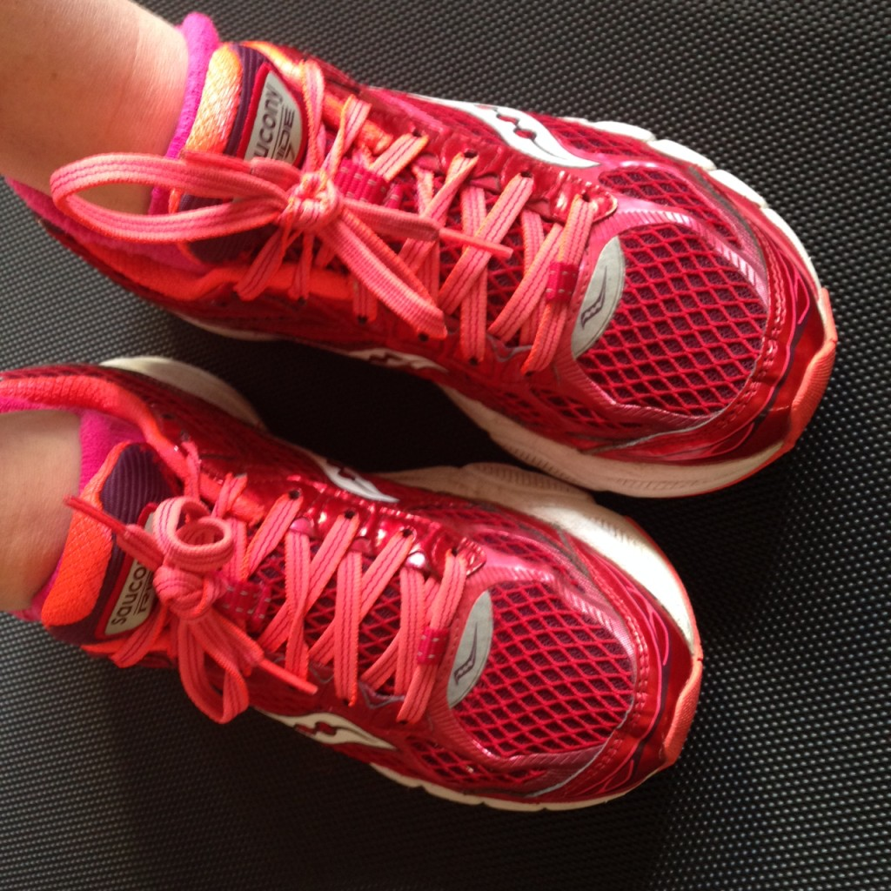
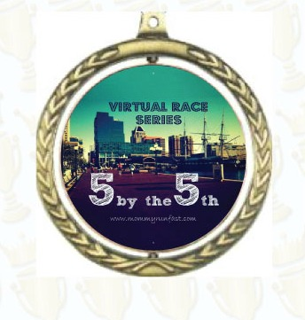

It's time for my favorite virtual race of the year! Laura over at [Mommy Run Fast](http://www.mommyrunfast.com/) hosts the 5 by the 5th race each year and I'm participating in it once again in 2015. The runners that have signed up for the race choose if they want to run a 5k, 5 miles or a combination by the 5th of each month. It runs from February through May.

A year ago when I ran the 5 by the 5th virtual race I ran my 5k personal best at 24:38 which is an 8:03 pace. I call this my PB instead of my PR because it wasn't at an official race. My PR in the 5k distance is 25:38 as of last May at one of our local 5k races.

Initially when I thought about this virtual race series I wanted to improve my 5k time from last year but running 3.1 miles at that pace is very intimidating to me right now. Instead I'm deciding to do my best for the fitness that I am right now and try and improve on that over the next couple months of the series.

That makes much more sense, right?

One resource that I will reference throughout the next few months is Tina Muir's [guest post](http://www.mommyrunfast.com/how-to-train-for-a-faster-5k-2/) over at Laura's blog called How to Train for a Faster 5k. Tina, an elite runner that also blogs over at [Fuel Your Future with Tina Muir](http://tinamuir.com/), shared five workouts for a faster 5k. Perfect timing!

So how did my first 5 by the 5th race of 2015 go? Ugh, it was hard and not as fast as I wanted but it gives me a good baseline as to how I want to improve over the next few months.

I ran the 5k during the week in the morning which meant that it was on the treadmill. As much as I would prefer to run these virtual races out on the street I am not running outside in the early morning right now mainly because of the darkness. So I hit the treadmill instead.

I ran a mile warm up in 9:32. Stopped for a drink of water. (I'm not coordinated enough to drink water from a water bottle on the treadmill. Maybe a bottle with a straw would be easier?) Then started back up for the 5k. I started at 7.0 speed on my 'mill, which is an 8:34 pace. Ideally, this was the pace that I wanted to hold for the entire 3.1 miles.

That didn't happen.

After about a mile in I had to slow it down. I punched in 6.5 (9:14 pace) and held that for awhile before jumping back up to 7.0. I did this back and forth pace for the remainder of the run except in the last quarter mile I pushed the pace up to 7.5 (8:00 pace) for a strong finish.

After I finished the 5k, I started my cool down. In total I ran 5 miles with an average pace of 9:03.

It completely showed on this run that I haven't done any formal speed work since training for the Chicago Marathon. Yikes! Of course I've done an occasional fartlek workout or 400 repeats here and there but this run has convinced me to add it into my weekly rotation!

 **Are you participating in the 5 by the 5th virtual race? Do you run speed work every week?**

**\[bctt tweet="#5bythe5th Virtual Race Recap! | A Mother's Pace #runchat "\]**

——————————-

Find A Mother’s Pace on…

Twitter [@amotherspace3](https://twitter.com/amotherspace3)

Facebook [amotherspace3](http://facebook.com/amotherspace3)

Instagram [amotherspace](http://instagram.com/amotherspace)

Pinterest [amotherspace](http://pinterest.com/amotherspace/)

Bloglovin’ [A Mother’s Pace](http://www.bloglovin.com/en/blog/6680087)

RSS [amotherspace](http://feeds.feedburner.com/amotherspace)
