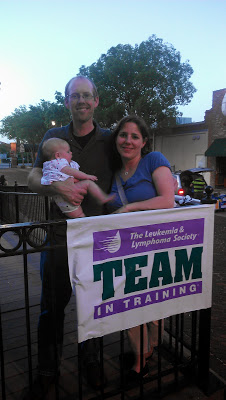

The Fall season of Team in Training (TNT) has officially kicked off. The party last week had a big turn out and it looks like we'll have a bunch of people running and raising money for the Leukemia and Lymphoma Society (LLS).   

  

  

It's amazing to me how strong honor patients are. Our special honor patient spoke at our kick off party and at the end of her emotional speech she actually said, "Let me know if there is anything I can do for you." She is going through so much with Chemo (and a list of things I can't even imagine!) but she appreciates the runners raising money so much that she offers her help. Yes, amazing, just amazing. 

  

  

Another speaker that evening said to "Find your WHY." This really stuck with me and was (unfortunately) very easy for me to answer. 

  

My WHY is for my niece who is currently 9 years old and undergoing maintenance chemo as she deals with leukemia for the **second** time.

  

My WHY is for my grandma who lost her life to leukemia weeks after I completed my first full marathon with TNT in 2010.

  

My WHY is for my husband's uncle who recently was diagnosed with lymphoma.

  

My WHY is for the others. All the children and adults battling a blood cancer that I have met through my journey with TNT over the past several years. 

  

Too many 'WHY's' as far as I'm concerned and so I have decided to once again join my fellow TNT teammates for another season.

  

I'm running TWO half marathons with TNT and I'll share more soon about my training plan(s) which have already started!

  

  

  

I'd love to hear from you. 

  

Are you a TNT Alumni?

  

Have you ever ran a race through a charity?

  

  

  

_While I am excited to raise money for LLS, I'm not going to make A Mother's Pace all about fundraising. That said, I am running with Team in Training for the next few months and so I'm sure I'll be writing about it. It's a wonderful experience and I know I will want to share events and TNT happenings with you. To learn more about Team in Training or LLS visit http://teamintraining.org_

  

  

  

  

  

  

\------------------------------------------

  

  
Find A Mother's Pace on...  
  
Twitter [@amotherpace3](https://twitter.com/amotherspace3)  
  
Facebook [http://facebook.com/amotherspace3](http://facebook.com/amotherspace3)   
  
Instagram [amotherspace](http://instagram.com/amotherspace)  
  
RSS [amotherspace](http://feeds.feedburner.com/amotherspace)
