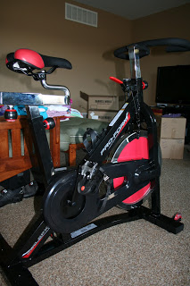
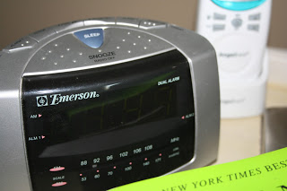

I can be very motivated during a training cycle. When I hear a 5:30 alarm while training it doesn't make me happy to get out of bed but I do get out of bed. This week I am not 'training' for a big distance race and I've found the snooze button.   
  
  
Twice I missed my morning run this week because 5:30 seemed entirely too early.   
  
  
I hit the snooze on Saturday because my husband and I stayed up late watching a movie (Girl with the Dragon Tattoo.) Only after we rented it (through Amazon) did we find out that it is ridiculously long. I surprised myself by staying awake for the entire thing BUT I could not get out of bed when my alarm went off the next morning. We had a busy day ahead of us and I didn't think I would find time to fit my 5-7 mile run in so I was very disappointed in myself for not dragging myself out of bed. It's hard to get out of bed early but I never regret it once I'm out on the road. Then it hit me. We had plans to go to the Farmer's Market as soon as we finished breakfast. It's about 5 miles away from our house....I could just run home from the market! So C.J. drove the kids and all of our newly purchased produce back to the house and I tightened my laces and enjoyed my run home.   
  
  
Distance: 5.2 miles  
Time: 53:30  
Average Pace: 10:18  
  
  
Monday morning I missed my run as well. No special reason. It was just too early and I talked myself into hitting snooze but accidentally hit 'off.' This time around I couldn't think of a way to make it up later in the day so I decided to try out our new spin bike.   

<table align="center" cellpadding="0" cellspacing="0"><tbody><tr><td></td></tr><tr><td>Please ignore the piles of clothing and boxes in the background. I'm working on sorting baby clothes to put away and store.</td></tr></tbody></table>

C.J. bought it to sneak in a little exercise after the kids go to sleep but I'm excited to use it too. It was a lot harder than I thought. I planned on going for 30 minutes but got off the bike at 20. I was super sweaty and was afraid that the kids would wake up from naps before I could take a shower.  
  
  
Tuesday I finally got out of bed when my alarm went off and enjoyed a 3 mile Fartlek run. Sure, I've fartleked (um, is that a word???) before but I've never set out with the intention of completing a fartlek run. What's a fartlek, you ask?   
  
  
Here's what Wikipedia has to say about it:  
  
  
**Fartlek**, which means "speed play" in [Swedish](http://en.wikipedia.org/wiki/Swedish_language "Swedish language"), is a training method that blends [continuous training](http://en.wikipedia.org/wiki/Continuous_training "Continuous training") with [interval training](http://en.wikipedia.org/wiki/Interval_training "Interval training").[\[1\]](http://en.wikipedia.org/wiki/Fartlek#cite_note-McArdle-0) The variable[intensity](http://en.wikipedia.org/wiki/Exercise_intensity "Exercise intensity") and continuous nature of the exercise places stress on both the [aerobic](http://en.wikipedia.org/wiki/Aerobic_exercise "Aerobic exercise") and [anaerobic](http://en.wikipedia.org/wiki/Anaerobic_exercise "Anaerobic exercise") systems. It differs from traditional interval training in that it is unstructured; intensity and/or speed can be varied whenever the athlete wishes.[\[2\]](http://en.wikipedia.org/wiki/Fartlek#cite_note-1)\[_[dead link](http://en.wikipedia.org/wiki/Wikipedia:Link_rot "Wikipedia:Link rot")_\][\[3\]](http://en.wikipedia.org/wiki/Fartlek#cite_note-McDonald-2) Most fartlek sessions last a minimum of 45 minutes and can vary from aerobic walking to anaerobic sprinting. Fartlek training is generally associated with running, but can include almost any kind of exercise.  
  
  
Basically, I just ran as fast as I could after each loop in the cul-de-sac. I did this seven times and it made the run more interesting and a little challenging. I think that it made my overall pace a little slower because after the speed burst I ran a little slower than normal.   
  
  
Distance: 3 miles  
Time: 29:43  
Average Pace: 9:55  
  
  
This morning I decided to go for Negative Splits. It's a workout that is hard for me so that makes it fun in a challenging way. It gives me something to concentrate on during a run. It gives me a goal to accomplish. Guess what, I did it! Here are my splits: 10:02, 9:51, 9:18, 9:15, 8:34. Eventually I want my slowest speed to be well below 10 minutes but this is only the second time that I've accomplished negative splits (when I've been trying to hit them.)   
  
  
Distance: 4.35 miles  
Time: 41:30  
Average Pace: 9:33  
  
  
And now we are caught up. I'm trying to figure out what motivates me when I am not training for a big race. Hopefully incorporating new and interesting strategies (fartleks, negative splits, etc...) will shake things up a little more for me and help me to forget that my alarm has a snooze button.  

