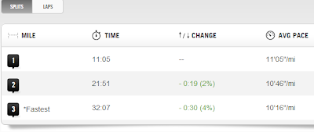
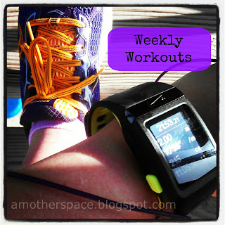
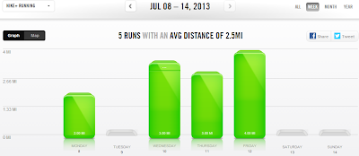

Last week the FUN came back to running. I've been struggling postpartum and then with the heat but something recently clicked for me. Who knows how long it will last but for now I'm enjoying the fun!  
  
First I had an easy 3 miles with 4 strides scheduled. Last time I had strides on the schedule I just added them into my 3 miles. I was feeling great on this run so I decided not to cut any corners and do them after my planned 3 miles.   
  
I was sweating like crazy and the workout ended on a tough note but I felt great! It was fun to pick up the pace at the end of the run and it gave me a little mental toughness. I'm liking strides right now!  
  
Second I had another easy 3 planned. I've been trying to work on starting slowly and gaining speed throughout my run and I nailed it on this one.   
  
  

  
I nailed the negative splits part, anyway. I'm still trying to figure out my pacing for various runs. This was an easy run and [according to my McMillan easy run pace](http://bit.ly/13DTXGt) I'm supposed to run between a 10:54 and 11:43 pace. It felt like an easy effort during this run but the pace was too fast. I'm still debating with myself on which is better for me. Effort or actual pace.  
  
I listened to the [Another Mother Runner podcast with Greg McMillan](http://bit.ly/13DTFiX) last week. (Another really good podcast from them, by the way!) I was listening to them talk during my 2 mile recovery jog. It helped me to run slower (or so I thought) while I was listening to them discuss the importance of varying paces during different workouts.  
  
Then I looked at my pace after I was finished and I had a 10:46 average! Ugh, once again it felt very easy but it was too fast. My recovery jog is supposed to be 11:53 or more.  
  
Friday's 4 miler with some speed work thrown in was fun as well. I like the bursts of faster running mixed into the run. My training plan adds more and more of these each week.   
  
Pretty much this week was filled with great runs. I've been trying to not knock myself down about my pace and just spend time enjoying the actual run. I recently read "[I will not call myself slow](http://bit.ly/1azunVP)" and it really helped put everything in perspective.  
  
  

  
**Weekly Workouts**  
  
Monday: 2 mile run: Recovery Jog  
  
Tuesday: Rest Day, Core Work  
  
Wednesday: 3.5 mile run with 4 strides, Core Work  
  
Thursday: 3 mile run with negative splits, Strength and Core Work  
  
Friday: 4 miles, Speed Work: WU, 4x45 sec w/ 1 min rest, CD, Core Work  
  
Saturday: Rest Day  
  
Sunday:  Unexpected Rest Day, Core Work  
  
  

  

  
Total Running Miles: 12.5  
Weekly Average Pace: 10:34  
  
July Running Miles: 27.5  
2013 Running Miles: 171.88  
  
  

**Did you have a great run this week? Tell me about it!**

  

  

  

\------------------------------------------

  

  
Find A Mother's Pace on...  
  
Twitter [@amotherpace3](https://twitter.com/amotherspace3)  
  
Facebook [http://facebook.com/amotherspace3](http://facebook.com/amotherspace3)   
  
Instagram [amotherspace](http://instagram.com/amotherspace)  
  
RSS [amotherspace](http://feeds.feedburner.com/amotherspace)
