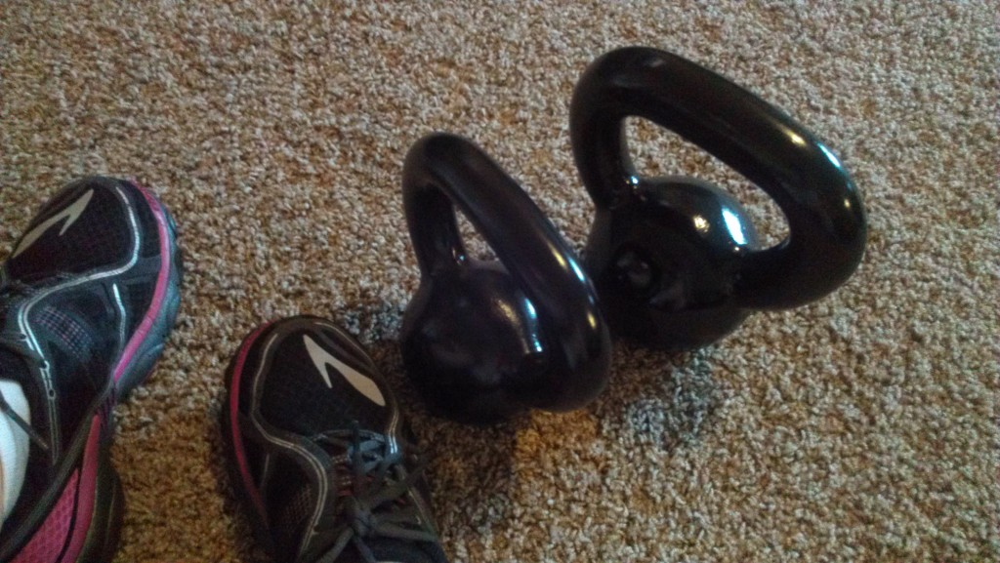
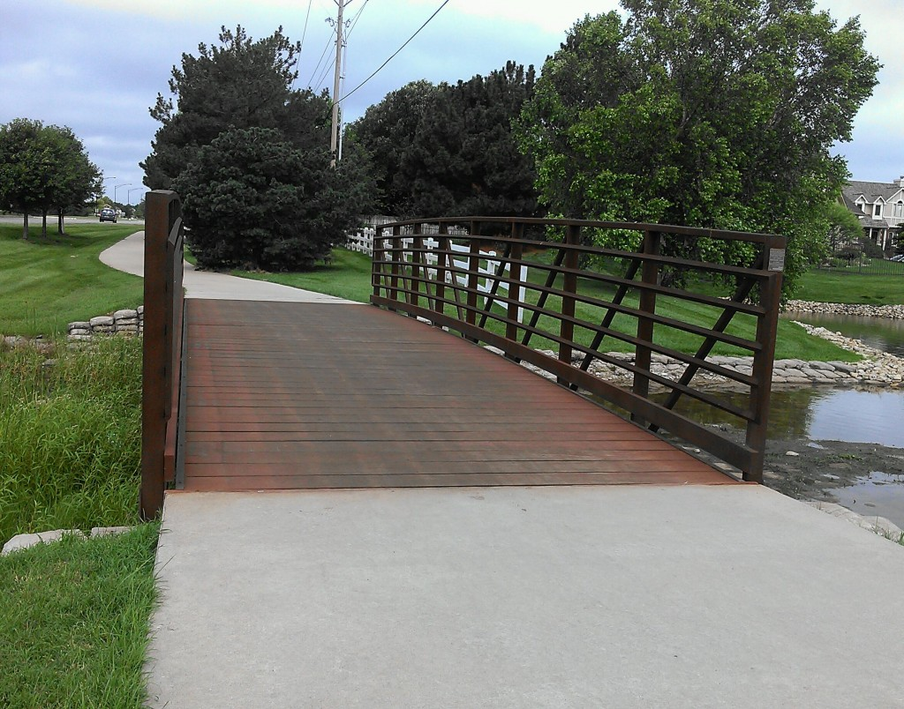
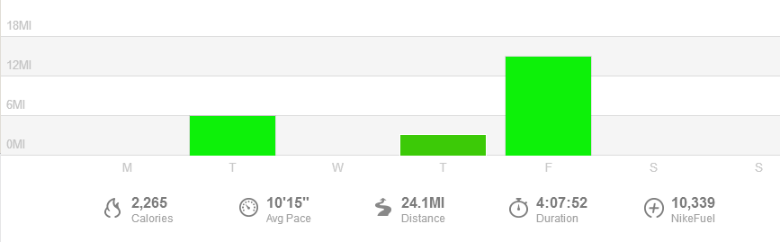

 

Last week was a strange one, training-wise. I usually like to stick as close to a training plan as I am able but last week was all about flexibility.

I had switched up my long run the week before and ran 14 miles on Sunday so on Monday I was not feeling my easy 3-4 miler that was written on my training plan. Instead I did some cross training and strength. Tuesday's workout was on the plan and I completed it but then I woke up on Wednesday planning on flip flopping my missed Monday workout but my legs were just tired. I decided to skip the run and just do strength and core work instead.

 

 

Then the biggest change was on Thursday. I decided that the weekend would be MUCH easier if I went ahead and ran long on Friday instead of the planned Saturday run. This ended up working out perfectly because we had grandparents here to watch the kiddos while I was running. I had wanted to run again on Sunday but we were busy with traveling and family so I skipped that run as well.

 

 

All in all I only ran 3 (!!!) times last week and worked out a total of 4 days. This was a good week to allow for flexibility though because it was a cut back week on mileage and I technically only ended up missing one 3-4 mile run.

 

 

## **Weekly Workouts**

 

**Monday:** 40 minutes Spin Bike + 20 minutes Strength

My tired legs did better with a spin workout than a run today. 10 minute warm up followed by 10 minutes of climb intervals. Then I hopped off the bike and did 20 minutes of strength then I repeated the bike workout again. My legs were happy after the break from running!

**Tuesday:** 6 miles (9:37 pace)

My training plan called for a negative split run (3,3) meaning that I run the last 3 miles faster than the first 3 miles. Success! My last mile was even my fastest too. I ended my run with an 8:56 mile.

**Wednesday:** 30 minutes Strength, Kettlebells and Core

I woke up with tired legs again. I'm really trying to be smart about this training plan and not do too much. I was going to make up my Monday run here but I decided just to do 30 minutes of strength instead. I don't want to miss a key run (speed work, long runs, etc.) but if it's an easy run day and I need a break, I'm taking it.

**Thursday:** 3.1 5 miles (9:43 pace)

My training plan called for a 'FUN' workout. I could pick anything I wanted! I thought about taking a spin class at the Y or maybe a body pump class but in the end I stuck with running. Mostly for lack of time to try out something new but I didn't take a shortcut here because I do think that running is FUN!

**Friday:** 15.01 miles (10:37 pace) + 15 minutes Yoga for Runners

Anytime that it works out to run long on a Friday I'm game. I LOVED getting it over with early and being able to enjoy the rest of my weekend. This run was supposed to have 5 race pace miles in the middle and I managed all 5 between 9:39 and 10:06. Not quite what I want for race pace but I'm happy I was able to speed up a bit for the 5 miles mid run. Most of the time when I get stuck on a pace in a long run it's hard to speed up. I have long runs with scheduled race pace miles every few weeks and I'm hoping to improve on this.

**Saturday:** Rest

**Sunday:** Rest

Yep, no running on the weekend. I can't remember a time when I haven't gone for a run on a weekend in quite some time. I'm not making this a habit, I missed it too much!

 

 

 

One of my main goals for 2014 is to Run This Year in kilometers. That's 2,014 kilometers or 1,251.44 miles.

Weekly Running Miles: 24.16

Weekly Average Pace: 10:15

June Running Miles: 105.21

2014 Running Miles: 611.07

2014 Running Kilometers: 983.42

 

**How flexible are you when it comes to your training plan?** 

\_\_\_\_\_\_\_\_\_\_\_\_\_\_\_\_\_

I’m running the Chicago Marathon with Team RMHC!

To find out more read my post about [Running for Charity](http://amotherspace.net/2014/06/the-chicago-marathon-running-for-charity/) or head over to my [fundraising page](http://www.kintera.org/faf/donorReg/donorPledge.asp?ievent=1097960&supId=399266070) to make a donation.

——————————-

Find A Mother’s Pace on…

Twitter [@amotherspace3](https://twitter.com/amotherspace3)

Facebook [amotherspace3](http://facebook.com/amotherspace3)

Instagram [amotherspace](http://instagram.com/amotherspace)

Pinterest [amotherspace](http://pinterest.com/amotherspace/)

Bloglovin’ [A Mother’s Pace](http://www.bloglovin.com/en/blog/6680087)

RSS [amotherspace](http://feeds.feedburner.com/amotherspace)
