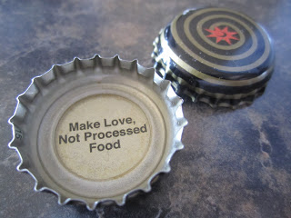

  

This was my Magic Hat bottle cap a few days ago. Usually they make me laugh but this one was...fitting. 

  

My eat healthy food project is going along well. It seems like I find out daily that something we eat regularly can be bad for us. I'm now checking labels for food dyes and trying to find local honey that hasn't had the pollen removed. Why is it so hard to find and eat food that is good for you???? 

  

Last week we ate Kale Chips. Yum! Very easy and very yummy. A gobbled up a bunch but O didn't want to have anything to do with them. We'll keep trying with him. We have also made the switch to brown rice. The kids ate it fine and both C.J. and I actually prefer it over white rice. Why was I so scared to try and make it? I made it in the rice cooker and it is just as easy, only it has to soak for a little bit before cooking. 

  

We also started our garden outside. We planted peas, lettuce, spinach and broccoli. Inside we planted peppers, and several herbs. We are picking up more seeds this weekend. I can't wait for all of the veggies to start growing! 

  
This afternoon is my 4 mile pace run. I'm looking forward to it as a practice for my race on Saturday. It is 79 degrees and currently we have 25 mile and hour winds. Too hot and too windy...sounds like fun!
