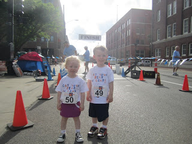
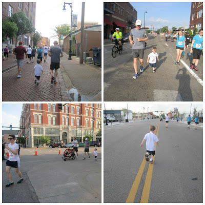
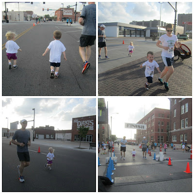
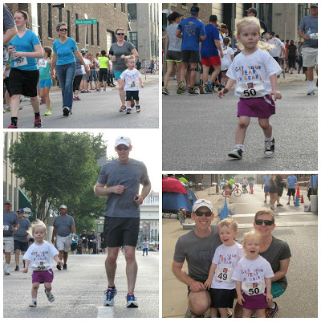

The Get Your Rear in Gear 5k and 1 Mile Fun Run was on Sunday which also happened to be my birthday. It did not disappoint!   
  
  

<table align="center" cellpadding="0" cellspacing="0"><tbody><tr><td></td></tr><tr><td><a href="http://www.getyourrearingear.com/events/list/2013/wichita-ks-2013/" target="_blank">Click to learn more about the race.</a></td></tr></tbody></table>

  
This year the Fun Run was first and boy was it ever FUN. Our kids have started to get more interested in running lately. They see both Mommy and Daddy running and they want in on the fun. That's why we signed up our 2 and 3 year old to run the 1 mile race.   
  
  

  

 Little O lined up at the start with Daddy and I was with the (backup) stroller and Little A. The blow horn went off and racers started moving. Of course the loud noise scared Little A and she jumped in the stroller right away. Uncle Rob took off and pushed the stroller. That made me free to be able to run with Little O and take pictures. Lots of pictures.  
  
  

  
I was amazed by Little O. He ran most of the race and only walked a little bit. He had a great stride and didn't get winded at all. I'm just so proud of him.  
  
He slowed down briefly to get a cup of water at the water stop. He was a little confused about what to do with the cup and the volunteer told him to just throw it on the ground when he was finished. He took a sip and dropped the cup. So funny.  
  
  

  
  

Aunt Sara is running with us in the picture above (top right). We had so many family members come out for the run that it made it an exciting race. Aunts, Uncles, Cousins, Grandparents and more.  
  
Little A decided to hop out of the stroller towards the end of the race to make a strong finish. I'm so glad she got out and ran a little. With her cute little running skirt she got a lot of applause crossing the finish line.   
  
  

<table align="center" cellpadding="0" cellspacing="0"><tbody><tr><td></td></tr><tr><td>Photo Credit for Photos 1, 2 and 3:&nbsp;<a href="https://www.facebook.com/pages/The-Running-Connection-Wichita/203709829690426?fref=ts" target="_blank">Running Connection</a></td></tr></tbody></table>

  
The 5k followed the fun run. It was my husbands first 5k and he did an awesome job. I'll be back tomorrow with a recap of the race.  
  
  
  

 Such a fun night with family. I couldn't have asked for a better birthday!  
  
  
  
  

**Do you like to run/race on your birthday? Have your kids ever ran in a fun run? Ever participated as a family in a running event?** 

  
  

\------------------------------------------

  

  

_Somehow my post was published yesterday while I was still working on it. (I must have clicked the publish button instead of the close button???) So if you happened to catch this yesterday there are some updates. Thanks for checking it out again today!_

  
  
  

\------------------------------------------

  

  
Find A Mother's Pace on...  
  
Twitter [@amotherpace3](https://twitter.com/amotherspace3)  
  
Facebook [http://facebook.com/amotherspace3](http://facebook.com/amotherspace3)   
  
Instagram [amotherspace](http://instagram.com/amotherspace)  
  
RSS [amotherspace](http://feeds.feedburner.com/amotherspace)
