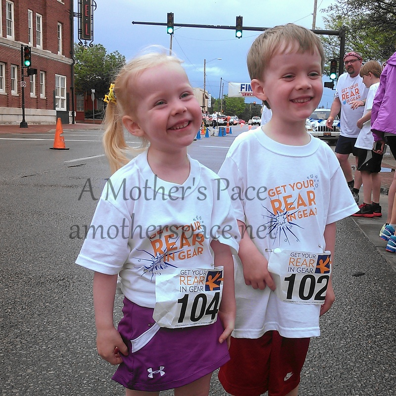
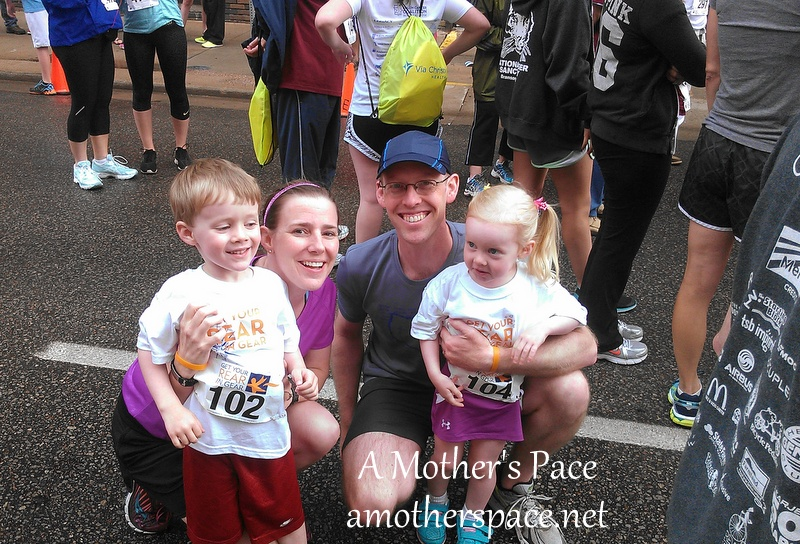
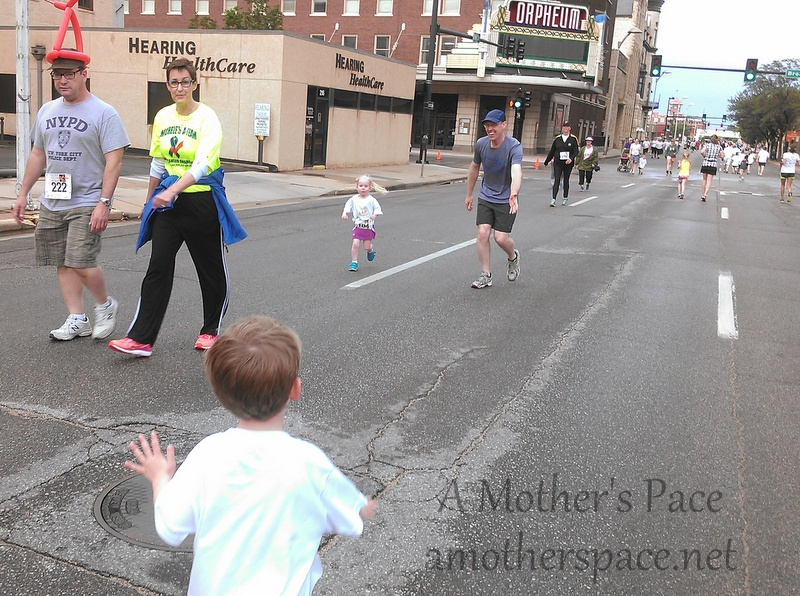
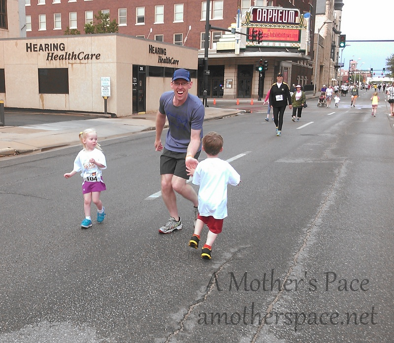
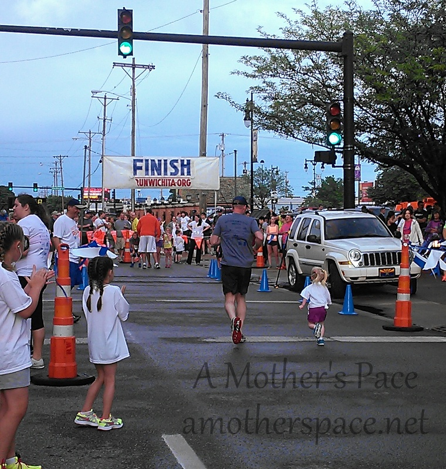
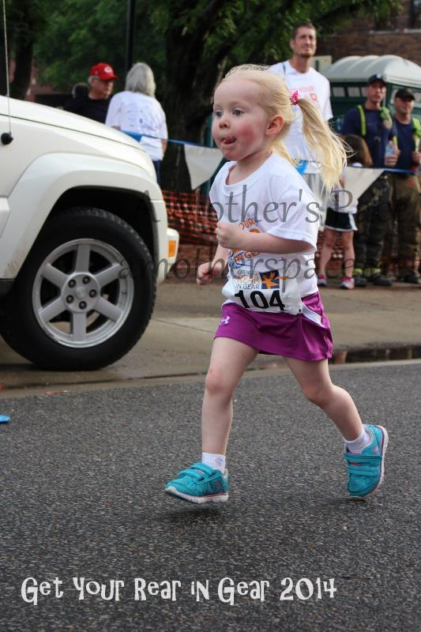
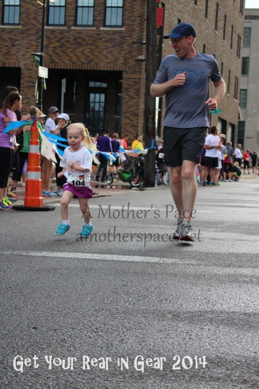
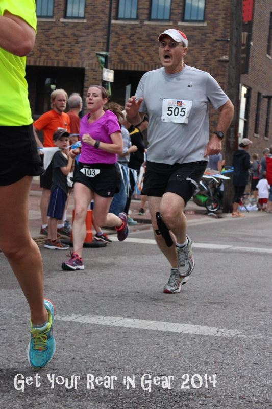
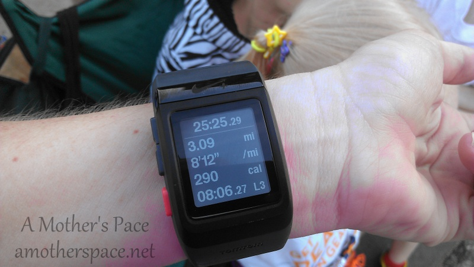

Have you ever not known your race goal until race day? That was me last weekend.

Now, of course, this 5k was not a goal race and I didn't specifically train for it but usually I have an idea of how I want to run a race at least a few hours before I start it.

Sunday was the annual Get Your Rear in Gear 5k and 1 Mile Fun Run and because it was an evening race plus a busy weekend, I was contemplating just running it for fun and not a PR. That was before the cold front came in and it cooled way down with a rain shower right before the race. When I saw temps in the 60's instead of the 80's and 90's that are typical for this race, my decision was made for me. I would be racing against myself and trying to beat my PR of 25:54.

 

 

But before the 5k started we had the 1 Mile Fun Run with the kids. A few weeks ago I asked my two littles (ages 3 and 4) if they would like to run the race again this year. Little O ran/walked the whole thing last year and Little A ran/walked and rode in the stroller last year. They both said yes and were very excited to have another race of their own. We've been practicing a little with a lap or two around our neighborhood lake a few times. One lap equals about a third of a mile.

 

 

My husband ran with Little A and I ran with Little O. The (very loud) starting horn sounded and we were off. I just followed O's lead and let him run as much as he wanted and walk when he needed it. We probably ended up walking a little somewhere during each quarter of the mile.

 

 

The course was an out and back which was fantastic because we knew several of the runners and it was fun to cheer them on. We even ran into Little A and gave her high 5's.

 

 

 

Little O was amazed by all the police officers that had closed the streets for us and he had fun thanking all of them as we ran past by. He also got quite a few cheers from the spectators for running so strong. (And possibly because he was so cute while doing it!)

Finally the finish line was in sight and and after a few high 5's from family members he crossed it in 12 minutes and 30 seconds.

 

 

\[caption id="attachment\_2391" align="aligncenter" width="533"\] Photo Credit: [The Running Connection](https://www.facebook.com/RunningConnection)\[/caption\]

 

I mean, really, could she be any cuter? Am I supposed to say that about my own child? I guess I did anyway!

 

\[caption id="attachment\_2390" align="aligncenter" width="533"\] Photo Credit: [The Running Connection](https://www.facebook.com/RunningConnection)\[/caption\]

 

Little A wasn't too far behind him with a finish in 16 minutes and 5 seconds.

I'm so proud of both of them and it makes this mommy happy to watch my children enjoying something that I love to do as well.

Now on to the 5k. The 1 mile fun run turned out to be a perfect warm up for the race. I've done strides before a race in the past but I've never ran anything as far as a mile. I felt really good at the start of this race and I think the warm up had something to do with it.

This is my 3rd time running in this event and this year they changed the course. Previously it had been a double loop course just in downtown Wichita. Nothing very exciting. This year they changed it to run out to the river on the bike path, over the Keeper of the Plains bridge and back to the finish line. It was a beautiful run in a scenic part of the city.

As I stated earlier, I was out for a 5k PR with this race but ideally I would have loved to break that 25 minute barrier. The race started and I decided I was going to stay as close to the 8 minute mile as I could to try for that sub 25.

My first mile beeped in at 8:02 and I was feeling great. We were down by the river at this point which is one of my favorite parts of town. When mile 2 beeped I had slowed down just a little. My mile pace said 8:24. The negative self talk (that I really need to stop!!) started and I began to doubt myself.

Shortly after the second mile a spectator pointed at me and said, "25th female." I nodded back to him and glanced at the 4 ladies right in front of me. I could catch them.

It was during this last mile that my breathing started to give me troubles. I just felt like I couldn't take a breath. I've never had this happen during a race before but it wasn't so bad that I couldn't keep pushing. The air was pretty heavy and humid and maybe that's what caused it.

I started to pick off the ladies in front of me one by one. With the finish line in sight but still a ways off, I passed the fourth woman. That was until I saw my family with their hands outstretched for a high 5. Of course I couldn't just run past them so I slowed to give them all a five and then ran on. One of the women passed me right at the finish but the high 5's were better than a 21st finish. I finished the last mile with an 8:06 pace.

 

\[caption id="attachment\_2392" align="aligncenter" width="533"\] Photo Credit: [The Running Connection](https://www.facebook.com/RunningConnection)\[/caption\]

 

My Nike+ watch said I had finished in 25:25. A new PR!

 

 

The official result was 25:38. I'm surprised that there is such a difference because usually my watch is longer than the official results. Regardless, both times give me a PR and I'll count the official results as my PR.

After eating a burger and some ice cream (this race always has excellent food grilling for after the race!) I went over to check my results. The printed results said that I was 2/14 in my division. A second place finish! Even though it was very late, we waited around for the awards ceremony. The kids were hanging in there way past their bedtime so far.

Except at the awards ceremony they didn't call my name. I had heard other people saying that the results were off for them as well. I went up to the race director after the ceremony was over and she ended up giving me a medal (as she had done for a few other people already.) They were having a lot of problems, for example, someone that they announced as a cancer survivor finisher had never had cancer. I went home with my award but the next day when the official results came out I was in 4th place.

I'm not sure how that can happen. Maybe they were still entering in names after my results page was printed off? If so, they really shouldn't have printed any results until everything was entered. Now I wish that I hadn't gone up and talked to her after the ceremony because I have this award that I need to get back to her. Ugh.

Even with the award mix-up, this is still one of my favorite races of the year. My extended family is there for the race and the party afterwards which makes it a lot of fun for everyone. My husband, and many of my  in-laws ran either the 1 mile race, the 5k or both. The kids event makes this special for our family and I hope that my children continue to want to participate in the race in the future.

Official Distance: 5k (3.1 miles)

Nike+ Distance: 3.09 miles

Official Time: 25:38

Nike+ Time: 25:25

Official Average Pace: 8:15

Nike+ Average Pace: 8:12

Division Placement: 4/40

Overall Placement: 70/455

14 in 2014 Race Goal: 6/14

This is my 3rd time running in this event. Click the links to read more: [GYRIG 5k 2013](http://amotherspace.net/2013/05/get-your-rear-in-gear-5k-race-recap/ "Get Your Rear in Gear 5k Race Recap"), [GYRIG 1 Mile 2013](http://amotherspace.net/2013/05/get-your-rear-in-gear-1-mile-fun-run/ "Get Your Rear in Gear 1 Mile Fun Run"), [GYRIG 2012](http://amotherspace.net/2012/06/get-your-rear-in-gear-5k-race-recap-2/ "Get Your Rear in Gear 5K Race Recap")

 

**Have you ran in your local Get Your Rear in Gear race? If you have kids, have they started running in races yet?**

 

——————————-

Find A Mother’s Pace on…

Twitter [@amotherspace3](https://twitter.com/amotherspace3)

Facebook [amotherspace3](http://facebook.com/amotherspace3)

Instagram [amotherspace](http://instagram.com/amotherspace)

Pinterest [amotherspace](http://pinterest.com/amotherspace/)

Bloglovin’ [A Mother’s Pace](http://www.bloglovin.com/en/blog/6680087)

RSS [amotherspace](http://feeds.feedburner.com/amotherspace)
