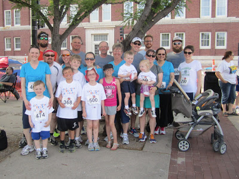
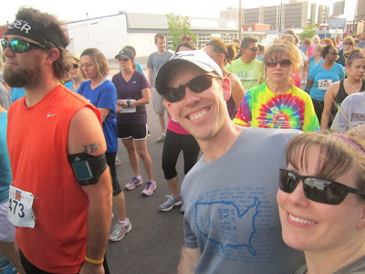
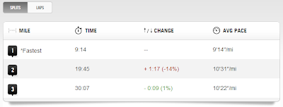
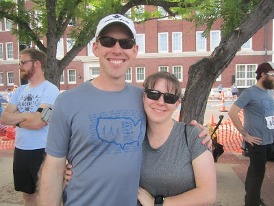
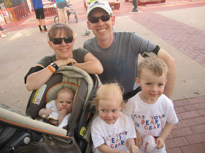

This was the 3rd Annual Get Your Rear in Gear 5k in Wichita and it's my 3rd year of running it.   
  
  

<table align="center" cellpadding="0" cellspacing="0"><tbody><tr><td></td></tr><tr><td><a href="http://www.getyourrearingear.com/events/list/2013/wichita-ks-2013/" target="_blank">Find out more about the Colon Cancer Coalition</a>&nbsp;</td></tr></tbody></table>

Last year [I earned my PR during this race](http://amotherspace.blogspot.com/2012_06_01_archive.html#2263696659952841998) and it was HOT! An evening race in the summer is tough but the atmosphere is so much fun. This year it was only in the lower 80's so the temps were a little better. Not close at all to the 50's and 60's that I'm used to running in the mornings but better than in the 90's of the past two years.  
  
This year I am nowhere near the shape to try for a PR but it was my first real race since having a baby 3 months ago. By real race I mean one that I am actually trying my best and not running with friends for fun.  
  
  

  
It was a family event in so many ways.   

- The Fun Run with my kids (check it out [here](http://bit.ly/118BjT8) for adorable running pics if you missed it) and a ton of other family members.

- Having family there to cheer us on.

- Racing with two brother-in-laws and two sister-in-laws. 

- Running together with my husband for the first time. 

My husband was running this 5k for the completion of his Couch to 5k program. He was nice enough to run with me (since it was my birthday!) instead of cruising ahead like he could have.   
  
  

  
Once we were all lined up and the race started we took off very quickly. Pretty much a text book version of going out too strong at the beginning. This isn't my first 5k, or race of any distance for that matter, but for some reason I thought it was o.k. to run a 9:14 pace for the first mile.  
  
  

  
Um, I haven't ran that quickly since before my pregnancy, by almost a minute!  
  
Once the initial excitement faded we slowed down a bit but still stayed at a pretty good postpartum pace for me. I really wanted to finish the race under a 10 minute average pace and I ended up finishing just at that.  
  
  

  
The course is a loop, which I'm not crazy about, although I love running in downtown Wichita. There's just the added mental challenge when you are half way finished and you know you have to complete the entire loop over again. To me it just seems longer that way.   
  
Speaking of half way, when we were coming up on the half way point we heard the bell of the lead runner bicycle behind us. C.J. and I kicked it up a notch to try and get to the turn off point before the lead runner lapped us. We made it, just barely! Speeding up like that in the middle of the race was tough but the burst of energy was fun.   
  
The second loop was pretty hard. The heat was getting to me and it was getting harder to hold the pace that we were running. But I hung in there and was very thankful to have my husband by my side encouraging me at the end to stay with it.   
  
We ended up finishing officially at 31:32. I wanted under 30 minutes but I really can't complain about the results. Not bad for the heat and the fact that I'm still working on increasing my pace at 3 months postpartum.   
  
  

  
The after-race party was great. There was a band, good food and beer. Gotta love a beer after a race, especially when it's an evening one. Heck, who am I kidding, I love beer after a morning race too. :)   
  
It was a fun race and a great birthday! I can't wait to run it again next year to support the Colon Cancer Coalition.  
  
  

  
  
  
  

Official Distance: 5K (3.1 miles)

Nike+ Distance: 3.15 miles

Official Time: 31:32

Nike+ Time: 31:31

Official Average Pace: 10:09

Nike+ Average Pace: 9:59

Overall Placement: 200 out of 492

Age Group Placement: 13 out of 34

  
  
  
  
  
  

\------------------------------------------

  

  
Find A Mother's Pace on...  
  
Twitter [@amotherpace3](https://twitter.com/amotherspace3)  
  
Facebook [http://facebook.com/amotherspace3](http://facebook.com/amotherspace3)   
  
Instagram [amotherspace](http://instagram.com/amotherspace)  
  
RSS [amotherspace](http://feeds.feedburner.com/amotherspace)
