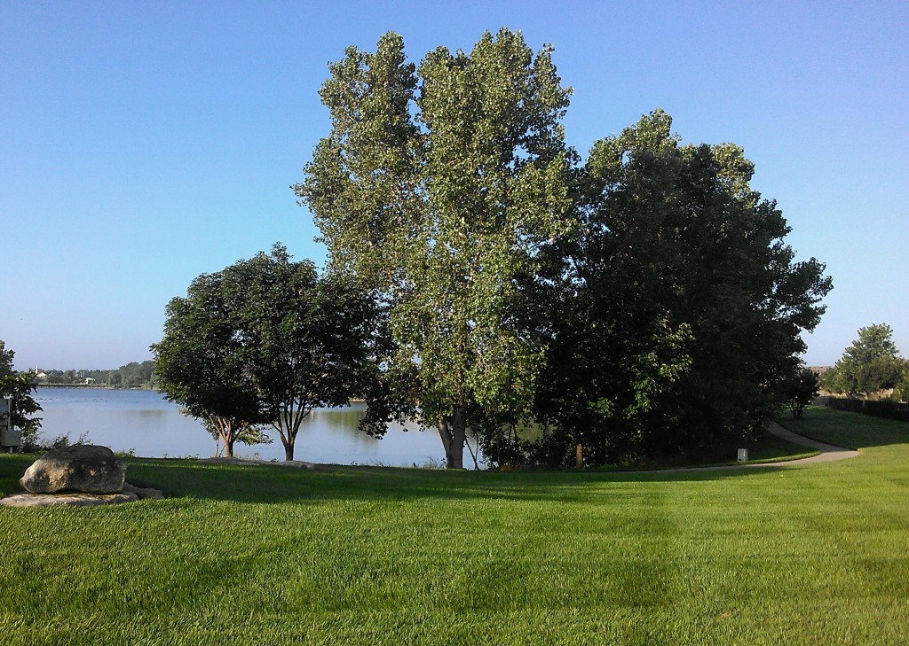
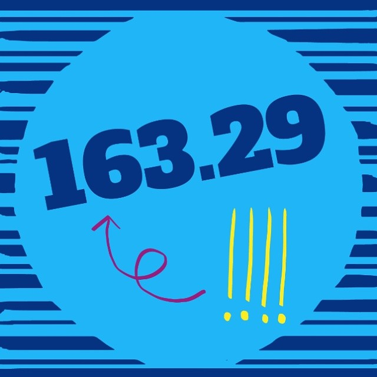
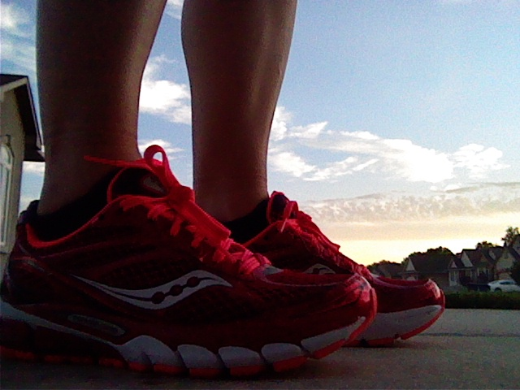
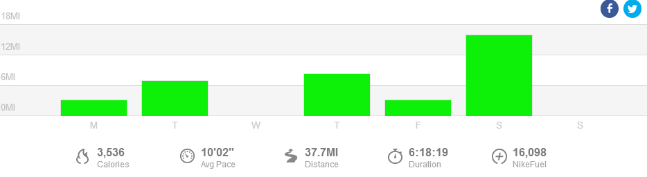

## Getting Lost

 

I am now able to add getting lost on the run to my ever growing list of running accomplishments!

Last week I set out on a run (my plan said 8-10 miles, I was shooting for 10) mid-week. I took a new(ish) route that I've been running for a couple of weeks now. Part of my route cuts through a neighborhood that has a lot of turns and usually I pay attention to the street names as I go through the neighborhood so that on the way back I make the correct turns again.

 

 

Thursday I was not paying attention at all and just spacing out on my run. It was really nice, that is until I realized that I had made a wrong turn and was pretty far from my house because of it. I ran until I knew for sure where I was (on a street that leads out to a shopping center) and I thought about my choices.

If I continued to run home I would be very late. It would work out okay because Nana was in town visiting and staying with the kids but it did add a lot of miles to my run. By the time I got home I would have ran 11.5 miles for the day which was entirely too much. I had my phone with me and so I called my husband to pick me up.

He was able to swing by before heading to work but that meant that I had to cut my run a little short. I just kept running until he drove up to get me. 8.36 miles for the day. Yep, I felt like a dork.

## July Miles

 

 

In other news, I had my highest running mileage EVER in July. The grand total was 163.29 miles. The best part about it is that I'm feeling great. My long runs may make me tired but my legs aren't trashed after I'm finished. I just added up my training log miles for August and I'm hitting around 160 again next month.

I love getting 8 - 10 milers in during the week. Lately I've been noticing that it takes me about 3 miles to warm up and start to feel great during the run but once I hit that spot I can just coast. This makes all my shorter runs seem difficult and the longer runs seem easy. That just sounds so backwards but that's how it's working right now for me.

 

 

## **Weekly Workouts**

 

How is it that I'm already finished with week 8 of training for the Chicago Marathon!?!

**Monday:** 3.15 miles (9:44 pace) + 20 minutes Kettlebells and Core Work

 

 

I bought the new Saucony Ride 7's over the weekend and tried them out on my Monday morning run. I love everything about this shoe so I'm pretty sure that these will be the ones that take me 26.2 miles in October.

 

**Tuesday:** 7 miles (10:11 pace)

 

A beautiful sunrise and nice chilly air.

**Wednesday:** 30 minutes Spin Bike + 20 minutes Strength

**Thursday:** 8.36 miles (10:17 pace)

A very enjoyable run even though I got lost!

**Friday:**  3.2 miles (9:41 pace)

A nice little neighborhood run.

**Saturday:** 16 miles (9:57 pace)

My training plan called for 16 miles with 10 at race pace. I warmed up with a couple miles and then kept 8 of the race pace miles between 9:25 and 9:49. Then the other two were at 10:04 and 10:02. The long run is my favorite run of the week lately!

**Sunday:** REST

 

 

 

One of my main goals for 2014 is to Run This Year in kilometers. That's 2,014 kilometers or 1,251.44 miles.

Weekly Running Miles: 37.72

Weekly Average Pace: 10:02

July Running Miles: 163.29

August Running Miles: 19.21

2014 Running Miles: 797.62

2014 Running Kilometers: 1283.64

 

**Have you ever gotten lost on a run?**

 

\_\_\_\_\_\_\_\_\_\_\_\_\_\_\_\_\_

I’m running the Chicago Marathon with Team RMHC!

To find out more read my post about [Running for Charity](http://amotherspace.net/2014/06/the-chicago-marathon-running-for-charity/) or head over to my [fundraising page](http://www.kintera.org/faf/donorReg/donorPledge.asp?ievent=1097960&supId=399266070) to make a donation.

——————————-

Find A Mother’s Pace on…

Twitter [@amotherspace3](https://twitter.com/amotherspace3)

Facebook [amotherspace3](http://facebook.com/amotherspace3)

Instagram [amotherspace](http://instagram.com/amotherspace)

Pinterest [amotherspace](http://pinterest.com/amotherspace/)

Bloglovin’ [A Mother’s Pace](http://www.bloglovin.com/en/blog/6680087)

RSS [amotherspace](http://feeds.feedburner.com/amotherspace)
