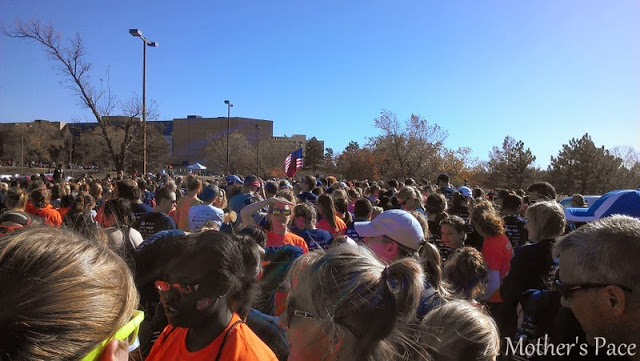
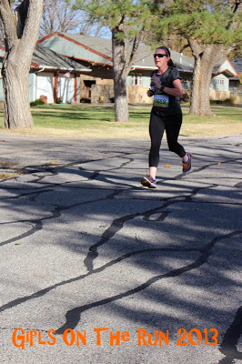
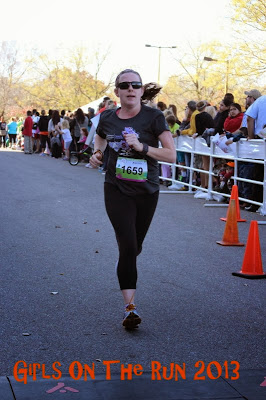
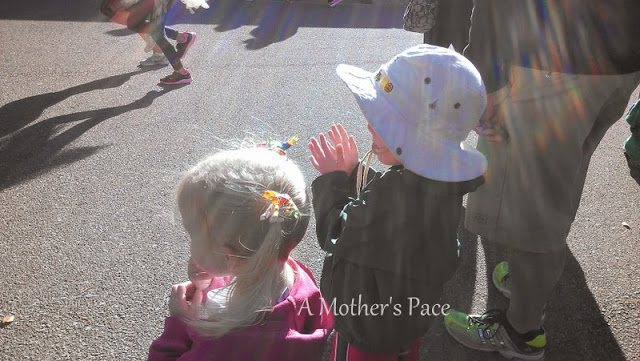
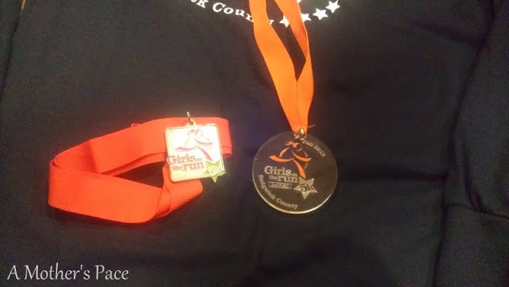
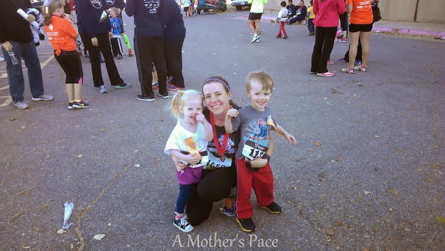
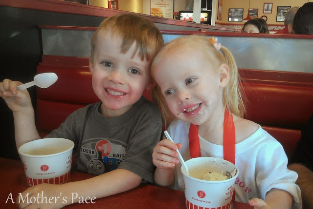

The Girls on the Run 5K is a race that I try to run every year. Last year I ran it at about [6 months pregnant.](http://amotherspace.blogspot.com/2012/11/girls-on-run-5k-race-recap.html#.Uo9RoPlQEYk) This weekend I ran it at almost 9 months postpartum.   
  
It's a mid-afternoon race, the 5K started at 2 p.m. and the Kiddie K started at 3:15. The Kansas wind was blowing on Sunday but what made it worse was all the leaves and stuff that the wind was picking up. I'm still sneezing from being outside in the wind all afternoon.  
  
[**Girls on the Run**](http://girlsontherunks.org/) is a great organization that not only encourages girls to exercise but also provides lessons to help the girls learn confidence building skills.   
  
Working up to the 5K many local children train with their coaches to run the race. Going into this 5K is different from others for me because it is all about the girls. Encouraging the girls throughout the race and really just being inspired by all of their hard work. I'm not a coach but this is definitely an organization I would like to become more involved with as my children get older.  

  
I was a little amazed by the number of people participating in the race this year. When we arrived a half an hour early (usually this gives us plenty of time) the parking lot was already full. We eventually found a parking spot though!   
  
  

  
The start line was very congested. It's not a race where people line up by their expected pace. A lot of the girls are in front. They are excited to run and that's what the race is all about. That said, after the race started I spent most of the first half mile walking, jogging and swerving between people. The race wasn't a PR for me but, considering the start, I'm very happy with my overall time.  
  
Once I was able to start running I just got into a pace that felt good but still challenging. I love running through this neighborhood (my high school cross country team used to run in this area) and enjoyed the scenery a lot because of that.  
  

<table align="center" cellpadding="0" cellspacing="0"><tbody><tr><td></td></tr><tr><td>Photo Credit: <a href="https://www.facebook.com/pages/The-Running-Connection-Wichita/203709829690426" target="_blank">Running Connection</a></td></tr></tbody></table>

At one point I was right behind a girl running with her dad. She was doing an awesome job. She was telling him about her race last year. She said that it really hurt to run but she stuck with it and kept going. When she finished she was 3rd! I thought a lot about her as I was running the race because she's right. 5K's are tough. They hurt but you just need to hang on and keep running.  
  
  

<table align="center" cellpadding="0" cellspacing="0"><tbody><tr><td></td></tr><tr><td>Photo Credit: <a href="https://www.facebook.com/pages/The-Running-Connection-Wichita/203709829690426" target="_blank">Running Connection</a></td></tr></tbody></table>

  
Before I knew it I was coming in for the finish, an uphill finish. I saw my family though and that helped to give me an extra push at the end.  
  
  

  
Later, when I walked over to the results table, I was very surprised to find out that I placed 2nd in my age group!   
  
  

  
  
Official Distance: 5K (3.1 miles)  
Nike+ Distance: 3.17 miles  
Official Time: 27:12  
Nike+ Time: 27:13  
Official Average Pace: 8:46  
Nike+ Average Pace: 8:35  
  
Overall Placement: 35/747  
Age Placement: 2/105  
  
Now we get to the fun part, the Kiddie K. Both of my older kids ran the race and had a ball.  
  
  

  
They were both pretty excited before the run and Little O wanted to win. :) He didn't win but he was a very determined runner!   
  
  

  
Little A and I ran together. She had on her favorite 'running' shoes. After the race was over she said she wanted to do it again. That's my girl!  
  
  

  

  
The goofball finishers and one proud mommy!  
  
  

  
  
And then, celebratory ice cream, of course!  
  
  

  
  
  
  

**Have you ran a 5K lately? How did it go? Do your kids run races? At what age did they start putting on a bib?**

  
  

\-------------------------------

  

Find A Mother's Pace on...  
  
Twitter [@amotherspace3](https://twitter.com/amotherspace3)  
  
Facebook [amotherspace3](http://facebook.com/amotherspace3)  
  
Instagram [amotherspace](http://instagram.com/amotherspace)  
  
Pinterest [amotherspace](http://pinterest.com/amotherspace/)  
  
Bloglovin' [A Mother's Pace](http://www.bloglovin.com/en/blog/6680087)  
  
RSS [amotherspace](http://feeds.feedburner.com/amotherspace)
