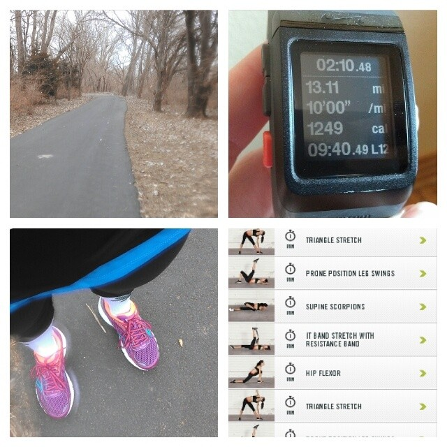
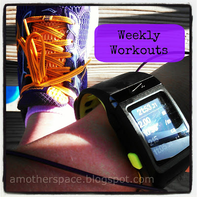
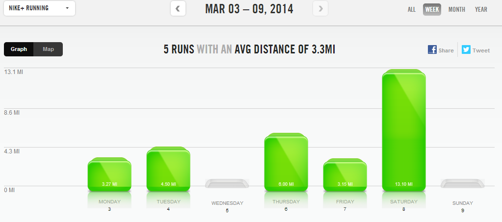

Today we are expecting highs in the 70's but that wasn't the case on Saturday when I was out for my long run. It was a windy morning and felt like 17 degrees. It was cold but it still felt great to be outside and not inside on the treadmill for all 13.1 miles.

Is it just me, or do you run the extra .1 miles when you have 13 scheduled in your training plan?

I left my house and ran to the park. My plan was for my pace to be around 9:30. My legs felt heavy and took awhile to warm up so that pace was too hard. I ran a loop around the park and headed home. My training plan called for a 'Strong Finish' so I kicked it up a little at the end and the last mile ended up being my fastest!

At first I was feeling a little bad that I missed my pace by around 30 seconds per mile but then I thought about it a little more. A 10 minute pace is still in my long run training pace range. And even more than that, I finished the half marathon _training run_ in less time that my first couple of half marathon races.

So while at first I was discouraged by this run, later on I realized that although this is the same distance as my race, it is still just a training run and I'm still on track to meet my goals for the race.

 

 

**Weekly Workouts**

Monday: 3 miles (9:04 pace) + JM Circuit 1 + Core

Tuesday: 4.5 miles (8:28 pace)

Wednesday: Rest

Thursday: 6 miles (9:10 pace) + 10 minutes leg and core strength

Friday: 3.15 miles (9:25 pace)

Saturday: 13.1 miles (9:58 pace) + 15 minutes NTC Pro Running Stretches

Sunday: 40 minutes Spin Bike + 30 minutes NTC Core Work + Leg Strength

 

 

 

Total Running Miles: 29.76 Weekly Average Pace: 9:05

March Running Miles: 39.76 2014 Running Miles: 218.89 2014 Running Kilometers: 352.27

 

 

 

**Do you run the extra .1 to make it a half marathon?**

 

 

\-------------------------------

Find A Mother's Pace on...

Twitter [@amotherspace3](https://twitter.com/amotherspace3)

Facebook [amotherspace3](http://facebook.com/amotherspace3)

Instagram [amotherspace](http://instagram.com/amotherspace)

Pinterest [amotherspace](http://pinterest.com/amotherspace/)

Bloglovin' [A Mother's Pace](http://www.bloglovin.com/en/blog/6680087)

RSS [amotherspace](http://feeds.feedburner.com/amotherspace)
