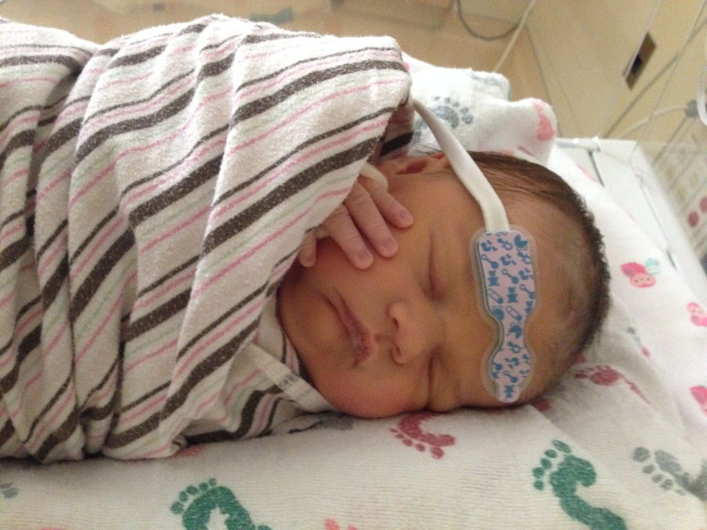
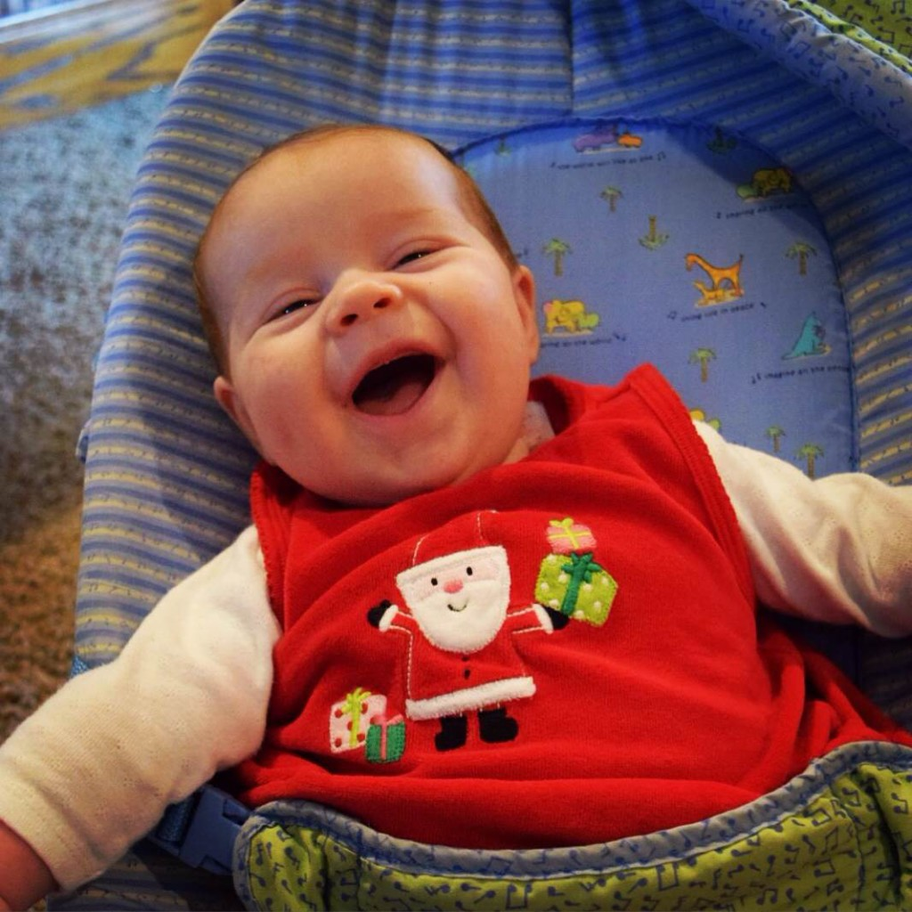

Wow, I knew that it had been awhile since I had written a blog post but 8 months (!!!) is much longer than I had thought! Well, I'm back and ready to write again in 2016.

#### Happy New Year!

2015 was a crazy year with not a lot of running (or energy!) for me. My last post announced that we were expecting our fourth child and the pregnancy was exhausting and filled with challenges. I only ran through 21 weeks of my pregnancy and it wasn't as often as I would have liked. Now, at 11 weeks postpartum, I'm just starting to feel the motivation to start consistent running again. That's a long time away and it's kinda like starting all over again. Every run is tough. Every run is slow. Every run is short.

But I'm doing it and I know that it will get easier the more I do it and eventually I'll get back to my pre-pregnancy fitness level.

So let me introduce you to our little baby girl...

Our Baby A was born on October 15th and entered the world in quite a dramatic way. The abbreviated version is that shortly before our little girl was born we found out that she would need heart surgery very soon after birth. We had to leave for Colorado with just a couple of days notice so that I could deliver in a hospital where she would be able to have the surgery that she needed.

She had the surgery when she was 5 days old. It was the longest 6(ish) hours of my life! I may at some point share her birth and surgery story but for now I'll let you know that the surgery was a complete success. Our Baby A is a healthy and thriving baby girl!

She's 11 weeks old now and her smiles are the best! The older kids have all fallen in love with her and it is so sweet to watch them with their baby sister.

Today I'm just checking in but next week I'll be back with some of my goals for the year and I'll give an update on my plans for A Mother's Pace in 2016.

#### Happy 2016!
