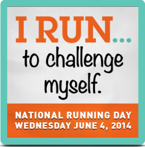
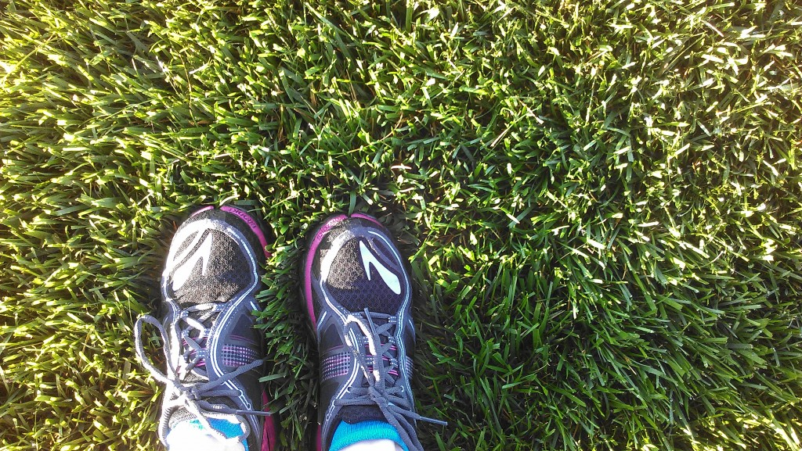

 

Happy National Running Day to all my fellow runners out there! This year when I filled out my badge (want to make one for yourself? Go -----> [here](http://basno.com/c/2014/nrd)) I had to think for a few minutes on why, exactly, do I run lately.

There are a lot of reasons. For health, to be a good role model for my children, so I can eat ice cream or drink a beer. I've also ran to raise money for a charity with Team in Training and now the Ronald McDonald House (more on that soon!) I could go on and on. That's what I love about running...there are so many reasons to get out there and RUN.

 

 

When it comes right down to it, lately my motivation is to run faster. To get that PR. To challenge myself. Sure, running is enjoyable and I love to do it most days but the challenge of race day is what keeps me running 5 days a week. Waking up early to run or squeezing in a strength training session mid-day is not always easy but it is completely worth it.

My next challenge is my biggest of all. Next week I officially start my training plan for the 2014 Chicago Marathon. Week after week and month after month I'll put in the work to get ready for race day. It's a tough training plan and it will certainly be a challenge to complete but every step and every mile will get me closer to a dream. And I can't wait. #dreambigrunlong

 

**Why do you run?**

Today I am linking up with Cori over at [Olive to Run](http://olivetorun.com/national-running-day-i-run-link-up/) to share Why I Run.

 

——————————-

Find A Mother’s Pace on…

Twitter [@amotherspace3](https://twitter.com/amotherspace3)

Facebook [amotherspace3](http://facebook.com/amotherspace3)

Instagram [amotherspace](http://instagram.com/amotherspace)

Pinterest [amotherspace](http://pinterest.com/amotherspace/)

Bloglovin’ [A Mother’s Pace](http://www.bloglovin.com/en/blog/6680087)

RSS [amotherspace](http://feeds.feedburner.com/amotherspace)
