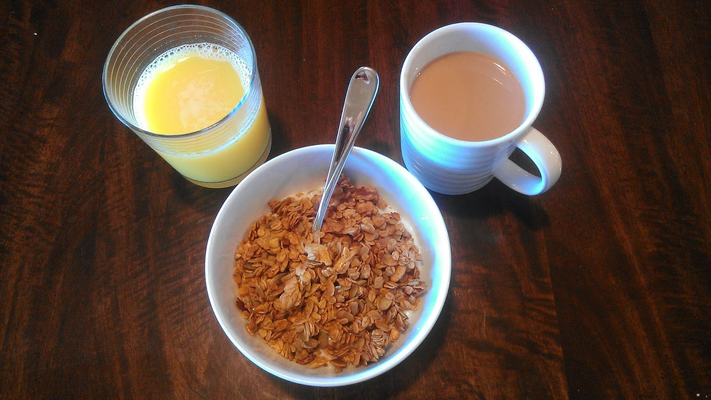
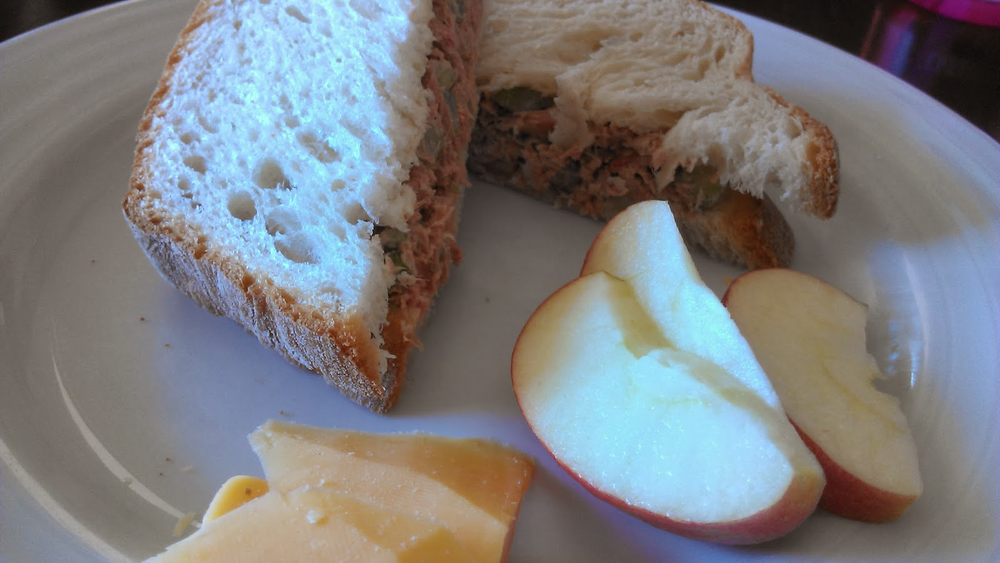

One of my all time favorite easy recipes is Taco Soup. It's the kind where you dump cans of beans and corn into the slow cooker or stock pot and add prepared taco meat. It's served over tortilla chips with sour cream, cheese and avocados.   
  
We haven't had it this winter yet because most of the ingredients in it are just too processed for how I like to cook at home right now.   
  
So this week I'm experimenting with the recipe. Instead of regular canned Mexican beans, my husband found organic spiced beans. We also now make our own recipe of taco seasoning instead of a packet. And we'll use frozen corn instead of canned corn.  
  
It will be a little healthier but I still have work to do with this recipe. Next time I make it I want to use homemade Mexican beans but I just have to find a recipe first.  
  
**Healthier Taco Soup**  
1 lb. Ground Beef, preferably grass fed organic beef  
[Taco Seasoning](http://allrecipes.com/recipe/taco-seasoning-i/)  
1 or 2 Cans Mexican Beans or  2-3 C. Homemade Beans  
1 Can Organic Tomato Sauce  
15 oz. Frozen Corn  
  
Brown ground beef in a skillet and add homemade taco seasoning with water. Meanwhile, add the rest of the ingredients to a stock pot. When meat is finished add to the pot as well.  
  
Simmer until soup is warm.  
  
Serve over tortilla chips and topped with sour cream, grated cheese, avocado or any of your favorite taco toppings.  
  
The recipe is very flexible. I sometimes will add more or less beans and/or corn depending on what we are in the mood for. I also sometimes use a small tomato sauce can if that's what I have on hand but I usually to put the 15 oz. size in the soup. I occasionally will put it in a slow cooker instead of a stock pot and let it simmer all day long.  
  
Some of my meals from the week.  
  
\[breakfast\]  
Homemade granola with organic yogurt is back this week. It's my favorite breakfast lately, I can't get enough of it.  
  
  

  
  
\[lunch\]  
I mixed it up a bit this week and made tuna sandwiches for lunch. They were good, although nothing quite beats a tuna sandwich with a big juicy garden tomato on top. That's why I usually make this in the summer.  
  
  

  
\[dinner\]  
We pulled dinner from the freezer one night this week. Our 'Dream Spaghetti' is a layer of cooked pasta, cottage cheese, prepared sauce (ours had ground beef in it) with cheese on top. I usually make two of these so I can stick one in the freezer to enjoy later. This week we did just that and had an easy meal that just needed to go in the oven.  
  
  

  
  
And finally, here's our meal plan for next week.  
  
\[monday\]  
Leftovers  
  
\[tuesday\]  
Black Bean and Sweet Potato Tacos  
  
\[wednesday\]  
Leftovers  
  
\[thursday\]  
Salmon with Roasted Veggies  
  
\[friday\]  
Homemade Pizza + Movie Night!  
  
\[saturday\]  
Quesadillas with Sweet Potoato Black Bean Quinoa Salad  
\[sunday\]  
[Winter Minestrone Soup](http://tastykitchen.com/recipes/soups/hearty-winter-minestrone-soup/)   
  
  

**Have you ever tried to remake a favorite recipe so that it is healthier? Do you have a recipe for homemade Mexican beans?**

  
  

Check out my **[giveaway](http://amotherspace.blogspot.com/2014/01/powered-by-bits-review-and-giveaway.html#.Ut-2VvTnard)** going on this week too!

  
  

\-------------------------------

  

Find A Mother's Pace on...  
  
Twitter [@amotherspace3](https://twitter.com/amotherspace3)  
  
Facebook [amotherspace3](http://facebook.com/amotherspace3)  
  
Instagram [amotherspace](http://instagram.com/amotherspace)  
  
Pinterest [amotherspace](http://pinterest.com/amotherspace/)  
  
Bloglovin' [A Mother's Pace](http://www.bloglovin.com/en/blog/6680087)  
  
RSS [amotherspace](http://feeds.feedburner.com/amotherspace)
