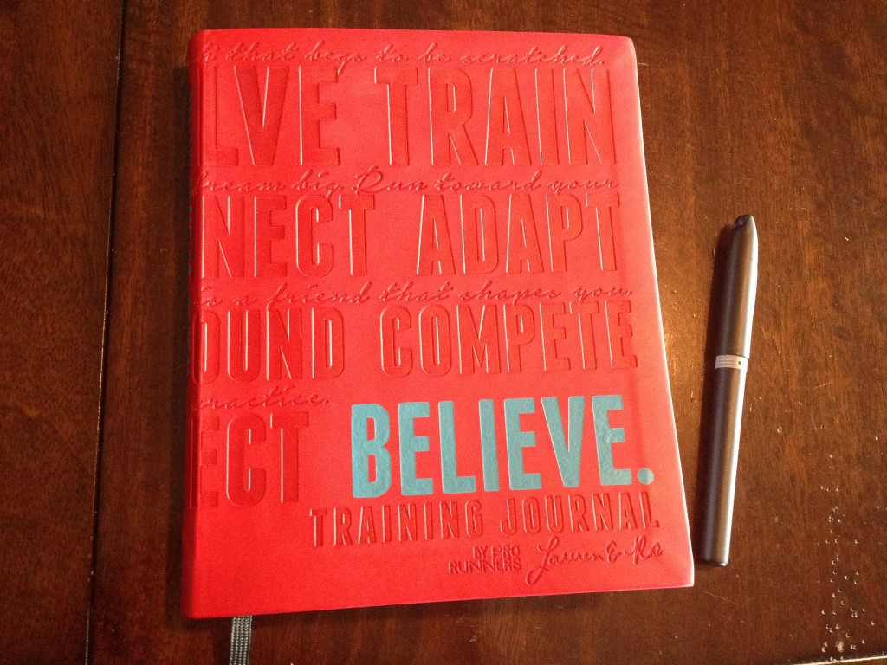
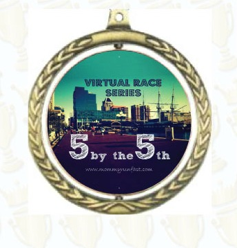

 

In my [last post](http://amotherspace.net/2014/12/2014-the-year-of-the-pr/ "2014: The Year of the PR") I wrote about how incredible 2014 was and how I didn't think that I could top it with 2015. I haven't changed my mind and I'm okay with that. 2015 will be about getting faster and running the shorter distances. I ran a half marathon on January 1st (What??? I know, it was a last minute decision!) and I have a recap coming up soon for that race but that half marathon may be my only 13.1 (or further) race of the year.

It's not that I don't love running the long distances. I do. It's just that right now I want to mix things up a little and focus on something different. There's no way that my mileage will match the 1,261 miles that I ran when I'm only racing short distances. Running that amount of mileage was part of what made 2014 such a great running year but I'm determined to make 2015 fabulous as well...just in a different way.

 

 

I've spent a little more time deciding on my goals for the year and putting them down on paper, instead of just in a blog post. This [Believe Training Journal](http://amzn.to/1A1Zzcd) by Pro Runners Lauren Fleshman and Roisin McGettigan-Dumas is just the motivation I needed to plan things out this year. It's very well thought out, packed with motivation and just plain beautiful. I'm planning on keeping track of much more than running and exercise in this journal. It has enough space to add in some relevant daily activities and important events/milestones. Thanks, Mom, for getting me such a fabulous Christmas gift!

I've narrowed down my running goals to two.

\[Goal One\]

**Work on 5K speed.** I want to specifically train for a 5K race. Even though I've ran plenty of 5K's I've never trained just for the 5K. I signed up for Laura's [5 by the 5th Spring Challenge](http://www.mommyrunfast.com/two-group-challenges-for-2015-eat-cleaner-and-run-faster/) to help me accomplish this.

For this virtual race you may sign up for either 5 miles or a 5K. I signed up for the 5K option so by the 5th of each month (February through May) I'll run a 5K and I'm hoping to increase my speed each month. I am also planning on signing up and training for a local 5K race sometime soon. Most of the training plans that I have found for the 5K are about 8 weeks long so I'll need to start training soon.

\[Goal Two\]

**Exercise 5/6 days a week.** Sometimes when I'm not in the middle of a tough training plan I tend to have a harder time getting out of bed early to exercise. I'm hoping this goal motivates me to wake up when it's hard and continue to get the miles in. But I'm not just counting running here. Spinning, Walking, Yoga, Strength and swimming will all count toward this goal. Those family walks in the evening when it gets warmer out? I'm totally counting them!

Happy New Year to you all! I hope that 2015 is a fabulous year for you and your family!

**Do you set goals in January? What is one of your goals for 2015? Any big races on the calendar?**

——————————-

Find A Mother’s Pace on…

Twitter [@amotherspace3](https://twitter.com/amotherspace3)

Facebook [amotherspace3](http://facebook.com/amotherspace3)

Instagram [amotherspace](http://instagram.com/amotherspace)

Pinterest [amotherspace](http://pinterest.com/amotherspace/)

Bloglovin’ [A Mother’s Pace](http://www.bloglovin.com/en/blog/6680087)

RSS [amotherspace](http://feeds.feedburner.com/amotherspace)
