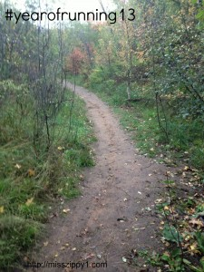

  

  
It's December and that means it's time to take a look back at 2013 in running. I'm playing along with Miss Zippy and answering some questions about my year of running.   
  
Want to join in on the fun? Just head on over to [**Miss Zippy's blog**](http://misszippy1.com/2013/12/year-of-running.html) to read other blog posts or enter one of your own into the link up. You can also follow along with the hashtag #yearofrunning13 on twitter.  
  
  
  
Here we go...  
  
What was your  
  

- **Best race experience?** My favorite race this year was the [**Wichita Prairie Fire Half Marathon**](http://amotherspace.blogspot.com/2013/10/prairie-fire-half-marathon-race-recap.html#.UqYl3cRDv8Z). I ran a pretty smart race and was very close to a PR. It makes me excited to see what I can do with my next half.

  

- **Best run?** I've had a bunch of great runs this year but if I had to pick just one favorite it would be my very first run postpartum. I missed running so much during the few months that I had to take off during pregnancy and after delivery. That first run was tough but amazing.
- **Best new piece of gear?** Finally trying both Nuun and Honey Stinger products. I've been looking for more natural ways to fuel long runs and while these products are not perfect, they are much better than what I was using before. And they are tasty!
- **Best piece of running advice you received?** Take it easy when returning to run after a pregnancy. Don't rush into it. I listened to my body and because I added running slowly back into my schedule I avoided an injury.
- **Most inspirational runner?** As a Team in Training alumni, I have to say that all of the 'Mommies on a Mission' are my inspiration. These women run races and raise money for a charity that is close to their heart and for their children who are currently or have battled leukemia. I'm inspired by their commitment daily.
- **If you could sum up your year in a couple of words, what would they be?** Believe and Dream Big Run Long. Two mantras that I have borrowed from two runners (Kara Goucher and Dorothy Beal) that have helped me overcome the difficulty of running after pregnancy.

  

  

This is my second year of writing a mini yearly recap. [This is what I wrote in 2012](http://amotherspace.blogspot.com/2012/12/a-mini-2012-recap.html#.UqYsAsRDv8Y).

  

**I'd love to hear from you. Answer a question from above in the comments below.**  
\-------------------------------

  

Find A Mother's Pace on...  
  
Twitter [@amotherspace3](https://twitter.com/amotherspace3)  
  
Facebook [amotherspace3](http://facebook.com/amotherspace3)  
  
Instagram [amotherspace](http://instagram.com/amotherspace)  
  
Pinterest [amotherspace](http://pinterest.com/amotherspace/)  
  
Bloglovin' [A Mother's Pace](http://www.bloglovin.com/en/blog/6680087)  
  
RSS [amotherspace](http://feeds.feedburner.com/amotherspace)
