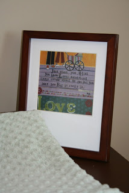
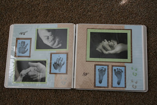
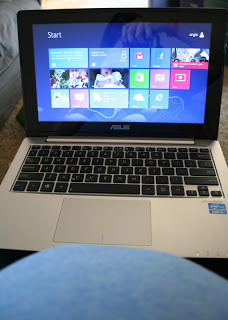
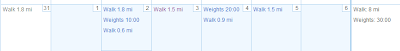

Inspiration hit me this week...or maybe it is just some form of nesting.  
  
I started on the baby's room. I'm 33 weeks pregnant tomorrow and we're not even planning on using the baby's room right away but for some crazy reason I'm all about getting it ready for the big day.  

I've discovered [Blurb](http://blurb.com/) and I think I've finally figured out how I'm going to save our pictures. I'll make a yearbook for our family every year. It's simple and quick, especially if I keep up with making albums of my favorite pictures on Picasa each month. I've started making one for 2012 and can't wait to have the finished product in my hands!  

One day, I'll get back to scrapbooking and finish the baby books for the kids. I'd like each one to have a separate baby book and then a school book as well. Making the family yearbook helps me to not feel quite so overwhelmed with the amount of pictures. Hopefully this will help me to set aside some time to finish O's and start on A's and the new baby's books.   
  
I also set a Goodreads goal for the year.   

I love to read but I'm finding it harder to finish a book these days. My book club keeps me pretty busy each month (we read one new book a month) but I would love to squeeze in another book each month as well. Usually, I read right before bedtime but lately I've been ready for sleep and can't seem to get many pages read before my eyes are closed.   
  
My husband and I celebrated our 4th wedding anniversary this week. We went out to eat and then headed over to Best Buy to look at a new laptop. I know, very romantic, right? Really, it's what I wanted to do. We rarely get a chance to get away alone and it's so much easier to look at something without two kids pulling on you. We didn't buy it right away but decided on this little beauty.  

<table align="center" cellpadding="0" cellspacing="0"><tbody><tr><td></td></tr><tr><td>New laptop and my big belly!</td></tr></tbody></table>

We ended up finding a deal online and it came on the big brown truck the other day. I am LOVING the touch screen!  
  
I'm continuing my walking workouts. I've gotten in a fair amount of mileage this week. I also decided that my strength training needs to make a comeback. I'm shooting for two times a week.   

  
My doctor's appointment went well this week. The baby has finally turned and is no longer breech or oblique. Yay! I love these quick appointments. Blood pressure, measure the belly, hear the heart beat, any questions, and then go. It takes me longer just to get to the appointment than the actual time with the doctor!   

  
Only 7 more weeks to go!
