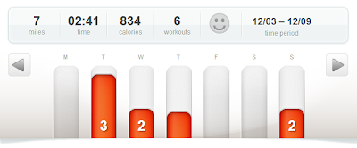

It's been a busy week around our house. My husband and I have finished the majority of the Christmas shopping. Yay! Just a couple more things to wrap it up and I have those on an easy list to get accomplished in the next couple of weeks.  
  
We are getting in the Christmas spirit these days and the weather is finally helping out (sort of). It's gotten a lot colder (16 degrees when we left the house on Monday!) but there is no snow yet. I'm not holding my breath. The cold is fine with me. I'm one that likes it to be cold around the holidays to help get me in the spirit.   
  
  

  
Our tree is definitely a kid friendly tree and has been rearranged by little hands many times. My personal favorite ornaments are the stained glass originals that my grandma has made over the years. We are also loving our Advent Boxes from Nana and Papa. The kids can't wait to open a new box each day to find out what little treasure is inside.   
  
The Chipmunks Christmas CD is playing in our car. I'm just about at my limit on how much I can listen to those guys though! The kids love it and sing along. A's favorite is Jingle Bells and she always wants me to play it again and again. I think O likes Frosty the best. He keeps asking me to read that story to him.  
  
  

  
It was so nice outside last week that we decided to go for a 'dark walk' and check out the Christmas lights in our neighborhood. It's completely different on foot than in the car. The kids didn't want to head home when we were finished!  
  
  

  
The local Children's Theatre was putting on The Runaway Snowman this past week and we enjoyed the show. The kids _loved_ watching as Happy the Snowman had his winter adventure. We had front row seats but my pregnant body didn't last too long on the thin carpet mat over the hard floor. We moved  to a chair just over to the side after sitting on the floor for about 15 minutes. Much better! They sent us home with a couple of coloring pages so we spent a few minutes with the crayons.  
  
Exercise for the Week:  
  
  

  
Two of those miles are running and the rest are walking. I have ran my last 2012 miles and my last pregnancy miles. [And that's o.k. with me!](http://amotherspace.blogspot.com/2012_12_01_archive.html#8120140511361257995) At this point I just want to keep active and stick with my morning walking on the treadmill.   
  
Pregnancy Update:  
  
29 weeks pregnant tomorrow! My doctor visit last week turned out to be a little disappointing.  Dr. said I'm gaining too much weight and so I have to watch that. So fun around the holidays! (Said with deep sarcasm, of course!) I shouldn't complain, I know there are worse things out there but we have so many holiday parties coming up. It will be hard not to give into the holiday food...especially when so many of those things are just what I'm craving in this pregnancy. (Anything chocolate, really.) I also tested high with my diabetes test (just over the normal range!) and so I had the pleasure of a longer lab visit this week.  Can't wait for those results to get in.  
  
Currently Reading:  
  
[Code Name Verity](http://www.amazon.com/Code-Name-Verity-Elizabeth-Wein/dp/1423152190/ref=sr_1_1?ie=UTF8&qid=1355172262&sr=8-1&keywords=code+name+verity) by Elizabeth Wein  
  
My book club is meeting soon and I have a lot of reading ahead of me! I need to spend a little quality time with my kindle fire and get some reading in...right away! I tried to read a bunch during my 3.5 hour lab visit yesterday but I got very distracted by my Runner's World.  
  
And that's it for me on this Wednesday Wrap Up!
