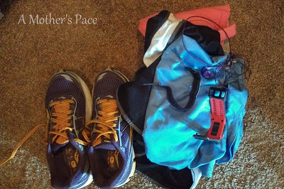
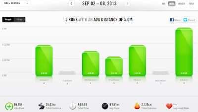
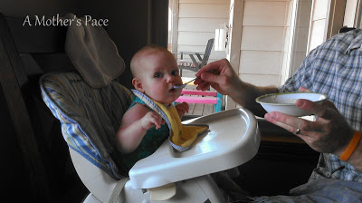

Lately I've been beating myself up a bit.   
  
I've been struggling to wake up and workout first thing in the morning. I want to do it. I plan for it.   
  
  

  
Every night I lay my running clothes out on my closet floor and more often than not they are still there later in the day.  
  
I want the drive to pop out of bed at 5:30 a.m. and hit the pavement. It's cool outside at that time. The run gets done. It's my FAVORITE time to get a run in.   
  
I feel like if I don't get my run in when I have it scheduled that I'm not motivated. I hop on twitter later and read about all these amazing runs that happened before 6 a.m. and I'm trying to not compare myself to them.  
  
I can't blame it on my 6 month old daughter. She's been sleeping through the night practically since we came home from the hospital.   
  
  

  
But I'm not sleeping the best at night right now and that makes waking up early difficult. So I'm giving myself a break. Last week I talked about [Being Flexible](http://bit.ly/17dSJQm) and this really is an extension of that.   
  
I am motivated and the proof is in the fact that on most days I figure out a way to run even if I miss it in the morning. Lately this has included a [stroller run](http://bit.ly/17dSepv) through the park with our double stroller and the treadmill after my husband is off of work or while the kids are playing.   
  
I'm getting it done. It might not be perfect and it might not be in the morning at my ideal time but it's what is working for me right now.   
  
And one day I'll be back to jumping out of bed when the alarm goes off in the morning. One day...  
  
  
  

  
**Weekly Workouts**  
  
Monday:  5.01 miles  
  
Tuesday: Planned Rest Day  
  
Wednesday: 4 miles (3 + Strides)  
  
Thursday: 3.01 stroller miles  
  
Friday: 5.01 miles  
  
Saturday: Planned Rest Day  
  
Sunday: 8 miles (long run) Taper for half next weekend!!  
  
  

  
Total Running Miles: 25.03  
Weekly Average Pace: 9:48  
  
August Running Miles: 25.03  
2013 Running Miles: 324.19  
  

**What time of day do you workout? Are you a morning runner?**

  

  
P.S. This little one is finally loving her cereal. It took her about 2 weeks of making yucky faces while eating but now she's excited when she sees the bowl. We've introduced banana, oatmeal, and avocado so far. Up next is sweet potato!  
  
  
I've linked up with Jen over at [Marathon Mom](http://www.runnershoe.blogspot.com/2013/09/marathon-weekly-following-week-of.html) today.  
  
  

\------------------------------------------

  

Staying at home with kids sounds easy, right? Life with 3 little ones is busier than I imagined. I don't write every day on the blog but I do update Facebook, Twitter and Instagram more often.   
  
Find A Mother's Pace on...  
  
Twitter [@amotherspace3](https://twitter.com/amotherspace3)  
  
Facebook [amotherspace3](http://facebook.com/amotherspace3)  
  
Instagram [amotherspace](http://instagram.com/amotherspace)  
  
Pinterest [amotherspace](http://pinterest.com/amotherspace/)  
  
Bloglovin' [A Mother's Pace](http://www.bloglovin.com/en/blog/6680087)  
  
RSS [amotherspace](http://feeds.feedburner.com/amotherspace)
